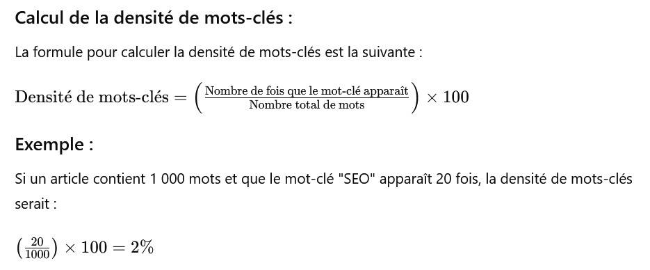

# GLOSSAIRE

- [Général](#général) [questions 1 à 17]
- [Front-end](#front-end) [questions 18 à 34]
- [UX / UI](#ux-ui) [questions 35 à 42]
- [Programmation orientée objet](#programmation-orientée-objet-poo) [questions 43 à 59]
- [Architecture](#architecture) [questions 60 à 66]
- [Modélisation / Base de données](#modélisation---base-de-données) [questions 67 à 83]
- [Symfony](#symfony) [questions 84 à 93]
- [Sécurité](#sécurité) [questions 94 à 103]
- [RGPD](#rgpd) [questions 104 à 113]
- [SEO](#seo) [questions 114 à 126]
- [Gestion de projets / DevOps](#gestion-de-projets---devops) [questions 127 à 142]
- [English](#english)

___
___

# Général
  
  
## 1.	Quel est l’environnement à installer pour exécuter un script PHP ? Citer 2 logiciels permettant ce contexte.

Il faut installer un **serveur local** sur son ordinateur, qui pourra **interpréter le code PHP** car le navigateur n'en est pas capable.
Précisément, il faut un serveur web (Apache est un choix fréquent), un interpréteur PHP (on choisit la dernière version stable de PHP) et une base de données si notre script interagit avec une base de données (un choix fréquent est MySQL).

Laragon inclut le serveur web Apache et la base de données MySQL (visibles sur la fenêtre menu) et propose plusieurs versions de PHP. C'est un environnement préconfiguré qui inclut ce dont on a besoin.

XAMPP permet également de créer un environnement de développement local pour PHP. C'est une alernative à Laragon.

___

## 2.	Qu’est-ce qu’un algorithme ?

Un algorithme est une **succession finie d'instructions claires et de règles bien définies**, à réaliser pour **résoudre un problème ou effectuer une tâche complexe** qui sont organisées de manière structurée. On doit garder en mémoire qu'il doit **être efficace** (temps d'exécution le plus court possible et utilisation des ressources le moins possible).

Un algorithme bien conçu doit être :

- **Défini** : chaque étape est précise et a un sens clair.
- **Fini** : il se termine après un certain nombre d'étapes.
- **Efficace** : il résout le problème de la manière la plus optimale possible.

___

## 3.	Qu’est-ce qu’une variable ? Par quel symbole est préfixée une variable en PHP ?

Une variable est un **emplacement mémoire qui associe un nom à une valeur**. Elle peut être de différents types : nombre entier, nombre à virgule, booléen, chaine de caractères, tableau, etc.  

En PHP, une variable est **préfixée par le symbole $**.

___

## 4.	Qu’est-ce que la portée d’une variable ?

La portée d'une variable en PHP définit la **zone dans laquelle une variable est accessible et utilisée**. Il existe plusieurs types de portée en PHP :

### 1. Portée globale
Les variables définies dans la portée globale sont accessibles partout dans le script, sauf dans les fonctions, où elles doivent être explicitement déclarées comme `global` pour être utilisées.

```
$variableGlobale = "Je suis global !";

function afficherVariable() {
    global $variableGlobale; // Déclaration de la variable globale
    echo $variableGlobale;
}

afficherVariable(); // Affiche "Je suis global !"
$variableGlobale = "Je suis global !";

function afficherVariable() {
    global $variableGlobale; // Déclaration de la variable globale
    echo $variableGlobale;
}

afficherVariable(); // Affiche "Je suis global !"
```

### 2. Portée locale
Les variables définies à l'intérieur d'une fonction sont locales à cette fonction. Elles ne peuvent pas être accédées à l'extérieur de celle-ci.

```
function maFonction() {
    $variableLocale = "Je suis local !";
    echo $variableLocale; // Accessible ici
}

maFonction(); // Affiche "Je suis local !"
// echo $variableLocale; // Provoquera une erreur, car elle est hors de portée
```

### 3. Portée statique
Les variables déclarées avec le mot-clé `static` à l'intérieur d'une fonction **conservent leur valeur entre les appels de fonction**, mais elles ne sont accessibles qu'à l'intérieur de cette fonction.

```
function compteur() {
    static $compte = 0; // Initialisé une seule fois
    $compte++;
    echo $compte;
}

compteur(); // Affiche 1
compteur(); // Affiche 2
```

### 4. Portée des classes (OOP)
Dans la programmation orientée objet (OOP), les variables d'instance (propriétés de classe) ont une portée qui dépend de leur visibilité :

- **Public** : accessible depuis n'importe où.
- **Protected** : accessible depuis la classe et ses sous-classes.
- **Private** : accessible uniquement depuis la classe elle-même.

```
class MaClasse {
    public $publicVar = "Public";
    protected $protectedVar = "Protected";
    private $privateVar = "Private";

    public function afficherVariables() {
        echo $this->publicVar;    // Accessible
        echo $this->protectedVar; // Accessible
        echo $this->privateVar;   // Accessible
    }
}

$obj = new MaClasse();
$obj->afficherVariables();
// echo $obj->protectedVar; // Provoquera une erreur
// echo $obj->privateVar;   // Provoquera une erreur
```


### Conclusion
La portée des variables en PHP est cruciale pour la gestion des données et la structure de ton code. Comprendre comment et où une variable peut être utilisée t'aide à éviter des erreurs et à écrire un code plus organisé.
___

## 5.	Qu’est-ce qu’une constante ? Quelle est la différence avec une variable ?

Une constante est une valeur qui, une fois définie, ne sera plus jamais modifiée au cours de l'exécution d'un programme.

Les différences sont :
- la constante n'est **pas déclarée avec le symbole $**.
- la constante est souvent **écrite en majuscule**.
- la constante **ne sert pas à stocker une valeur (une information) qui peut varier** pendant l'exécution du programme.

___

## 6.	Qu’est-ce qu’une superglobale, combien en existe-t-il ? Donner un exemple d’utilisation.

Une superglobale est **une variable (variable prédéfinie) qui est toujours accessible, peu importe le contexte dans lequel elle est utilisée**. Contrairement aux variables normales, qui ont une portée limitée, les superglobales sont **accessibles de n'importe où dans le script**.

Il existe plusieurs superglobales en PHP :
1. $GLOBALS : contient toutes les variables globales.
2. $_SERVER : contient des informations sur les en-têtes, chemins, et emplacements des scripts.
3. $_REQUEST : contient les données envoyées via les méthodes GET et POST.
4. $_POST : contient les données envoyées via la méthode POST.
5. $_GET : contient les données envoyées via la méthode GET.
6. $_FILES : contient des informations sur les fichiers téléchargés via le script.
7. $_COOKIE : contient les cookies envoyés par le client.
8. $_SESSION : contient les variables de session.

Une superglobale en PHP peut être vue comme un tableau associatif.

Exemple d'utilisation de la superglobale $_POST, à étudier pour une meilleure compréhension :

#### Un formulaire HTML :
```
<!DOCTYPE html>
<html lang="fr">
<head>
    <meta charset="UTF-8">
    <title>Formulaire de contact</title>
</head>
<body>
    <form action="traitement.php" method="post">
        <label for="nom">Nom :</label>
        <input type="text" id="nom" name="nom" required>
        
        <label for="email">Email :</label>
        <input type="email" id="email" name="email" required>
        
        <input type="submit" value="Envoyer">
    </form>
</body>
</html>
```

#### Le fichier de traitement 'traitement.php'
```
<?php
if ($_SERVER["REQUEST_METHOD"] == "POST") {
    // Récupérer les données du formulaire
    $nom = htmlspecialchars($_POST['nom']);
    $email = htmlspecialchars($_POST['email']);
    
    // Afficher les données
    echo "Nom : " . $nom . "<br>";
    echo "Email : " . $email;
}
?>
```

#### Explications :

**Formulaire HTML :**

- Le formulaire envoie les données à traitement.php en utilisant la méthode POST.

**Traitement en PHP :**

- Dans traitement.php, nous vérifions si la requête est de type POST.
- Nous utilisons $_POST pour accéder aux valeurs des champs nom et email.
- htmlspecialchars() est utilisé pour échapper les caractères spéciaux afin d'éviter les attaques XSS.

**Affichage :**

- Les données du formulaire sont ensuite affichées à l'écran.

**En images pour bien comprendre :**


**Dans les détails :**


___

## 7.	Quels sont les différents types (primitifs) que l’on peut associer à une variable en PHP ? Les citer et en donner des exemples (ne pas oublier le type d’une variable sans valeur).

Les différents types que l'on peut associer à une variable en PHP sont :
- une **chaine de caracères (string)**. Exemple : $chaine = "Bonjour"
- un **nombre entier (integer)**. Exemple : $nombre = 4
- un **nombre à virgule (float)**. Exemple : $float = 3.20
- un **booléen (boolean)**. Exemple : Exemple : $bool = true ou $bool = false
- un **tableau (array)**. Exemple : $tableau = [ "élément1" , 4 , 4.20 , "élément5", $variable ] -> un tableau peut contenir toute sorte de choses
- un **objet (object)**. Exemple : $maVoiture = new Voiture [avant de pouvoir créer une instance de la classe voiture, on a dû définir la classe voiture au préalable] :  
```
class Voiture {  
    // voici les propriétés de la classe que nous créeons :  
    public $marque;  
    public $modèle;  
    pblic $couleur;  
}  
```

-  une **variable sans valeur**. Exemple : 
    - $maVariable [la variable est déclarée mais n'a pas de valeur initiale, donc elle est non définie : sa valeur est considérée comme NULL]
    - $mavariable2 = NULL [on définit explicitement la variable comme NULL]

> commentaire : un objet peut contenir des propriétés et des méthodes.

___

## 8.	Existe-t-il plusieurs types de tableaux en PHP, si oui lesquels ?

Il existe trois types de tableaux, à savoir les tableaux indexés, les tableaux associatifs et les tableaux multidimensionnels.

- Les **tableaux indexés** sont des tableaux dont les éléments sont indexés par des nombres. Par défaut, les indices commencent à 0.
- Les **tableaux associatifs**  sont des tableaux dont les éléments sont indexés par des clés nommées. On peut donc accéder aux valeurs par ces clés. Attention, on ne peut pas avoir dans un même tableau deux clés identiques. Par contre, deux clés différentes peuvent avoir la même valeur.
- Les **tableaux multidimensionnels** sont des tableaux contenant d'autres tableaux, pour créer des structures de données plus complexes.

___

## 9.	Quelles sont les différentes structures de contrôle qu’il existe en algorithmie ? Donner un exemple pour chacune d’entre elles.

#### Il y a les structures conditionnelles qui permettent de prendre des décisions basées sur des conditions.

1. if :  
```
si (condition) alors  
    faire quelque chose  
fin si 
``` 

2. if ... else :  
```
si (condition) alors  
    faire quelque chose  
sinon  
    faire autre chose  
fin si  
```

3. switch :  
```
choix variable  
    cas valeur1 :  
        faire quelque chose  
    cas valeur2 :  
        faire autre chose   
    par défaut :  
        faire une autre chose   
fin choix  
```


#### Il y a les structures de répétition (les boucles) qui permettent de répéter un bloc de code plusieurs fois.

1. while :  
```
tant que (condition) faire  
    faire quelque chose  
fin tant que  
```

La condition est vérifiée avant chaque itération.  
Elle est généralement utilisée lorsque le nombre d'itérations n'est pas connu à l'avance et dépend d'une condition dynamique.  

2. for : 
```
pour i de 1 à 10 faire  
    faire quelque chose  
fin pour  
```

L'initialisation, la condition et l'incrément sont généralement définis dans la même ligne.  
Elle est souvent utilisée lorsque le nombre d'itérations est connu à l'avance.  

3. do ... while :  
```
faire  
    faire quelque chose  
tant que (condition) 
``` 

Le **bloc de code est exécuté au moins une fois**, car la condition est vérifiée après l'exécution du code.  
Elle est utile lorsque vous souhaitez garantir qu'une action est effectuée au moins une fois, indépendamment de la condition.  


#### Il y a les structures de saut qui permettent de modifier le flux d'exécution en sautant à d'autres parties du code.

1. break (utilisé **pour sortir d'une boucle** ou d'une structure de contrôle) : 
```
pour i de 1 à 10 faire  
    si (i = 5) alors  
        sortir  
    fin si  
fin pour  
```

2. continue (utilisé **pour sauter à l'itération suivante** d'une boucle) : 
```
pour i de 1 à 10 faire  
    si (i est pair) alors  
        continuer  
    fin si  
    faire quelque chose  
fin pour 
``` 

3. return (utilisé **pour sortir d'une fonction** et éventuellement renvoyer une valeur) :
``` 
fonction somme(a, b)  
    retourner a + b  
fin fonction   
```

___

## 10.	Quelle est la fonction PHP permettant de demander la longueur d’une chaîne de caractères ?

La fonction PHP permettant de demander la longueur d’une chaîne de caractères est : **strlen ()**. Cette fonction compte tous les caractères, y compris les espaces et la ponctuation.  
*ATTENTION* : si la chaine contient des caractères spéciaux, on préfèrera utiliser la fonction **mb_strlen()**.

___

## 11.	Qu’est-ce qu’une session ? Quelle fonction permet de démarrer une session en PHP ? Donner un exemple d’utilisation en PHP.

Une session en PHP est un mécanisme qui permet de stocker des données "utilisateur" sur le serveur afin de les conserver entre différentes requêtes HTTP. 
La **fonction session_start()** permet de démarrer une session en PHP.

Sur un site marchand, la session permet de conserver le contenu du panier d'achat jusqu'à la finalisation de la commande.

___

## 12.	Qu’est-ce qu’un cookie ? Donner un exemple d’utilisation en PHP.

Un **cookie** est un petit fichier de données stocké sur l'ordinateur de l'utilisateur par le navigateur web. Les cookies sont utilisés pour mémoriser des informations sur l'utilisateur, comme les préférences de session, les identifiants de connexion, ou d'autres données qui permettent de personnaliser l'expérience utilisateur sur un site web.


### Caractéristiques des cookies

- **Durée de vie** : les cookies peuvent être **temporaires** (disparaissent lorsque le navigateur est fermé) **ou persistants** (restent sur l'ordinateur jusqu'à une date d'expiration définie).
- **Taille** : ils sont **limités en taille**, généralement autour de 4 Ko.
- **Portée** : les cookies sont **associés à un domaine spécifique** et ne sont pas accessibles par d'autres domaines.


### Exemple d'utilisation en PHP

Voici comment créer et récupérer un cookie en PHP :

1. **Création d'un cookie**
Tu peux créer un cookie en utilisant la fonction setcookie() :

```
<?php
// Crée un cookie qui expire dans 1 heure
setcookie("nom_utilisateur", "Alice", time() + 3600, "/"); // "/" pour le rendre accessible sur tout le domaine

echo "Cookie 'nom_utilisateur' a été créé.";
?>
```

2. **Récupération d'un cookie**
Pour récupérer la valeur d'un cookie, tu peux accéder à la superglobale $_COOKIE :

```
<?php
if (isset($_COOKIE['nom_utilisateur'])) {
    echo "Bonjour " . $_COOKIE['nom_utilisateur'] . "!";
} else {
    echo "Cookie non trouvé.";
}
?>
```

### Exemple complet
Voici un exemple complet qui crée un cookie et l'affiche sur la page :

```
<?php
// Création du cookie
setcookie("nom_utilisateur", "Alice", time() + 3600, "/");

// Récupération et affichage du cookie
if (isset($_COOKIE['nom_utilisateur'])) {
    echo "Bonjour " . $_COOKIE['nom_utilisateur'] . "!";
} else {
    echo "Cookie non trouvé.";
}
?>
```


### Notes importantes

- **En-tête HTTP** : la fonction `setcookie()` doit être appelée avant tout envoi de sortie (c'est-à-dire avant d'envoyer du texte HTML ou des en-têtes). Si tu essaies de créer un cookie après l'envoi de contenu, cela déclenchera une erreur.
- **Sécurité** : les **cookies peuvent contenir des informations sensibles**, il est donc important de les sécuriser, par exemple en utilisant le protocole HTTPS ou en configurant les options `HttpOnly` et `Secure`.


___

## 13.	Quelle est la différence entre les instructions «require» et «include» en PHP ?

Ces instructions sont utilisées **pour inclure le contenu d'un fichier dans un autre fichier**. Mais elles présentent des différences en terme de comportement et d'utilisation.

Si le fichier spécifié ne peut pas être inclus, **require** génère une erreur fatale et arrête l'exécution du script : si le fichier est essentiel pour le fonctionnement du programme, l'utilisation de **require** est donc appropriée.

Si le fichier ne peut pas être inclus, **include** génère un avertissement et le script continue à s'exécuter. Cela peut être utile si le fichier est optionnel ou si vous voulez que le programme continue même en cas d'erreur.

En résumé, choisissez **require** lorsque le fichier est indispensable au fonctionnement du script et **include** lorsque le fichier est optionnel. Les variantes **require_once** et **include_once** permettent d'**éviter les inclusions multiples**, garantissant que le contenu du fichier est exécuté une seule fois.

___

## 14.	Comment effectuer une redirection en PHP ?

Pour effectuer une redirection en PHP, tu peux utiliser la fonction header(). Cette fonction envoie un en-tête HTTP au navigateur, ce qui peut être utilisé pour rediriger l'utilisateur vers une autre page. Voici comment faire :

### Exemple de redirection simple

```
<?php
// Redirection vers une autre page
header("Location: http://www.example.com");
exit(); // Toujours utiliser exit() après header() pour arrêter l'exécution du script
?>
```

### Étapes à suivre

1. **Appel à header()** : utilise `header("Location: URL")` pour spécifier la nouvelle URL vers laquelle tu veux rediriger l'utilisateur.

2. **Appel à exit()** : il est recommandé d'appeler `exit()` ou `die()` juste après `header()`. Cela arrête l'exécution du script, ce qui empêche d'autres sorties qui pourraient être envoyées au navigateur avant la redirection.

### Points importants à considérer

- **Envoi d'en-têtes** : la fonction `header()` doit être appelée avant tout envoi de contenu (comme HTML, texte, ou même des espaces). Si tu as déjà envoyé des données au navigateur, tu obtiendras une erreur de type "Headers already sent".

- **Redirection avec des codes d'état** : tu peux également spécifier un code d'état HTTP pour indiquer le type de redirection. Par exemple, pour une redirection permanente (301) :

```
<?php
header("Location: http://www.example.com", true, 301);
exit();
?>
```


- **Redirection conditionnelle** : tu peux effectuer une redirection basée sur une condition, par exemple, après une vérification d'authentification :

```
<?php
session_start();
if (!isset($_SESSION['loggedin'])) {
    header("Location: login.php");
    exit();
}
?>
```

### Conclusion
La redirection en PHP est un processus simple mais puissant pour gérer la navigation dans tes applications web.

___

## 15.	Définir la partie « front-end » et « back-end » d’une application.

La partie **front-end** d'une application contient toute la partie visible par l'utilisateur. Elle contient donc **la partie "contenu informatif du site" et la partie "mise en forme du site"**. Les langages associés à cette partie sont le **HTML** et le **CSS**.

- **HTML pour fournir du contenu et le structurer**. (je maitrise les fondamentaux)
- **CSS pour la mise en forme et la gestion graphique du site**. (je dois améliorer ma pratique des outils flexbox)

Mon navigateur gère parfaitement l'affichage du front-end et je peux développer sans outil particulier. Le logiciel VSCode fait très bien le travail demandé.

La partie **back-end** d'une application contient toute la machinerie cachée qui permet un bon fonctionnement de mon application. Le langage associé à cette partie est le PHP (en ce qui me concerne).

- **PHP pour aller envoyer des requêtes au serveur**. (je découvre ce langage en ce moment même)

**Mon navigateur ne gère pas correctement le langage PHP**. En plus du logiciel VSCode, je vais installer Laragon, qui va me fournir les outils adaptés au besoin du développement en PHP.

___

## 16.	Définir le contrôle de version ? Qu’est-ce que Git ?

Le **contrôle de version** est un système qui **enregistre les modifications apportés à des fichiers au fil de l'avancement d'un projet**. 
- On sait quelle modification a été faite, qui a fait la modification et quand elle a été faite.
- On garde un historique complet des versions des fichiers, pour revenir facilement à une version ancienne si besoin.
- On peut travailler à plusieurs sur un même projet, en travaillant chacun sur sa propre copie des fichiers.
- On peut créer des branches pour travailler sur des fonctionnalités séparement puis fusionner ces branches à la branche principale.
- En cas de conflits, on a à disposition des outils pour les résoudre.

Git est un logiciel de contrôle de version très populaire, utilisé pour la gestion de code source. Utilisé avec la plateforme en ligne GitHub, il permet en plus une gesion décentralisée.

___

## 17.	Qu’est-ce qu’un CMS ? Citer au moins 2 exemples.

Un CMS (**Content Management System**), aussi appelé **système de gestion de contenu**, est un logiciel qui permet de créer, gérer et modifier du contenu numérique sur un site web sans compétences techniques avancées en programmation.

Deux exemples de CMS : 
- **WordPress**
- **Shopify**

___
___

# Front-end

    
## 18.	Définir HTML.

HTML (**HyperText Markup Language**) est un langage de balisage qui permet d'**ajouter du contenu et** de **le structurer**, pour la création d'une page web. Il permet entre autres de **créer des liens hypertextes** qui relient différentes pages web entre elles. Il s'utilise avec d'autres langages informatiques.

___

## 19.	Définir CSS.

CSS (**Cascading Style Sheets**) est un langage informatique utilisé **pour contrôler l'apparence visuelle d'une page web**. Il permet de bien contrôler la disposition des éléments sur une page et le design de chaque élément. C'est vraiment le langage **pour styliser et mettre en forme sa page web**. Il s'utilise avec d'autres langages informatiques.

*ATTENTION* : un fichier CSS peut être couplé à un fichier HTML via une balise `<link>` dans la section `<head>` du fichier HTML.  
- `<link rel="stylesheet" href="styles.css">` 

C'est la méthode la plus propre pour faire interagir du code CSS et du code HTML et nous l'utiliserons par la suite. Le code CSS est stocké proprement dans un fichier CSS distinct.

___

## 20.	Définir Javascript.

JavaScript (« JS » en abrégé) est un langage de programmation qui permet de **créer du contenu mis à jour de façon dynamique**, de **contrôler le contenu multimédia**, d'**animer des images**, etc. Il est utilisé pour améliorer les pages HTML et est couramment intégré dans le code HTML. Il permet d’ajouter des **fonctionnalités dynamiques** aux pages HTML, comme la manipulation des éléments de la page, la gestion des événements utilisateur, et la communication avec des serveurs via des requêtes AJAX. JavaScript est un langage interprété, ce qui signifie qu’il n’a pas besoin d’être compilé.
___

## 21.	Définir JSON. Dans quel contexte ce format est-il utilisé ? 

JSON (**JavaScript Object Notation**) est un format léger de stockage et d'échange de données, facile à lire et à écrire pour les humains, et simple à analyser et à générer pour les machines. JSON utilise une **syntaxe similaire à celle des objets JavaScript**, ce qui le rend facilement compréhensible. Il représente des **données sous forme de paires clé-valeur et de tableaux**, ce qui permet de structurer les informations de manière hiérarchique. Bien que dérivé de JavaScript, JSON est un format de données indépendant du langage, supporté par de nombreux langages de programmation, y compris Python, Java, et PHP.

### Contexte d'utilisation :

1. **Échange de données entre client et serveur** : JSON est couramment utilisé pour transmettre des données entre un client (navigateur) et un serveur, notamment lors des requêtes AJAX.
2. **Stockage de données** : JSON est utilisé pour sauvegarder des configurations ou des paramètres d'application, en raison de sa simplicité et de sa lisibilité.
3. **Bases de données NoSQL** : Certaines bases de données, comme MongoDB, stockent des données en format JSON, ce qui facilite la manipulation et l'interrogation des données.

___

## 22.	Peut-on interpréter du Javascript côté serveur ? Si oui, comment ?

Oui, on peut interpréter JavaScript côté serveur, principalement **grâce à Node.js**. Node.js est un environnement d'exécution qui permet d'exécuter du JavaScript sur le serveur, en dehors d'un navigateur web.

___

## 23.	Qu’est-ce qu’un sélecteur CSS ?

Un **sélecteur CSS** est un élément qui permet de cibler des éléments HTML spécifiques pour leur appliquer des styles. Les sélecteurs CSS sont des outils puissants qui permettent de cibler des éléments HTML pour appliquer des styles de manière précise et flexible.  
  
On notera comme différents sélecteurs :

- le **sélecteur de type** qui cible tous les éléments d'un type particulier (balise).    
```
p {  
    color: blue; /* Tous les paragraphes seront bleus */  
}  
```

- le **sélecteur de classe** qui cible tous les éléments ayant une classe spécifique, préfixée par un point `.`.  
```
.mon-style {  
    font-weight: bold; /* Tous les éléments avec la classe "mon-style" seront en gras */  
}  
```

- le **sélecteur d'identifiant** qui cible un élément unique ayant un identifiant spécifique, préfixé par un dièse `#`.   
```
#mon-id {  
    background-color: yellow; /* L'élément avec l'id "mon-id" aura un fond jaune */  
}  
```

- le **sélecteur d'attribut** qui cible les éléments en fonction de leurs attributs ou de leurs valeurs d'attribut.    
```
a[href] {  
    text-decoration: none; /* Tous les liens avec un attribut href n'auront pas de soulignement */  
}  
```

**Une illustration syntaxique avec les deux premiers cas :**


- le **sélecteur combiné** qui combine plusieurs sélecteurs pour cibler des éléments en fonction de leur relation. Trop compliqué pour moi, je ne pense pas l'utiliser pour le moment.    

- le **sélecteur pseudo-classe** qui cible des éléments dans un état particulier. Peut être super utile pour des effets au survol de la souris par exemple.    
```
a:hover {  
    color: green; /* Le lien deviendra vert au survol */  
}  
```

- le **sélecteur pseudo-élément** qui cible des parties spécifiques d'un élément. Peut être sympa à utiliser.  
```
p::first-line {  
    font-weight: bold; /* La première ligne de tous les paragraphes sera en gras */  
}  
```

___

## 24.	Quelle balise HTML permet de créer un lien hypertexte ?

La balise qui permet de créer un lien hypertexte est la balise `<a></a>`.
Exemple : `<a href="https://www.example.com">Visitez notre site</a>`

#### attributs de la balise `<a>` :
- href : obligatoire, il spécifie l'URL de la page vers laquelle renvoie le lien.
- target : facultatif, il spécifie comment ouvrir le lien. `target="_blank"` ouvre le lien dans un nouvel onglet ou une nouvelle fenêtre alors que `target="_self"` ouvre le lien dans le même onglet.
- title : fournit des informations supplémentaires sur le lien. Ce texte s'affiche généralement en tant qu'info-bulle lorsque l'utilisateur survole le lien.
- download : indique que le lien doit être traité comme un téléchargement. Si cet attribut est présent, le lien déclenche le téléchargement du fichier lié au lieu de naviguer vers celui-ci.

Exemple de code pour une balise `<a>` avec un attribut download :
```
<a href="https://www.example.com" 
   target="_blank" 
   title="Visitez notre site" 
   rel="noopener" (notion liée à la sécurité)
   download>
   Télécharger notre brochure
</a>
```

___

## 25.	Qu’est-ce qu’une requête AJAX ? (je ne maitrise pas cet outil)

Une requête AJAX (**Asynchronous JavaScript and XML**) est une technique qui permet de communiquer avec un serveur sans recharger la page web. Cela permet d'**échanger des données en arrière-plan** et de mettre à jour des parties de la page sans interrompre l'expérience utilisateur.

#### Caractéristiques principales
1. **Asynchrone** : les requêtes AJAX se font de manière asynchrone, ce qui signifie que l'utilisateur peut continuer à interagir avec la page pendant que la requête est en cours.

2. **Formats de données** : bien que le nom fasse référence à XML, AJAX peut également utiliser d'autres formats de données comme JSON, HTML ou texte brut.

3. **Utilisation de JavaScript** : AJAX s'appuie sur JavaScript, souvent en utilisant l'objet ``XMLHttpRequest` ou la méthode `fetch()` pour effectuer des requêtes.

#### Exemples simples


#### Avantages
- **Expérience utilisateur améliorée** : les pages se chargent plus rapidement et de manière plus fluide.

- **Réduction de la bande passante** : seules les données nécessaires sont échangées, pas la page entière.

#### Utilisations courantes
- Chargement de contenu dynamique (comme les commentaires ou les articles).

- Envoi de formulaires sans recharger la page.

- Mise à jour de sections spécifiques d'une page (comme les notifications).

___

## 26.	Quel sélecteur CSS permet de sélectionner tous les éléments d’une classe spécifique ? D’un identifiant spécifique ? (déjà répondu à la question 23)

Le premier s'appelle le **sélecteur de classe** qui cible tous les éléments ayant une classe spécifique, **préfixée par un point (.)**.
```
.mon-style {
    font-weight: bold; /* Tous les éléments avec la classe "mon-style" seront en gras */
}
```

Le deuxième s'appelle le **sélecteur d'identifiant** qui cible un élément unique ayant un identifiant spécifique, **préfixé par un dièse (#)**.
```
#mon-id {
    background-color: yellow; /* L'élément avec l'id "mon-id" aura un fond jaune */
}
```

___

## 27.	Définir le responsive design

Le **responsive design** est une approche de conception web qui vise à créer des sites et des applications capables de s'adapter à une variété de tailles d'écran.

___

## 28.	Qu’est-ce que le templating ?

**Le templating est une technique** utilisée dans le développement web pour générer du contenu HTML dynamique à partir de **modèles** (ou **templates** en anglais). Ces modèles contiennent généralement des espaces réservés (**placeholders** en anglais) qui sont remplacés par des données réelles au moment de l'exécution. Cela permet de séparer la logique de l'application de la présentation, rendant le code plus organisé et maintenable. Le templating est essentiel pour créer des applications web dynamiques et modernes.

#### Caractéristiques principales :

1. **Séparation des préoccupations** : le templating aide à séparer **le code logique** (JavaScript, PHP, etc.) de **la présentation** (HTML, CSS). Cela rend le code plus lisible et plus facile à maintenir.

2. **Réutilisabilité** : les templates peuvent être réutilisés pour générer plusieurs pages ou sections de pages, ce qui évite la duplication de code.

3. **Données dynamiques** : les modèles peuvent être remplis avec des données provenant de bases de données, d'API, ou d'autres sources, permettant ainsi de créer du contenu personnalisé.

#### Comment ça fonctionne :

1. **Création d'un modèle** : un fichier template est créé avec des balises spécifiques pour les variables. Par exemple, en utilisant une syntaxe comme {{ variable }} pour indiquer où une donnée doit être insérée. Commentaire : la plateforme de Nalan utilisait cette technique.

2. **Rendu** : lorsqu'une page est demandée, le serveur (ou le client, selon l'architecture) remplace les espaces réservés par les valeurs réelles et génère le HTML final.

#### Exemple simple :


#### Outils et frameworks :

Il existe de nombreux outils et frameworks qui facilitent le templating, tels que :

- JavaScript : Handlebars, EJS, Mustache
- Python : Jinja2, Django Templates
- PHP : Twig, Blade
- Ruby : ERB, Haml

On notera **un lien entre les notions de templating et de frameworks**. Voici les remarques de chatGPT sur la question : 

Un framework est un ensemble d'outils, de bibliothèques et de conventions qui facilitent le développement d'applications en fournissant une structure de base. Il permet aux développeurs de gagner du temps et de respecter des bonnes pratiques en intégrant des fonctionnalités réutilisables et des abstractions.

En résumé, un framework est un outil puissant qui aide à structurer et à accélérer le développement d'applications en fournissant des ressources et des conventions bien définies.

**Le templating est souvent une composante essentielle des frameworks**, permettant de générer des interfaces utilisateur dynamiques et de maintenir une bonne organisation du code. **Les deux concepts se renforcent mutuellement**, rendant le développement d'applications plus fluide et structuré.
___

## 29.	Qu’est-ce qu’une fonction anonyme en Javascript ?

Une fonction anonyme en JavaScript est une fonction qui n'a pas de nom. Elle peut être définie à la volée et est souvent utilisée pour des cas spécifiques où une fonction temporaire est nécessaire, comme dans des callbacks ou des expressions fonctionnelles.

### Caractéristiques des fonctions anonymes :

1. **Sans nom** : contrairement aux fonctions déclarées qui ont un nom, les fonctions anonymes sont définies sans identifier.

2. **Utilisation immédiate** : elles sont souvent utilisées comme arguments dans des appels de fonction ou pour créer des fonctions immédiatement invoquées (IIFE = Immediately Invoked Function Expression).

3. **Flexibilité** : les fonctions anonymes peuvent être assignées à des variables, ce qui permet de les utiliser comme des objets de première classe.

### Exemples de fonctions anonymes :

1. **Comme callback** :

```
setTimeout(function() {
    console.log("Ceci s'affiche après 2 secondes !");
}, 2000);
```

2. **Fonction anonyme assignée à une variable** :

```
const somme = function(a, b) {
    return a + b;
};

console.log(somme(5, 3)); // Affiche 8
```

3. **IIFE (Immediately Invoked Function Expression)** :

```
(function() {
    console.log("Ceci s'exécute immédiatement !");
})();
```


### Avantages des fonctions anonymes :
- **Simplicité** : elles permettent d'écrire du code de manière concise, surtout pour des opérations temporaires.
- **Encapsulation** : en utilisant des IIFE, on peut encapsuler des variables et des fonctions pour éviter la pollution de l'espace de noms global.

### Limitations :
- **Pas de nom** : l'absence de nom peut rendre le débogage plus difficile, car les erreurs ne pointeront pas vers une fonction nommée.
___

## 30.	Quelle méthode JavaScript est utilisée pour ajouter un élément à la fin d'un tableau ?

La méthode JavaScript utilisée pour ajouter un élément à la fin d'un tableau est **push()**.

Exemple 1 :
```
let fruits = ['pomme', 'banane'];
fruits.push('orange'); // Ajoute 'orange' à la fin du tableau

console.log(fruits); // Affiche : ['pomme', 'banane', 'orange']
```
Exemple 2 :
```
fruits.push('kiwi', 'fraise'); // Ajoute 'kiwi' et 'fraise' à la fin du tableau

console.log(fruits); // Affiche : ['pomme', 'banane', 'orange', 'kiwi', 'fraise']
```

#### Détails :

- La méthode **push()** modifie le tableau original et retourne la nouvelle longueur du tableau après l'ajout.

- Elle peut également accepter plusieurs arguments pour ajouter plusieurs éléments en une seule fois (voir l'exemple 2).

___

## 31.	Qu’est-ce qu’un « media query » ?

Une instruction pour appliquer des styles différents en fonction des caractéristiques du dispositif, telles que la largeur de l'écran, la résolution, ou l'orientation (portrait ou paysage).
```
@media (max-width: 600px) {
    body {
        background-color: lightblue; /* Applique un fond bleu clair sur les petits écrans */
    }
}
```

___

## 32.	Qu’est-ce qu’un pseudo-élément en CSS ?

En langage CSS, **un pseudo-élément est un mot-clé** (before, after, first-line, first-letter, etc) qui permet de sélectionner et de styliser une partie spécifique d'un élément HTML. Il ne cible pas des éléments entiers comme les sélecteurs classiques le font mais il applique des styles à des sous-éléments virtuels sans avoir à ajouter des éléments HTML supplémentaires. Les **pseudo-éléments sont préfixés par deux deux-points (::)**, ce qui les distingue des pseudo-classes (comme :hover ou :focus, qui utilisent un seul deux-points). En conclusion, les pseudo-éléments sont un outil puissant en CSS pour styliser des parties spécifiques d'un élément sans modifier le HTML.

Exemple 01 : **::before**, qui insère du contenu avant le contenu d'un élément sélectionné.
```
p::before {
    content: "Note : "; /* Ajoute "Note : " avant chaque paragraphe */
    font-weight: bold;
}
```

Exemple 02 : **::after**, qui insère du contenu après le contenu d'un élément sélectionné.
```
p::after {
    content: " (fin)"; /* Ajoute " (fin)" après chaque paragraphe */
    font-style: italic;
}
```

Exemple 03 : **::first-line**, qui cible la première ligne de texte d'un élément.
```
p::first-line {
    font-weight: bold; /* La première ligne de tous les paragraphes sera en gras */
}
```

Exemple 04 : **::first-letter**, qui cible la première lettre d'un élément.
```
p::first-letter {
    font-size: 2em; /* Agrandit la première lettre de chaque paragraphe */
    float: left; /* Permet de créer un effet de lettrine */
}
```

___

## 33.	Qu’est-ce que Bootstrap ? Donner d’autres exemples équivalents.

Bootstrap est **un framework front-end open-source** conçu pour faciliter le développement d'interfaces web réactives et attrayantes. Il fournit une collection de composants CSS et JavaScript préconstruits, permettant aux développeurs de créer rapidement des sites web modernes et adaptatifs.


#### Utilisation :

Pour commencer à utiliser Bootstrap, il suffit d'inclure les fichiers CSS et JavaScript dans ton projet. Tu peux soit télécharger les fichiers depuis le site officiel, soit utiliser un CDN (**Content Delivery Network** = un réseau de serveurs répartis géographiquement qui stockent et distribuent du contenu web.).

#### Exemple d'inclusion via un CDN : (dans notre fichier .html)

```
<link rel="stylesheet" href="https://stackpath.bootstrapcdn.com/bootstrap/4.5.2/css/bootstrap.min.css">
<script src="https://code.jquery.com/jquery-3.5.1.slim.min.js"></script>
<script src="https://cdn.jsdelivr.net/npm/@popperjs/core@2.0.7/dist/umd/popper.min.js"></script>
<script src="https://stackpath.bootstrapcdn.com/bootstrap/4.5.2/js/bootstrap.min.js"></script>
```

___

## 34.	Quand un formulaire HTML est créé, quelles sont les 2 méthodes qui peuvent lui être associées ? Donner la différence entre ces 2 méthodes.

Lorsqu'un formulaire HTML est créé, les deux méthodes qui peuvent lui être associées sont GET et POST. Voici une explication des deux méthodes et leurs différences.

#### Méthode GET

- Description : **la méthode GET envoie les données du formulaire en les ajoutant à l'URL sous forme de paramètres de requête. Les données sont visibles dans la barre d'adresse du navigateur.**

- Caractéristiques :
    - Limité en taille (environ 2000 caractères selon le navigateur).
    - Les données sont exposées dans l'URL, ce qui peut poser des problèmes de sécurité pour des informations sensibles.
    - Idéal pour des requêtes non sensibles, comme des recherches ou des filtrages, où les données peuvent être mises en cache et partagées.

- Exemple :
```
<form action="/search" method="GET">
    <input type="text" name="query">
    <button type="submit">Rechercher</button>
</form>
```

#### Méthode POST

- Description : **La méthode POST envoie les données du formulaire dans le corps de la requête HTTP, ce qui les rend invisibles dans l'URL.**

- Caractéristiques :
    - Pas de limite de taille stricte, permettant d'envoyer des volumes de données plus importants.
    - Les données ne sont pas visibles dans l'URL, offrant une meilleure sécurité pour les informations sensibles (comme les mots de passe).
    - Idéal pour soumettre des données sensibles, télécharger des fichiers ou effectuer des opérations qui modifient les données sur le serveur.

- Exemple :

```
<form action="/submit" method="POST">
    <input type="text" name="username">
    <input type="password" name="password">
    <button type="submit">Se connecter</button>
</form>
```

#### Différences clés :

| Caractéristique          | GET                        | POST                        |
|-------------------------|---------------------------|-----------------------------|
| Visibilité des données   | Dans l'URL                | Dans le corps de la requête |
| Limite de taille         | Environ 2000 caractères    | Pas de limite stricte        |
| Sécurité des données     | Moins sécurisée           | Plus sécurisée              |
| Utilisation typique      | Requêtes non sensibles     | Soumissions de données sensibles |

___
___

# UX UI


## 35.	Quelle est la différence entre UX Design et UI Design ?

UX Design (User Experience Design) et UI Design (User Interface Design) sont deux concepts distincts mais complémentaires dans le processus de création d'interfaces numériques.

 L'UX Design se concentre sur l'expérience globale de l'utilisateur lors de l'interaction avec un produit ou un service. Cela inclut la recherche, la définition des besoins des utilisateurs, et la création de parcours utilisateur efficaces. L'objectif principal est de rendre l'interaction aussi fluide, intuitive et agréable que possible. L'UX Designer s'efforce de résoudre des problèmes pour les utilisateurs et d'optimiser la satisfaction. **Se concentre sur l'expérience utilisateur globale et l'interaction, en s'assurant que le produit répond aux besoins des utilisateurs.**

 L'UI Design se concentre sur l'aspect visuel et l'interaction d'une interface utilisateur. Cela inclut la conception de tous les éléments visuels, tels que les boutons, les icônes, les typographies, les couleurs, et la mise en page. L'objectif principal est de créer une interface esthétique et cohérente qui facilite l'interaction et améliore l'attrait visuel du produit. **Se concentre sur l'aspect visuel et l'esthétique de l'interface, en créant une présentation attrayante et cohérente.**

___

## 36.	Qu’est-ce qu’un wireframe ?

Un **wireframe** est une **représentation visuelle simplifiée** d'une interface utilisateur, généralement utilisée dans les phases de conception d'un produit numérique (site web, application, etc.). Il sert de plan ou de maquette qui montre la structure, la disposition et les fonctionnalités de l'interface **sans se soucier des détails esthétiques**.

#### Caractéristiques principales d'un wireframe :

1. **Simplicité** : les wireframes sont **souvent en noir et blanc** et se concentrent sur la disposition des éléments, tels que les boutons, les images, les menus et le contenu, sans inclure de couleurs ou de graphiques complexes.

2. **Fonctionnalités** : ils mettent en avant la **hiérarchie de l'information** et les **interactions possibles**, aidant à clarifier comment les utilisateurs interagiront avec le produit.

3. **Communication** : les wireframes facilitent la **communication entre les membres de l'équipe de projet** (designers, développeurs, clients) en fournissant un aperçu clair de l'interface sans distractions visuelles.

4. **Itératif** : les wireframes peuvent être **facilement modifiés et améliorés** en fonction des **retours d'expérience**, ce qui permet de tester et d'affiner les idées avant de passer à des étapes de conception plus détaillées. (itératif -> processus qui se déroule en plusieurs étapes ou cycles, où chaque itération permet d'apporter des améliorations et des ajustements.)

___

## 37.	Qu’est-ce qu’un prototype ? 


Un **prototype** est une **version préliminaire** d'un produit ou d'un système, utilisée pour tester et valider des concepts, des fonctionnalités et des designs avant la production finale. Dans le domaine du design, notamment en UX/UI, **un prototype permet de simuler l'interaction avec une interface** sans avoir à construire le produit complet.

#### Caractéristiques principales d'un prototype :

1. **Interactivité** : les prototypes interactifs permettent aux utilisateurs de tester les fonctionnalités et d'interagir avec l'interface, ce qui aide à évaluer l'expérience utilisateur.

2. **Validation** : ils sont utilisés pour recueillir des retours d'expérience de la part des utilisateurs, des parties prenantes et des équipes, afin d'identifier les problèmes et d'apporter des améliorations.

3. **Itératif** : le processus de prototypage est généralement itératif, ce qui signifie que les prototypes sont affinés et modifiés en fonction des retours jusqu'à ce que le produit réponde aux attentes.

#### Types de prototypes :

1. **Prototypes papier** : utilisent des dessins sur papier pour représenter des interfaces et des flux utilisateur.

2. **Prototypes numériques** : créés à l'aide d'outils comme **Figma**, Adobe XD, ou InVision, permettant une simulation plus réaliste des interactions.

3. **Prototypes fonctionnels** : impliquent une certaine forme de code et de développement, permettant de tester des fonctionnalités spécifiques dans un **environnement plus proche du produit final**.

___

## 38.	Qu’est-ce que la hiérarchie visuelle en UI Design ?

La hiérarchie visuelle en UI Design est un principe qui organise les éléments d'une interface de manière à guider l'utilisateur à travers le contenu et à mettre en avant les informations les plus importantes. Elle utilise des techniques visuelles pour créer un ordre de priorité et aider à la compréhension et à la navigation.

#### Éléments de la hiérarchie visuelle :

- **Taille et échelle** : les éléments plus grands attirent plus l'attention. Par exemple, un titre principal sera généralement plus grand qu'un sous-titre.

- **Couleur** : l'utilisation de couleurs contrastées peut faire ressortir certains éléments. Les couleurs vives attirent l'œil, tandis que des couleurs plus neutres peuvent être utilisées pour des éléments moins importants.

- **Poids typographique** : les polices de caractères en gras ou différentes tailles peuvent indiquer l'importance. Un texte en gras ou en italique peut attirer l'attention.

- **Espacement et alignement** : un bon espacement entre les éléments crée une structure claire. Les éléments alignés de manière cohérente facilitent la lecture et la compréhension.

- **Position** : les éléments placés en haut ou au centre d'une page sont souvent perçus comme plus importants. La position sur la page peut influencer la manière dont l'information est interprétée.

- **Contraste** : le contraste entre les éléments (couleur, forme, texture) aide à faire ressortir des informations clés.


#### Importance de la hiérarchie visuelle

- **Guidage de l'utilisateur** : elle aide les utilisateurs à naviguer dans l'interface et à comprendre quelles actions sont prioritaires.

- **Amélioration de l'expérience utilisateur** : une hiérarchie claire rend l'interface plus intuitive et agréable à utiliser.

- **Facilitation de la compréhension** : elle permet aux utilisateurs de traiter rapidement l'information, en leur montrant ce qui est le plus pertinent.


En résumé, la hiérarchie visuelle est un outil essentiel en UI Design pour orienter l'attention des utilisateurs, simplifier la navigation et améliorer l'expérience globale.

___

## 39.	Qu’est-ce que l’accessibilité en UX Design ? 

L'accessibilité en UX Design fait référence à la conception d'interfaces et d'expériences utilisateur qui peuvent être utilisées par tous, y compris les personnes ayant des handicaps ou des limitations. Cela inclut des considérations pour les personnes ayant des problèmes de vision, d'audition, de motricité ou de cognition.


#### Principes de l'accessibilité :

- **Perceptibilité** : l'information et les éléments de l'interface doivent être présentés de manière à ce qu'ils puissent être perçus par tous les utilisateurs. Cela inclut des textes lisibles, des contrastes suffisants, et des alternatives textuelles pour les images.

- **Utilisabilité** : l'interface doit être utilisable, c'est-à-dire que tous les utilisateurs doivent pouvoir interagir avec elle facilement. Cela peut impliquer des tailles de boutons appropriées, des zones cliquables assez grandes, et des éléments facilement navigables.

- **Compréhensibilité** : le contenu doit être facile à comprendre. Cela inclut une terminologie simple, des instructions claires et une structure logique de l'information.

- **Robustesse** : l'interface doit être compatible avec divers appareils et technologies d'assistance, tels que les lecteurs d'écran. Cela signifie que le code HTML doit être sémantique et bien structuré.

#### Importance de l'accessibilité :

- **Inclusion** : l'accessibilité garantit que tout le monde, quel que soit son handicap, peut accéder à l'information et aux services en ligne.
    
- **Conformité** : de nombreuses législations, comme la loi ADA (Americans with Disabilities Act) aux États-Unis ou les normes WCAG (Web Content Accessibility Guidelines), exigent que les sites web soient accessibles.
    
- **Amélioration de l'expérience utilisateur** : une conception accessible bénéficie à tous les utilisateurs, car elle améliore la clarté et la facilité d'utilisation de l'interface.
    
- **Élargissement de l'audience** : en rendant un produit accessible, tu peux toucher un public plus large, y compris des personnes ayant des besoins spécifiques.


#### Exemples de bonnes pratiques en accessibilité :

- Utiliser un contraste élevé entre le texte et l'arrière-plan.
    
- Fournir des descriptions alternatives pour les images.
    
- Assurer que tous les éléments interactifs sont accessibles au clavier.
    
- Utiliser des titres et des balises pour structurer le contenu de manière logique.

En résumé, l'accessibilité en UX Design est **essentielle pour créer des expériences inclusives et conviviales** qui répondent aux besoins de tous les utilisateurs.

___

## 40.	Qu’est-ce qu’une grille de mise en page ?

Une grille de mise en page (ou **grid layout** en anglais) est un système de lignes et de colonnes utilisé en design graphique et en design d'interface pour organiser et structurer le contenu de manière cohérente et esthétique. Elle aide à aligner les éléments visuels et à créer une hiérarchie visuelle, facilitant ainsi la lecture et la navigation.

#### Caractéristiques d'une grille de mise en page :

- **Colonnes et rangées** : Une grille est généralement composée de colonnes (verticales) et de rangées (horizontales) qui forment des cellules où les éléments peuvent être placés.

- **Espacement** : les grilles définissent souvent des marges et des gouttières (l'espace entre les colonnes) pour assurer un espacement cohérent entre les éléments.

- **Flexibilité** : les grilles peuvent être rigides (avec des dimensions fixes) ou fluides (s'adaptant à différentes tailles d'écran), ce qui les rend utiles pour le **responsive design**.

- **Alignement** : elles aident à aligner les éléments de manière cohérente, ce qui contribue à une **apparence soignée et ordonnée**.

#### Avantages d'une grille de mise en page :

- **Cohérence** : en utilisant une grille, tu peux **maintenir une structure cohérente** à travers différentes pages ou sections d'un site.

- **Hiérarchie visuelle** : les grilles aident à établir une hiérarchie, rendant le contenu plus facile à lire et à comprendre.

- **Facilité de mise en œuvre** : elles simplifient le processus de conception, car les designers peuvent se concentrer sur le contenu sans se soucier constamment de l'alignement.

#### Types de grilles :

- **Grille à colonnes fixes** : les colonnes ont des largeurs définies, souvent utilisées pour des designs plus traditionnels.

- **Grille fluide** : les colonnes s'ajustent en fonction de la taille de l'écran, couramment utilisée dans le **design web moderne**.

- **Grille asymétrique** : les éléments peuvent avoir des largeurs variées, offrant plus de flexibilité pour des compositions créatives.

- **Grille modulaire** : elle utilise à la fois des colonnes et des rangées, permettant de créer des modules ou des sections répétitives.

#### Conclusion

En résumé, une grille de mise en page est un outil essentiel en design qui **aide à organiser le contenu de manière claire et esthétique**, facilitant ainsi la navigation et l'expérience utilisateur. Elle est particulièrement **importante dans le design d'interface, où la lisibilité et l'accessibilité sont primordiales**.

___

## 41.	Qu’est-ce que la notion d’affordance en UX Design ?

#### définitions 

Faculté d'un objet ou d'un environnement à suggérer spontanément sa propre utilisation.

L’affordance est la capacité d’un objet ou d’un système à évoquer son utilisation, sa fonction.
Par définition, l’affordance provoque une interaction spontanée entre un environnement et son utilisateur. En ergonomie, elle permet de rendre l’utilisation d’un objet ou d’un service « intuitive ». Pour améliorer l’interface utilisateur (UI) et l’expérience utilisateur (UX), les affordances sont donc essentielles dans le design des interfaces et des services

### définition du chat 

L'affordance en UX Design désigne la qualité d'un objet ou d'un élément d'interface qui suggère son utilisation ou son interaction. En d'autres termes, c'est la manière dont un design communique à l'utilisateur comment il doit interagir avec un élément donné.

#### Types d'affordance :

- **Affordance réelle** : cela fait référence aux propriétés physiques d'un objet qui permettent une interaction. Par exemple, une poignée de porte offre une prise pour être tirée ou poussée.

- **Affordance perçue** : c'est la manière dont un utilisateur perçoit comment interagir avec un objet ou un élément d'interface, même si cela n'est pas évident. Par exemple, un bouton avec une ombre ou un effet de survol indique à l'utilisateur qu'il peut cliquer dessus.

#### Importance de l'affordance en UX Design :

- **Facilite l'utilisation** : une bonne affordance **rend l'interface intuitive**, permettant aux utilisateurs de comprendre rapidement comment interagir avec les éléments sans avoir besoin d'instructions.

- **Réduit la courbe d'apprentissage** : les utilisateurs peuvent naviguer et utiliser une interface de manière plus fluide, car ils savent instinctivement comment interagir avec les éléments.

- **Améliore l'expérience utilisateur** : en créant des éléments qui sont faciles à comprendre et à utiliser, l'affordance **contribue à une expérience utilisateur positive et satisfaisante**.

#### Exemples d'affordance :

- **Boutons** : un bouton qui semble en relief (avec des ombres et des bordures) indique qu'il peut être cliqué.
- **Liens** : le texte souligné et en couleur est souvent perçu comme un lien cliquable.
- **Glissières** : les barres de défilement ou les curseurs qui semblent pouvoir être tirés indiquent une interactivité.

#### Conclusion

En résumé, l'affordance en UX Design est essentielle pour créer des interfaces intuitives et faciles à utiliser. Elle permet aux utilisateurs de comprendre rapidement comment interagir avec les éléments d'une interface, améliorant ainsi l'efficacité et la satisfaction générale.

___

## 42.	Qu’est-ce qu’un « mobile first design » ?

Le **mobile first design** est une approche de conception web qui consiste à créer des sites et des applications **en partant d'abord de la version mobile**, avant de s'adapter aux écrans plus grands, comme ceux des tablettes et des ordinateurs de bureau. Cette méthode est devenue populaire avec l'augmentation de l'utilisation des appareils mobiles pour naviguer sur Internet.

#### Principes du mobile first design :

1. **Priorité au contenu essentiel** : en concevant d'abord pour les petits écrans, les designers sont forcés de se concentrer sur les fonctionnalités et le contenu les plus importants, éliminant le superflu.

2. **Responsive design** : après avoir conçu la version mobile, on adapte progressivement le design pour les écrans plus grands, en ajoutant des éléments et des fonctionnalités supplémentaires au fur et à mesure.

3. **Performance optimisée** : les sites conçus en mobile first sont généralement plus légers et plus rapides, car ils doivent fonctionner efficacement sur des appareils avec des ressources limitées.

4. **Expérience utilisateur améliorée** : en se concentrant d'abord sur les besoins des utilisateurs mobiles, cette approche garantit une expérience fluide et intuitive, quel que soit l'appareil utilisé.

#### Avantages du mobile first design :

- **Adaptation à la réalité actuelle** : avec une part croissante du trafic web provenant des appareils mobiles, cette approche répond aux besoins des utilisateurs modernes.

- **Meilleure accessibilité** : les utilisateurs mobiles peuvent accéder au contenu plus facilement et rapidement, ce qui peut améliorer l'engagement.

- **Optimisation pour le SEO** : les moteurs de recherche favorisent souvent les sites conçus en mobile first, ce qui peut améliorer leur classement dans les résultats de recherche.

#### Conclusion

En résumé, le mobile first design est une approche stratégique qui met l'accent sur la création d'expériences utilisateur optimales pour les appareils mobiles avant de s'étendre à des écrans plus grands. Cela permet de répondre aux besoins des utilisateurs modernes et d'assurer une interface efficace et conviviale.

___
___

# Programmation orientée objet (POO)

## 43.	Donner une définition de la programmation orientée objet.   

La programmation orientée objet (POO) est un paradigme de programmation qui organise le code autour d'objets, qui sont des instances de classes. Ces objets regroupent des données (attributs) et des comportements (méthodes) associés. La POO repose sur quatre concepts principaux :

1. **Encapsulation** : regrouper les données et les méthodes qui manipulent ces données, tout en cachant les détails internes de l'objet.

2. **Héritage** : permettre à une classe de dériver d'une autre classe, réutilisant ainsi le code existant et ajoutant ou modifiant des fonctionnalités.

3. **Polymorphisme** : permettre à des objets de différentes classes d'être traités comme des objets de la même classe, facilitant ainsi la flexibilité et l'extensibilité du code.

4. **Abstraction** : fournir une interface simplifiée tout en cachant la complexité sous-jacente, permettant aux utilisateurs de se concentrer sur les interactions essentielles.

La POO favorise la modularité, la réutilisation du code et facilite la maintenance des applications.

#### UTILE : une présentation des paradigmes les plus courants !

Un **paradigme de programmation** est un style ou une approche fondamentale pour structurer et écrire du code. Il définit **la manière dont les problèmes sont résolus et comment les concepts de programmation sont organisés**.

Les paradigmes de programmation influencent la façon dont les développeurs pensent et conçoivent leurs programmes. Voici quelques exemples courants :

1. **Programmation impérative** : se concentre sur des instructions séquentielles qui modifient l'état du programme. C'est la façon traditionnelle de programmer, en utilisant des structures comme les boucles et les conditions.

2. **Programmation orientée objet (POO)** : comme expliqué précédemment, elle organise le code autour d'objets, ce qui permet de modéliser des concepts du monde réel et de favoriser la réutilisation du code.

3. **Programmation fonctionnelle** : met l'accent sur l'utilisation de fonctions comme des "citoyens de première classe" et évite les effets de bord. Elle favorise des approches déclaratives où le "quoi" est plus important que le "comment".

4. **Programmation déclarative** : se concentre sur la description de ce que le programme doit accomplir, plutôt que sur les étapes spécifiques pour y parvenir. Les langages de requête comme SQL en sont un exemple.

Chaque paradigme a ses avantages et ses inconvénients, et le choix d'un paradigme dépend souvent du problème à résoudre et des préférences du développeur.

#### En ce qui nous concerne ...

En PHP, tu as la liberté d'utiliser plusieurs paradigmes de programmation, ce qui en fait un langage polyvalent. Voici comment les principaux paradigmes peuvent être appliqués :

1. **Programmation impérative** : tu peux écrire du code de manière impérative en utilisant des instructions séquentielles, des boucles et des conditions. C’est le style le plus courant et accessible.

2. **Programmation orientée objet (POO)** : PHP prend en charge la POO depuis sa version 5, te permettant de créer des classes, des objets, d'utiliser l'héritage, l'encapsulation et le polymorphisme. Cela te permet d'organiser ton code de manière modulaire et réutilisable.

3. **Programmation fonctionnelle** : bien que PHP ne soit pas un langage fonctionnel pur, il supporte certaines fonctionnalités de la programmation fonctionnelle, comme les fonctions anonymes (closures) et des fonctions de manipulation de tableaux comme array_map, array_filter, etc.

4. **Programmation déclarative** : PHP ne se concentre pas spécifiquement sur la programmation déclarative, mais tu peux utiliser des bibliothèques ou des frameworks qui adoptent ce style, notamment pour des requêtes SQL ou des configurations.

En résumé, **PHP permet de mélanger ces paradigmes selon les besoins du projet**, ce qui donne beaucoup de flexibilité dans la façon de coder.

___

## 44.	Qu’est-ce qu’une classe ? Comment la déclare-t-on ?

En programmation orientée objet (POO), une classe est un modèle ou un plan qui définit les propriétés (attributs) et les comportements (méthodes) que les objets créés à partir de cette classe auront. En d'autres termes, **une classe sert de structure pour créer des objets**.

#### Principales caractéristiques d'une classe :

1. **Attributs** : ce sont les variables qui stockent les données ou les états d'un objet. Par exemple, si tu as une classe `Voiture`, les attributs pourraient inclure `couleur`, `marque`, et `vitesse`.

2. **Méthodes** : ce sont les fonctions définies au sein de la classe qui décrivent les comportements ou les actions que les objets peuvent effectuer. Dans notre exemple de `Voiture`, une méthode pourrait être `accélérer()` ou `freiner()`.

3. **Constructeur** : c'est une **méthode spéciale** qui est appelée lors de la création d'un objet. Elle permet d'**initialiser les attributs de l'objet**.

4. **Encapsulation** : les attributs et les méthodes d'une classe peuvent être rendus privés ou protégés pour contrôler l'accès, ce qui aide à **protéger les données**.

#### Exemple en PHP :


Dans cet exemple, `Voiture` est une classe qui définit les attributs et les méthodes associés aux objets de type `Voiture`. Tu peux créer plusieurs objets à partir de cette classe, chacun ayant ses propres valeurs pour les attributs définis.

> commentaire : En PHP, `$this` est une référence à l'objet courant dans lequel le code est exécuté. Il est utilisé au sein d'une classe pour accéder aux attributs et aux méthodes de l'objet en cours. Voici quelques points clés concernant $this :

> 1. *Accès aux attributs* : lorsque tu veux accéder à un attribut d'un objet à l'intérieur d'une méthode de la même classe, tu utilises `$this->nomAttribut`. Par exemple, dans l'exemple de la classe `Voiture`, `$this->vitesse` accède à l'attribut `vitesse` de l'objet.

> 2. *Accès aux méthodes* : de même, pour appeler une méthode de l'objet courant, tu utilises `$this->nomMethode()`. Cela permet d'exécuter d'autres méthodes de l'objet à l'intérieur de la méthode actuelle.

> 3. *Identité de l'objet* : `$this` permet de distinguer entre les propriétés et méthodes de l'objet courant et les variables locales ou les paramètres de méthode. C'est particulièrement utile lorsqu'un paramètre a le même nom qu'un attribut.


___

## 45.	Qu’est-ce qu’un objet ?

En programmation orientée objet (POO), un objet est une instance d'une classe. Il représente une entité concrète qui combine des données (attributs) et des comportements (méthodes) définis par la classe dont il est issu.

#### Caractéristiques d'un objet :

1. **État** : les attributs d'un objet définissent son état. Par exemple, pour un objet `Voiture`, des attributs comme `couleur`, `marque`, et `vitesse` décrivent ses caractéristiques à un moment donné.

2. **Comportement** : les méthodes de l'objet définissent ce qu'il peut faire. Par exemple, une méthode `accelerer()` permet à la voiture d'augmenter sa vitesse.

3. **Identité** : **chaque objet a une identité unique**, même s'il est créé à partir de la même classe. Cela signifie que deux objets peuvent avoir les mêmes attributs mais sont des instances distinctes.

#### Exemple en PHP : on reprend l'exemple de la classe `Voiture`.


Dans cet exemple :

- `maVoiture` et `autreVoiture` sont des objets distincts de la classe `Voiture`.
- Chacun a ses propres valeurs pour `couleur`, `marque`, et `vitesse`, ce qui illustre l'état unique de chaque objet.
- Ils peuvent interagir avec leurs propres méthodes sans interférer l'un avec l'autre.

En résumé, **un objet est une instance concrète d'une classe**, combinant état et comportement, ce qui permet de modéliser des entités du monde réel dans le code.


> commentaire : En PHP, on utilise le double underscore __ devant construct pour indiquer qu'il s'agit d'une méthode spéciale, appelée **méthode magique**.

> - Constructeur : la méthode __construct est le constructeur de la classe. Elle est automatiquement appelée lors de la création d'une nouvelle instance de la classe (lorsque tu utilises le mot-clé new).

> - Initialisation : son rôle principal est d'initialiser les attributs de l'objet. Dans l'exemple précédent, __construct est utilisé pour définir la couleur, la marque et la vitesse de la voiture au moment de sa création.


___

## 46.	Définir la notion de propriété / attribut / méthode

En programmation orientée objet (POO), les notions de propriété, d'attribut et de méthode sont essentielles pour comprendre comment fonctionnent les classes et les objets. Voici une définition pour chacune de ces notions :

#### Propriété

La propriété fait généralement référence à une caractéristique d'une classe. En POO, on utilise souvent ce terme de manière interchangeable avec "attribut", mais il peut aussi désigner les propriétés d'une classe en tant que telles, souvent en relation avec les concepts de visibilité et d'encapsulation.

#### Attribut

Un attribut est une variable qui fait partie d'une classe. Il représente l'état ou les données d'un objet. Par exemple, dans une classe `Voiture`, les attributs pourraient être `couleur`, `marque`, et `vitesse`. Les attributs peuvent avoir différents niveaux de visibilité (public, privé, protégé) qui déterminent leur accessibilité.

#### Méthode

Une méthode est une fonction définie à l'intérieur d'une classe. Elle définit un comportement que l'objet peut réaliser. Les méthodes peuvent manipuler les attributs de l'objet et effectuer des actions. Par exemple, dans la classe `Voiture`, une méthode comme `accelerer()` permettrait d'augmenter la vitesse de la voiture.

#### Exemple en PHP

Voici comment ces notions se combinent dans un exemple :

```
php

class Voiture {
    // Attributs (ou propriétés)
    private $couleur; // Attribut privé
    private $marque;  // Attribut privé
    private $vitesse; // Attribut privé

    // Constructeur pour initialiser les attributs
    public function __construct($couleur, $marque) {
        $this->couleur = $couleur;
        $this->marque = $marque;
        $this->vitesse = 0; // Initialisation à 0
    }

    // Méthode pour accélérer
    public function accelerer($augmentation) {
        $this->vitesse += $augmentation; // Manipule l'attribut vitesse
    }

    // Méthode pour obtenir la vitesse actuelle
    public function getVitesse() {
        return $this->vitesse; // Retourne l'attribut vitesse
    }
}
```

#### Résumé

- **Attribut** : variable qui stocke des données ou l'état d'un objet.
- **Propriété** : terme souvent interchangeable avec "attribut", désignant une caractéristique d'une classe.
- **Méthode** : fonction définie dans une classe, qui décrit les actions ou comportements que l'objet peut réaliser.

___

## 47.	Qu’est-ce que la visibilité d’une propriété ou d’une méthode ? Citer les différents types de visibilité.

La visibilité d’une propriété ou d’une méthode en programmation orientée objet (POO) détermine l'accessibilité de ces éléments depuis d'autres parties du code, notamment d'autres classes ou objets. En PHP, il existe trois types de visibilité :

#### 1. Public

- **Accessibilité** : les propriétés et méthodes déclarées comme `public` peuvent être **accessibles depuis n'importe où**, que ce soit à l'intérieur de la classe, à l'extérieur, ou dans des classes dérivées.
- **Usage** : utilisé pour les éléments que l'on souhaite exposer et rendre accessibles à tous.

#### 2. Privé (private)

- **Accessibilité** : les éléments déclarés comme `private` ne sont **accessibles que depuis l'intérieur de la classe où ils sont définis**. Ils ne peuvent pas être accédés depuis d'autres classes, même celles qui héritent de cette classe.
- **Usage** : utilisé pour protéger les données sensibles ou internes de l'objet, en empêchant les modifications non contrôlées.

#### 3. Protégé (protected)

- **Accessibilité** : les éléments `protected` sont **accessibles à l'intérieur de la classe où ils sont définis et dans toutes les classes qui en héritent (les sous-classes)**. Cependant, ils ne sont pas accessibles depuis l'extérieur de ces classes.
- **Usage** : utilisé pour permettre un accès aux propriétés ou méthodes par des classes dérivées, tout en les protégeant de l'accès direct depuis l'extérieur.

#### Exemple en PHP 

Voici un exemple illustrant ces différents niveaux de visibilité :


#### Résumé

- **Public** : accessible de partout.
- **Privé** : accessible uniquement à l'intérieur de la classe.
- **Protégé** : accessible dans la classe et ses sous-classes.

> Commentaire :
> - Si aucune visibilité n'est spécifiée, les propriétés et méthodes sont considérées comme **publiques**.
> - Il est généralement recommandé de toujours définir explicitement la visibilité pour plus de clarté et pour éviter toute confusion dans le code.

___

## 48.	Quelle est la méthode spécifique utilisée pour créer un nouvel objet à partir d’une classe ?

La méthode spécifique utilisée pour créer un nouvel objet à partir d’une classe en PHP est **le constructeur**. En PHP, le constructeur est une méthode spéciale nommée `__construct()`.

### Exemple :

Voici un exemple simple :

```
class Voiture {
    public $marque;
    public $modele;

    // Constructeur
    public function __construct($marque, $modele) {
        $this->marque = $marque;
        $this->modele = $modele;
    }
}

// Création d'un nouvel objet
$maVoiture = new Voiture("Toyota", "Corolla");
```

Dans cet exemple, lorsque tu crées un nouvel objet `Voiture`, le constructeur `__construct()` est appelé, et les propriétés `marque` et `modele` sont initialisées avec les valeurs fournies.

___

## 49.	Qu’est-ce que l’encapsulation ?

 L'encapsulation est un principe fondamental de la programmation orientée objet (POO) qui consiste à restreindre l'accès direct aux données d'un objet et à n'autoriser l'interaction avec ces données qu'à travers des méthodes spécifiques. Cela permet de protéger l'intégrité des données et de cacher les détails d'implémentation.

### Caractéristiques de l'encapsulation :

1. **Visibilité des propriétés** : en PHP, tu peux utiliser des modificateurs d'accès pour définir la visibilité des propriétés et des méthodes d'une classe :
- **public** : accessible de partout.
- **protected** : accessible uniquement à la classe elle-même et aux classes dérivées.
- **private** : accessible uniquement à la classe elle-même.

2. **Méthodes d'accès** : pour interagir avec les propriétés d'une classe, on utilise généralement des méthodes appelées "getters" et "setters". Ces méthodes permettent de lire ou de modifier les valeurs des propriétés tout en contrôlant l'accès.

### Exemple :

Voici un exemple d'encapsulation en PHP :

```
class CompteBancaire {
    private $solde;

    public function __construct($soldeInitial) {
        $this->solde = $soldeInitial;
    }

    // Getter
    public function getSolde() {
        return $this->solde;
    }

    // Setter
    public function deposer($montant) {
        if ($montant > 0) {
            $this->solde += $montant;
        }
    }

    public function retirer($montant) {
        if ($montant > 0 && $montant <= $this->solde) {
            $this->solde -= $montant;
        }
    }
}

// Utilisation de la classe
$compte = new CompteBancaire(100);
$compte->deposer(50);
echo $compte->getSolde(); // Affiche 150
```

### Avantages de l'encapsulation :

- **Protection des données** : les propriétés privées ne peuvent pas être modifiées directement, ce qui préserve l'intégrité des données.
- **Facilité de maintenance** : les modifications des détails d'implémentation n'affectent pas le code qui utilise la classe, tant que l'interface (les méthodes publiques) reste inchangée.
- **Contrôle d'accès** : les méthodes permettent d'ajouter des validations ou des logiques supplémentaires lors de l'accès ou de la modification des données.

___

## 50.	Que signifie « étendre une classe » ? Quelle est le concept clé mis en œuvre ? Donner un exemple.

**Étendre une classe** en programmation orientée objet signifie créer une nouvelle classe (appelée **classe dérivée** ou **sous-classe**) qui hérite des propriétés et des méthodes d'une classe existante (appelée **classe parente** ou **superclasse**). Ce processus permet de réutiliser le code existant tout en ajoutant ou en modifiant des fonctionnalités spécifiques à la sous-classe.

### Concept clé : Héritage

L'héritage est le concept clé mis en œuvre lorsque l'on étend une classe. Il permet à **une sous-classe d'hériter des caractéristiques (propriétés et méthodes) de la superclasse**, facilitant ainsi la réutilisation du code et la création de hiérarchies de classes.

### Exemple en PHP :

Voici un exemple simple :

```
// Classe parente
class Animal {
    public function parler() {
        return "L'animal fait un bruit.";
    }
}

// Classe dérivée
class Chien extends Animal {
    public function parler() {
        return "Le chien aboie.";
    }
}

// Classe dérivée
class Chat extends Animal {
    public function parler() {
        return "Le chat miaule.";
    }
}

// Utilisation des classes
$monChien = new Chien();
echo $monChien->parler(); // Affiche "Le chien aboie."

$monChat = new Chat();
echo $monChat->parler(); // Affiche "Le chat miaule."
```


### Explication :

- La classe `Animal` est la classe parente, avec une méthode `parler()`.
- Les classes `Chien` et `Chat` étendent la classe `Animal`, héritant ainsi de la méthode `parler()`.
- Chaque sous-classe redéfinit (ou surcharge) la méthode `parler()` pour fournir un comportement spécifique.

### Avantages de l'héritage :

- **Réutilisation du code** : les sous-classes peuvent utiliser le code de la superclasse sans le réécrire.
- **Extension des fonctionnalités** : les sous-classes peuvent ajouter des méthodes et des propriétés supplémentaires.
- **Polymorphisme** : les sous-classes peuvent être traitées comme des instances de leur superclasse, ce qui facilite le travail avec des collections d'objets de différentes classes. (notions à éclaircir !)
  
  
### Ajouts d'explications sur le polymorphisme :

Le polymorphisme est un **concept fondamental en programmation orientée objet** (**POO**) qui permet à des objets de différentes classes d'être traités de manière uniforme via une interface commune. Il se manifeste souvent **par le biais de l'héritage et de la redéfinition de méthodes**.

#### Types de polymorphisme :

1. **Polymorphisme de substitution (ou d'héritage)** : cela se produit lorsque des classes dérivées remplacent ou étendent les méthodes d'une classe parente. Tu peux traiter les objets des classes dérivées comme s'ils étaient des objets de la classe parente.

2. **Polymorphisme paramétrique** : cela se produit lorsque des fonctions ou des méthodes peuvent accepter des arguments de différents types, comme dans les génériques (ceci est plus courant dans d'autres langages, comme Java ou C#).

#### Exemple de polymorphisme de substitution en PHP :

Reprenons l'exemple précédent :

```
// Classe parente
class Animal {
    public function parler() {
        return "L'animal fait un bruit.";
    }
}

// Classe dérivée
class Chien extends Animal {
    public function parler() {
        return "Le chien aboie.";
    }
}

// Classe dérivée
class Chat extends Animal {
    public function parler() {
        return "Le chat miaule.";
    }
}

// Fonction qui utilise le polymorphisme
function faireParler(Animal $animal) {
    echo $animal->parler();
}

// Utilisation des classes
$monChien = new Chien();
$monChat = new Chat();

faireParler($monChien); // Affiche "Le chien aboie."
faireParler($monChat);  // Affiche "Le chat miaule."
```

#### Explication :

- La fonction `faireParler()` prend un paramètre de type `Animal`. Grâce au polymorphisme, elle peut accepter des objets de n'importe quelle classe qui hérite d'`Animal`, comme `Chien` ou `Chat`.
- Quand tu appelles `faireParler($monChien)`, cela exécute la méthode `parler()` de la classe `Chien`.
- Quand tu appelles `faireParler($monChat)`, cela exécute la méthode `parler()` de la classe `Chat`.
- Le même code peut fonctionner avec des types d'objets différents, ce qui rend le code plus flexible et extensible.

#### Avantages du polymorphisme :

- **Flexibilité** : tu peux écrire du code qui fonctionne avec différents types d'objets sans connaître leurs classes spécifiques.
- **Extensibilité** : tu peux ajouter de nouvelles classes sans modifier le code existant, tant qu'elles respectent l'interface de la classe parente.
- **Réduction de la duplication de code** : les comportements communs peuvent être centralisés dans la classe parente.

___

## 51.	Définir l’opérateur de résolution de portée.

L'**opérateur de résolution de portée en PHP** est représenté par les doubles deux-points `::`. Cet opérateur est utilisé pour accéder aux membres statiques d'une classe (propriétés et méthodes), ainsi qu'aux constantes de classe et aux méthodes surchargées.

### Utilisations principales :

1. **Accéder aux membres statiques** : les membres statiques d'une classe peuvent être appelés **sans avoir besoin d'instancier la classe**. Par exemple :

```
class Exemple {
    public static $maPropriete = "Valeur statique";

    public static function maMethode() {
        return "Ceci est une méthode statique.";
    }
}

// Accès à la propriété et à la méthode statiques
echo Exemple::$maPropriete; // Affiche "Valeur statique"
echo Exemple::maMethode();   // Affiche "Ceci est une méthode statique."
```

2. **Accéder aux constantes de classe** : les constantes définies dans une classe peuvent également être accédées via l'opérateur de résolution de portée :

```
class Constantes {
    const MA_CONSTANTE = "Valeur constante";
}

echo Constantes::MA_CONSTANTE; // Affiche "Valeur constante"
```

3. **Accéder aux méthodes surchargées** : l'opérateur peut aussi être utilisé pour appeler une méthode de la classe parente depuis une classe dérivée :

```
class ParentClass {
    public static function method() {
        return "Méthode de la classe parente.";
    }
}

class ChildClass extends ParentClass {
    public static function method() {
        return "Méthode de la classe enfant.";
    }

    public static function parentMethod() {
        return parent::method(); // Appel à la méthode de la classe parente
    }
}

echo ChildClass::parentMethod(); // Affiche "Méthode de la classe parente."
```

### Conclusion

L'opérateur de résolution de portée `::` est un outil puissant en PHP qui permet d'accéder facilement aux membres statiques, aux constantes de classe et aux méthodes surchargées, tout en favorisant une structure de code organisée et claire.
  
  
  
### Membres statiques, c'est quoi ? (on répond en avance à la question 52)

Les membres statiques d'une classe en PHP sont des propriétés et des méthodes qui appartiennent à la classe elle-même plutôt qu'à une instance particulière de cette classe. Cela signifie qu'on peut accéder à ces membres sans avoir besoin de créer un objet de cette classe.

#### Caractéristiques des membres statiques :

1. **Partage entre instances** : les membres statiques sont partagés entre toutes les instances de la classe. Si une instance modifie une propriété statique, cette modification est visible par toutes les autres instances.

2. **Accès direct** : on peut accéder aux membres statiques en utilisant l'opérateur de résolution de portée `::`, sans avoir besoin d'instancier la classe.

3. **Utilisation courante** : les membres statiques sont souvent utilisés pour des constantes, des paramètres globaux ou des utilitaires qui ne nécessitent pas d'état spécifique à une instance.

#### Exemple de membres statiques :

```
class Compteur {
    public static $nombreInstances = 0;

    public function __construct() {
        self::$nombreInstances++; // Incrémente le compteur à chaque nouvelle instance
    }

    public static function getNombreInstances() {
        return self::$nombreInstances;
    }
}

// Créer plusieurs instances
$instance1 = new Compteur();
$instance2 = new Compteur();

echo Compteur::getNombreInstances(); // Affiche 2
```


#### Pourquoi sont-ils statiques ?

**Indépendance de l'instance** : les membres statiques ne dépendent pas de l'état d'une instance spécifique. Ils existent au niveau de la classe. Cela les rend utiles pour des fonctionnalités qui doivent être communes à toutes les instances ou qui ne nécessitent pas d'informations spécifiques à une instance.

**Efficacité** : l'utilisation de membres statiques peut parfois être plus efficace, car tu n'as pas besoin de créer un objet pour accéder à certaines fonctionnalités ou données.

#### Limites des membres statiques :

**Pas de** `$this` : dans une méthode statique, tu ne peux pas utiliser `$this`, car `$this` fait référence à une instance de la classe. Pour accéder à d'autres membres (non statiques), tu dois créer une instance de la classe.

**Risque de conflits** : comme les membres statiques sont partagés entre toutes les instances, des modifications inattendues peuvent survenir si différentes parties du code accèdent et modifient les mêmes membres statiques.

En résumé, les membres statiques offrent une manière efficace et centralisée d'accéder à des données ou des fonctionnalités qui ne dépendent pas de l'état d'une instance spécifique.


### Constantes de classe, c'est quoi ?

Les **constantes de classe en PHP** sont des valeurs qui ne peuvent pas être modifiées après leur définition. Elles sont liées à la classe elle-même et non à des instances spécifiques de cette classe. Les constantes sont souvent utilisées pour définir des valeurs fixes qui doivent rester constantes tout au long de l'exécution du programme.

#### Caractéristiques des constantes de classe :

- **Déclaration** : les constantes sont déclarées avec le mot-clé `const`. Elles doivent être initialisées lors de leur déclaration et ne peuvent pas être modifiées par la suite.

- **Accès** : on peut accéder aux constantes de classe en utilisant l'opérateur de résolution de portée `::`, similaire aux membres statiques.

- **Visibilité** : les constantes de classe sont toujours `public` par défaut, ce qui signifie qu'elles peuvent être accessibles de l'extérieur de la classe.

#### Exemple de constantes de classe :

Voici un exemple de définition et d'utilisation de constantes de classe :

```
class Configuration {
    const VERSION = "1.0";
    const NOM_APPLICATION = "Mon Application";

    public static function afficherInfo() {
        echo "Version: " . self::VERSION . "\n";
        echo "Nom de l'application: " . self::NOM_APPLICATION . "\n";
    }
}

// Accéder aux constantes de classe
echo Configuration::VERSION; // Affiche "1.0"
echo Configuration::NOM_APPLICATION; // Affiche "Mon Application"

// Utiliser une méthode pour afficher les informations
Configuration::afficherInfo();
```

#### Avantages des constantes de classe :

- **Immutabilité** : une fois définies, les constantes ne peuvent pas être modifiées, ce qui garantit que les valeurs restent fixes pendant l'exécution du programme.

- **Clarté et organisation** : utiliser des constantes de classe permet de centraliser les valeurs importantes liées à une classe, rendant le code plus lisible et maintenable.

- **Accessibilité** : les constantes de classe peuvent être facilement accessibles à partir de n'importe quelle méthode de la classe, ainsi que depuis l'extérieur de la classe en utilisant l'opérateur `::`.

#### Utilisations courantes :

- **Configuration** : les constantes de classe sont souvent utilisées pour stocker des valeurs de configuration, comme les chemins de fichiers, les clés API, les versions, etc.

- **Codes d'erreur** : elles peuvent également être utilisées pour définir des codes d'erreur constants dans des applications.

#### Conclusion

Les constantes de classe en PHP sont un **outil puissant pour gérer des valeurs fixes qui sont liées à une classe**. Elles améliorent la clarté du code et **garantissent que les valeurs critiques ne seront pas modifiées accidentellement**.


### Que se passerait-il si on choisissait que les constantes de classes soient déclarées avec le modificateur d'accès `private` ?

Si on déclare une constante de classe en utilisant le modificateur d'accès `private`, cela signifie que cette constante ne sera accessible qu'à l'intérieur de la classe elle-même. **Les instances de cette classe ou les classes dérivées ne pourront pas y accéder directement.** (même les instances de classes, c'est à dire les objets créés à partir de cette classe !)

#### Exemple avec une constante privée :

Voici un exemple pour illustrer cela :

```
class Configuration {
    private const VERSION = "1.0";
    
    public static function afficherVersion() {
        return self::VERSION; // Accessible ici, dans la classe
    }
}

// Accéder à la constante depuis la classe
echo Configuration::afficherVersion(); // Affiche "1.0"

// Essayer d'accéder directement à la constante depuis l'extérieur
// echo Configuration::VERSION; // Cela entraînerait une erreur
```

#### Ce qui se passe :

1. **Accessibilité** : dans cet exemple, `VERSION` est déclarée comme `private`. Cela signifie qu'elle peut être utilisée à l'intérieur de la méthode `afficherVersion()` de la classe `Configuration`, mais si tu essaies d'accéder à `VERSION` directement en dehors de la classe (comme dans la ligne commentée), cela entraînera une erreur.

2. **Protection des données** : utiliser `private` pour les constantes peut être utile si tu veux protéger des valeurs qui ne doivent pas être accessibles ou modifiées par le code extérieur, ce qui renforce l'encapsulation.

#### Conclusion :

En résumé, déclarer une constante de classe comme `private` protège la constante des accès non autorisés, ce qui peut être utile pour maintenir l'intégrité des données ou pour cacher les détails d'implémentation. Cependant, cela signifie aussi que tu dois fournir des méthodes publiques (ou protégées) pour accéder à ces constantes si tu souhaites les utiliser en dehors de la classe.


### si on déclare la propriété d'une classe comme private, cette propriété ne sera pas accessible en dehors de cette classe. Mais sera-t-elle accessible dans une instance de cette classe ou pas non plus ?

Si on déclares une propriété d'une classe comme `private`, cette propriété **ne sera pas accessible en dehors de la classe, même à partir d'une instance de cette classe**. Cela signifie que les objets de cette classe ne peuvent pas accéder directement à cette propriété.

#### Exemple :

Voici un exemple pour illustrer cela :

```
class Voiture {
    private $couleur;

    public function __construct($couleur) {
        $this->couleur = $couleur; // Accessible à l'intérieur de la classe
    }

    public function afficherCouleur() {
        return $this->couleur; // Accessible à l'intérieur de la classe
    }
}

// Création d'une instance de la classe Voiture
$maVoiture = new Voiture("rouge");

// Essayer d'accéder à la propriété depuis l'extérieur de la classe
// echo $maVoiture->couleur; // Cela entraînerait une erreur

// Accéder à la couleur via une méthode publique
echo $maVoiture->afficherCouleur(); // Affiche "rouge"
```

#### Ce qui se passe :

1. **Propriété privée** : la propriété `$couleur` est déclarée comme `private`. Cela signifie qu'elle ne peut être accédée directement que dans la classe `Voiture`.

2. **Méthodes publiques** : pour accéder à la valeur de la propriété, tu dois utiliser une méthode publique (comme `afficherCouleur()`) qui est autorisée à accéder à cette propriété.

#### Conclusion :

Les propriétés privées sont utilisées pour encapsuler les données et empêcher les accès non autorisés, ce qui favorise la sécurité et l'intégrité des données. Si tu as besoin d'accéder à ces propriétés depuis l'extérieur de la classe, tu devras créer des méthodes publiques (ou protégées) qui le permettent. Si tu as d'autres questions, n'hésite pas à demander !

___

## 52.	Définir une méthode / propriété statique.

Une **méthode statique** et une **propriété statique** en PHP sont des **membres d'une classe qui appartiennent à la classe elle-même plutôt qu'à des instances spécifiques de cette classe**. Cela signifie qu'**on peut accéder à ces membres sans avoir à créer un objet de cette classe**.

### Propriété statique

Une **propriété statique** est une variable qui est définie avec le mot-clé `static` et qui est partagée par toutes les instances de la classe. Elle est accessible via l'opérateur de résolution de portée ::.

#### Exemple de propriété statique :

```
class Compteur {
    public static $nombreInstances = 0;

    public function __construct() {
        self::$nombreInstances++; // Incrémente à chaque nouvelle instance. Le mot-clé `self` en PHP est utilisé pour faire référence à la classe actuelle à l'intérieur de la classe elle-même.
    }
}

// Créer des instances
$instance1 = new Compteur();
$instance2 = new Compteur();

echo Compteur::$nombreInstances; // Affiche 2
```

### Méthode statique

Une **méthode statique** est une fonction qui est définie avec le mot-clé `static` et qui peut être appelée sans avoir à créer une instance de la classe. Elle peut accéder uniquement aux membres statiques de la classe.

#### Exemple de méthode statique :

```
class Utilitaire {
    public static function direBonjour() {
        return "Bonjour !";
    }
}

// Appel de la méthode statique sans instancier la classe
echo Utilitaire::direBonjour(); // Affiche "Bonjour !"
```

### Caractéristiques des méthodes et propriétés statiques :

1. **Accès direct** : on peut accéder aux membres statiques en utilisant l'opérateur `::` sans créer d'instance de la classe.

2. **Partage entre instances** : les propriétés statiques sont partagées entre toutes les instances de la classe. Si une instance modifie la propriété statique, cette modification est visible pour toutes les autres instances.

3. **Pas d'accès à** `$this` : dans une méthode statique, tu ne peux pas utiliser `$this`, car `$this` fait référence à une instance de la classe. Pour accéder à d'autres membres (non statiques), tu dois créer une instance de la classe.

### Utilisations courantes :

- **Propriétés statiques** : souvent utilisées pour stocker des valeurs communes, comme un compteur d'instances ou des configurations globales.

- **Méthodes statiques** : utilisées pour des fonctions utilitaires qui ne nécessitent pas d'état spécifique à une instance. Par exemple, des méthodes de validation, de formatage, etc.

En résumé, les **méthodes et propriétés statiques en PHP offrent une manière efficace de gérer des données et des fonctionnalités qui ne dépendent pas d'une instance spécifique de la classe**.


### A propos du mot-clé `self` 


Le mot-clé `self` en PHP est utilisé pour faire référence à la classe actuelle à l'intérieur de la classe elle-même. Il est particulièrement utile lorsque tu veux accéder à des membres statiques (propriétés ou méthodes) de la classe dans laquelle tu te trouves.


#### Caractéristiques du mot-clé `self` :

1. **Accès aux membres statiques** : `self` te permet d'accéder aux propriétés et méthodes statiques de la classe sans avoir besoin de créer une instance de cette classe.

2. **Scope de la classe** : `self` fait référence à la classe où il est utilisé, et non à une instance spécifique de la classe. Cela signifie qu'il est utilisé uniquement pour accéder à des membres qui ne dépendent pas d'une instance.

3. **Pas d'héritage** : lorsque tu utilises `self`, il fait référence à la classe dans laquelle il est défini, même si tu es dans une sous-classe. Pour accéder aux membres d'une classe parente, tu devrais utiliser le mot-clé `parent`.


#### Exemple d'utilisation de `self` :

Voici un exemple pour illustrer l'utilisation de self :

```
class Compteur {
    public static $nombreInstances = 0;

    public function __construct() {
        self::$nombreInstances++; // Incrémente à chaque nouvelle instance
    }

    public static function getNombreInstances() {
        return self::$nombreInstances; // Accès à la propriété statique
    }
}

// Créer des instances
$instance1 = new Compteur();
$instance2 = new Compteur();

echo Compteur::getNombreInstances(); // Affiche 2
```

#### Explication de l'exemple :

- `self::$nombreInstances` : dans le constructeur, nous utilisons `self` pour accéder à la propriété statique `$nombreInstances`. Cela nous permet de l'incrémenter à chaque fois qu'une nouvelle instance de Compteur est créée.

- `self::getNombreInstances()` : dans la méthode statique `getNombreInstances()`, nous accédons également à la propriété statique en utilisant `self`.

#### Conclusion

Le mot-clé `self` est un outil puissant pour accéder à des membres statiques dans une classe sans avoir besoin d'instancier la classe. Cela permet de garder le code organisé et d'utiliser efficacement des propriétés et méthodes partagées.

___

## 53.	Définir le polymorphisme en POO.

Le polymorphisme en programmation orientée objet (POO) est un concept qui permet à des objets de différentes classes d'être traités comme des instances de la même classe parente. Cela signifie que le même nom de méthode peut être utilisé pour différentes implémentations, selon le type d'objet qui appelle la méthode. Voici les principaux aspects du polymorphisme :

### 1. Types de polymorphisme :
a. Polymorphisme de sous-typage (ou d'héritage) :

  - Ce type se produit lorsque des sous-classes redéfinissent (ou "surchargent") des méthodes d'une super-classe.
  - Par exemple, si une classe `Animal` a une méthode `faireDuBruit()`, les sous-classes `Chien` et `Chat` peuvent fournir leurs propres implémentations de cette méthode :
    - `Chien` pourrait retourner "Aboyer".
    - `Chat` pourrait retourner "Miauler".

Cela permet d'appeler la méthode `faireDuBruit()` sur un objet de type `Animal`, peu importe qu'il s'agisse d'un `Chien` ou d'un `Chat`, et d'obtenir le comportement approprié.

b. Polymorphisme paramétrique :

  - Cela se produit lorsqu'une méthode peut être utilisée avec différents types d'objets sans que l'implémentation de la méthode ne change. Cela est souvent réalisé grâce à des générics en langages comme Java ou C#.
  - Par exemple, une méthode de tri pourrait être écrite pour accepter une liste d'objets de n'importe quel type, tant qu'ils implémentent une interface commune.

### 2. Avantages du polymorphisme :

- **Flexibilité et réutilisabilité** : permet de coder de manière plus flexible, en permettant d'écrire des fonctions et des méthodes qui peuvent fonctionner avec différents types d'objets.
- **Simplicité** : facilite l'utilisation de structures de données complexes, car un même code peut gérer des objets de différentes classes de manière uniforme.
- **Maintenance** : simplifie la maintenance du code en permettant d'ajouter de nouveaux types sans avoir à modifier le code existant.

### Conclusion

Le polymorphisme est un concept clé en POO qui favorise la flexibilité, la réutilisation du code et la simplification de la maintenance. Il permet de traiter différents types d'objets de manière uniforme, ce qui est essentiel pour construire des systèmes logiciels modulaires et extensibles.

___

## 54.	Définir une classe / méthode abstraite.

## Classe Abstraite

Une classe abstraite en PHP est une classe qui ne peut pas être instanciée directement. Elle est utilisée comme modèle pour d'autres classes. Les classes abstraites peuvent contenir des méthodes abstraites (sans implémentation) et des méthodes concrètes (avec implémentation).


### 1. Déclaration :
- Une classe abstraite en PHP est définie avec le mot-clé abstract. Elle peut contenir des méthodes abstraites, qui doivent être implémentées par les sous-classes.


### 2. Héritage :

- Les sous-classes qui héritent d'une classe abstraite doivent implémenter toutes ses méthodes abstraites.


### 3. Utilité :

- Les classes abstraites sont utiles pour définir une interface commune pour un groupe d'objets tout en fournissant une certaine implémentation de base.


### 4. Exemple :
    
```
<?php
abstract class Animal {
    // Méthode abstraite
    abstract public function faireDuBruit();

    // Méthode concrète
    public function dormir() {
        echo "Je dors\n";
    }
}

class Chien extends Animal {
    // Implémentation de la méthode abstraite
    public function faireDuBruit() {
        echo "Aboyer\n";
    }
}

$chien = new Chien();
$chien->faireDuBruit(); // Affiche "Aboyer"
$chien->dormir();       // Affiche "Je dors"
?>
```


## Méthode Abstraite

Une méthode abstraite est une méthode déclarée dans une classe abstraite sans corps (implémentation). Elle doit être implémentée par les sous-classes. Voici les caractéristiques :


### Déclaration : (deux formulations explicatives)

- Une méthode abstraite est déclarée dans une classe abstraite sans implémentation. Elle doit être définie dans toutes les sous-classes.
- Une méthode abstraite est déclarée dans une classe abstraite sans corps. Elle doit être implémentée dans toutes les sous-classes qui héritent de cette classe.
     

### Obligation d'implémentation :

- Toute sous-classe d'une classe abstraite doit fournir une implémentation de toutes ses méthodes abstraites, sinon la sous-classe devra également être déclarée comme abstraite.


### Utilité :

- Les méthodes abstraites permettent d'imposer une structure et un comportement à toutes les sous-classes, garantissant que certaines méthodes seront toujours présentes et définies de manière appropriée.


### Exemple : 

```
<?php
abstract class Oiseau {
    // Méthode abstraite
    abstract public function chanter();
}

class RougeGorge extends Oiseau {
    // Implémentation de la méthode abstraite
    public function chanter() {
        echo "Le rouge-gorge chante\n";
    }
}

$rougeGorge = new RougeGorge();
$rougeGorge->chanter(); // Affiche "Le rouge-gorge chante"
?>
```


## Conclusion de 'classe abstraite et méthode abstraite'

Les classes et méthodes abstraites sont des outils puissants en programmation orientée objet, car elles permettent de créer des hiérarchies de classes qui partagent des comportements communs tout en permettant des implémentations spécifiques. Cela favorise la réutilisation du code, la maintenabilité du code et la structuration des systèmes logiciels. Les classes et méthodes abstraites en PHP permettent de structurer le code de manière à établir des modèles pour d'autres classes et à garantir que certaines méthodes seront toujours définies dans les sous-classes.

___

## 55.	Définir le chaînage de méthodes.

Le **chaînage de méthodes** (ou **method chaining**) est une technique en programmation orientée objet qui permet d’appeler plusieurs méthodes sur le même objet en une seule instruction. Cela est **possible grâce à l'utilisation de l'instruction `return $this` à la fin de chaque méthode**. Voici comment cela fonctionne en PHP :

### Exemple de Chaînage de Méthodes

Imaginons une classe `Personne` qui permet de définir des attributs comme le prénom et le nom, et d’afficher ces informations.

```
<?php
class Personne {
    private $prenom;
    private $nom;

    // Méthode pour définir le prénom
    public function setPrenom($prenom) {
        $this->prenom = $prenom;
        return $this; // Permet le chaînage
    }

    // Méthode pour définir le nom
    public function setNom($nom) {
        $this->nom = $nom;
        return $this; // Permet le chaînage
    }

    // Méthode pour afficher le nom complet
    public function afficherNomComplet() {
        echo $this->prenom . ' ' . $this->nom . "\n";
    }
}

// Utilisation du chaînage de méthodes
$personne = new Personne();
$personne->setPrenom('Jean')
         ->setNom('Dupont')
         ->afficherNomComplet(); // Affiche "Jean Dupont"
?>
```


### Avantages du Chaînage de Méthodes

1. **Lisibilité** : le code devient plus compact et facile à lire, car il évite les déclarations répétées de l'objet.

2. **Simplicité** : facilite l'expression de séquences d'actions sur un objet, ce qui rend le code plus intuitif.

3. **Fluide** : permet de créer une API fluide, où les méthodes peuvent être appelées dans une séquence naturelle.


### Conclusion

Le chaînage de méthodes est une pratique courante dans les bibliothèques et frameworks modernes, car il améliore la lisibilité et la maintenabilité du code.


Le chaînage de méthodes peut également permettre d’appeler plusieurs méthodes à la suite sur des objets de différentes classes, tant qu’elles retournent des instances de l'objet permettant ainsi le chaînage. Voici un exemple en PHP :

### Exemple de Chaînage de Méthodes entre Plusieurs Classes

Imaginons deux classes, `Utilisateur` et `Profil`. L'idée est que `Utilisateur` peut configurer son profil via des méthodes chaînées.


```
<?php
class Profil {
    private $bio;

    public function setBio($bio) {
        $this->bio = $bio;
        return $this; // Permet le chaînage
    }

    public function afficherBio() {
        echo "Bio: " . $this->bio . "\n";
    }
}

class Utilisateur {
    private $nom;
    private $profil;

    public function __construct($nom) {
        $this->nom = $nom;
        $this->profil = new Profil(); // Création d'une instance de Profil
    }

    public function setNom($nom) {
        $this->nom = $nom;
        return $this; // Permet le chaînage
    }

    public function configurerProfil($bio) {
        $this->profil->setBio($bio);
        return $this; // Permet le chaînage
    }

    public function afficherNom() {
        echo "Nom: " . $this->nom . "\n";
        return $this; // Permet le chaînage
    }

    public function afficherProfil() {
        $this->profil->afficherBio();
        return $this; // Permet le chaînage
    }
}

// Utilisation du chaînage de méthodes
$utilisateur = new Utilisateur('Alice');
$utilisateur->setNom('Alice Dupont')
            ->configurerProfil('Développeuse PHP')
            ->afficherNom()
            ->afficherProfil(); 
// Affiche:
// Nom: Alice Dupont
// Bio: Développeuse PHP
?>
```


### Explication

- **Chaînage entre classes** : dans cet exemple, nous pouvons voir que la méthode `configurerProfil` dans la classe `Utilisateur` appelle la méthode `setBio` de la classe `Profil`.

- **Retour de l'objet** : chaque méthode retourne `$this`, ce qui permet de continuer à appeler d'autres méthodes sur le même objet, y compris des méthodes d'une autre classe (dans ce cas, le profil).

### Conclusion

Le chaînage de méthodes peut rendre le code très fluide et naturel à lire, surtout lorsqu'il est utilisé pour configurer des objets de manière cohérente.


___

## 56.	Qu’est-ce que la méthode __toString() ? Existe-t-il d’autres méthodes « magiques » ?

La méthode `__toString()` est une méthode magique en PHP qui permet de définir comment un objet doit être représenté sous forme de chaîne de caractères. Lorsqu'un objet est utilisé dans un contexte où une chaîne est attendue (comme lors de l'affichage avec `echo`), la méthode `__toString()` est automatiquement appelée.

### Exemple de `__toString()`

Voici un exemple d'utilisation de la méthode `__toString()` :

```
<?php
class Personne {
    private $prenom;
    private $nom;

    public function __construct($prenom, $nom) {
        $this->prenom = $prenom;
        $this->nom = $nom;
    }

    // Méthode magique __toString()
    public function __toString() {
        return $this->prenom . ' ' . $this->nom;
    }
}

// Utilisation
$personne = new Personne('Jean', 'Dupont');
echo $personne; // Affiche "Jean Dupont"
?>
```


### Autres Méthodes Magiques

PHP propose plusieurs autres méthodes "magiques" qui permettent d'interagir avec les objets de manière spéciale. Voici quelques-unes des plus courantes :

1. `__construct()` : méthode appelée lors de la création d'un nouvel objet.
2. `__destruct()` : méthode appelée lors de la destruction d'un objet.
3. `__get($name)` : appelée lorsque l'on tente d'accéder à une propriété inaccessible d'un objet.
4. `__set($name, $value)` : appelée lorsque l'on tente de définir une valeur sur une propriété inaccessible d'un objet.
5. `__call($name, $arguments)` : appelée lorsque l'on tente d'appeler une méthode inaccessible d'un objet.
6. `__callStatic($name, $arguments)` : semblable à `__call()`, mais pour les méthodes statiques.
7. `__isset($name)` : appelée pour vérifier si une propriété inaccessible est définie.
8. `__unset($name)` : appelée pour détruire une propriété inaccessible.
9. `__clone()` : appelée lors de la clonage d'un objet.
10. `__sleep()` : appelée lors de la sérialisation d'un objet, pour spécifier quelles propriétés doivent être sérialisées.
11. `__wakeup()` : appelée lors de la désérialisation d'un objet.

### Conclusion

Les méthodes magiques en PHP offrent une manière puissante de **personnaliser le comportement des objets**. Elles permettent de **rendre les objets plus intuitifs à utiliser** et d'**ajouter des fonctionnalités supplémentaires sans avoir à écrire beaucoup de code**.


___

## 57.	Qu’est-ce qu’un « autoload » ?


L’autoloading en PHP est une fonctionnalité qui permet de charger automatiquement les classes lorsque cela est nécessaire, sans avoir à inclure manuellement chaque fichier de classe avec `require` ou `include`. Cela simplifie la gestion des dépendances dans les projets, surtout lorsqu'il y a beaucoup de classes réparties dans plusieurs fichiers.

### Fonctionnement de l'Autoloading

Lorsqu'une classe est utilisée, PHP vérifie d'abord si elle a déjà été chargée. Si elle ne l'est pas, il appelle une fonction d'autoloading pour charger automatiquement le fichier contenant la définition de la classe. Voici comment cela fonctionne en pratique.

### Exemple d'Autoloading

1. Définir une fonction d'autoload :

```    
<?php
// Fonction d'autoload
function monAutoload($classe) {
    include $classe . '.php'; // Supposons que les fichiers de classe portent le même nom que la classe
}

// Enregistrer la fonction d'autoload
spl_autoload_register('monAutoload');
?>
```

2. Utiliser les classes :

Supposons que tu aies une classe `Chat` définie dans un fichier `Chat.php`.


```
<?php
// Fichier Chat.php
class Chat {
    public function parler() {
        echo "Miaulement\n";
    }
}
?>
```


3. Appeler la classe sans inclure le fichier :

```
<?php
// Fichier principal
require 'autoload.php'; // Le fichier contenant la fonction d'autoload

$chat = new Chat(); // Appelle la fonction d'autoload pour charger Chat.php
$chat->parler(); // Affiche "Miaulement"
?>
```


### Avantages de l'Autoloading

1. **Simplicité** : évite d’avoir à gérer manuellement les inclusions de fichiers pour chaque classe.
2. **Organisation** : permet de garder le code organisé en séparant les classes dans différents fichiers.
3. **Performances** : les fichiers ne sont chargés que lorsqu'ils sont nécessaires, ce qui peut améliorer les performances.


### Autoloading avec Composer

Pour les projets plus complexes, il est courant d'utiliser un gestionnaire de dépendances comme **Composer**, qui fournit une méthode d'autoloading robuste et standardisée. Avec Composer, il te suffit de déclarer tes classes dans un fichier `composer.json`, et Composer s'occupe de l'autoloading pour toi.


### Conclusion

L'autoloading est un mécanisme puissant en PHP qui permet de rendre le développement plus fluide et organisé.


___

## 58.	Comment appelle-t-on en français les « getters » et les « setters » ?

En français, les **getters** et **setters** sont souvent appelés respectivement **accesseurs** et **mutateurs**.

- **Accesseurs (Getters)** : **méthodes utilisées pour accéder aux valeurs des propriétés d'une classe**. Elles permettent de lire les valeurs sans modifier l'état de l'objet.

- **Mutateurs (Setters)** : **méthodes utilisées pour modifier les valeurs des propriétés d'une classe**. Elles permettent d'assigner de nouvelles valeurs tout en potentiellement validant ces valeurs.

### Exemple en PHP

Voici un exemple simple pour illustrer cela :

```
<?php
class Personne {
    private $nom;

    // Accesseur
    public function getNom() {
        return $this->nom;
    }

    // Mutateur
    public function setNom($nom) {
        $this->nom = $nom;
    }
}

// Utilisation
$personne = new Personne();
$personne->setNom('Alice'); // Appelle le mutateur
echo $personne->getNom();   // Appelle l'accesseur, affiche "Alice"
?>
```


___

## 59.	Qu’est-ce que la sérialisation en PHP ? 

La **sérialisation** en PHP est le processus de conversion d'un objet ou d'une structure de données en une chaîne de caractères, afin de pouvoir les stocker ou les transmettre facilement. Cela permet de sauvegarder l'état d'un objet ou d'une variable pour une utilisation ultérieure.

### Pourquoi Sérialiser ?

La sérialisation est utile dans plusieurs cas, tels que :

1. **Stockage** : enregistrer des objets dans une base de données ou dans des fichiers.
2. **Transmission** : envoyer des objets à travers des réseaux (par exemple, via des API).
3. **Cache** : conserver des objets en mémoire pour améliorer les performances.

### Fonctions de Sérialisation

PHP fournit deux fonctions principales pour la sérialisation :

1. `serialize()` : convertit un objet ou une structure de données en une chaîne sérialisée.
2. `unserialize()` : convertit une chaîne sérialisée en un objet ou une structure de données.

### Exemple de Sérialisation

Voici un exemple simple pour illustrer la sérialisation :

```
<?php
class Personne {
    public $nom;
    public $age;

    public function __construct($nom, $age) {
        $this->nom = $nom;
        $this->age = $age;
    }
}

// Création d'un objet
$personne = new Personne('Alice', 30);

// Sérialisation de l'objet
$serialized = serialize($personne);
echo "Objet sérialisé : " . $serialized . "\n";

// Désérialisation de l'objet
$deserialized = unserialize($serialized);
echo "Nom : " . $deserialized->nom . ", Age : " . $deserialized->age . "\n";
?>
```


### Points à Noter

- La sérialisation ne fonctionne que pour les objets qui n'ont pas de propriétés non sérialisables, comme les ressources (fichiers, connexions de base de données, etc.).
- Il est recommandé de faire attention aux problèmes de sécurité lors de la désérialisation, car cela peut potentiellement permettre l'exécution de code malveillant si des données non fiables sont désérialisées.

### Conclusion

La sérialisation est un outil puissant en PHP qui facilite le stockage et la transmission d'objets.

___
___

# Architecture 

## 60.	Qu’est-ce que l’architecture Client / Serveur ? Grâce à quel type de requête peut-on interroger le serveur. Définir l’acronyme de ce type de requête. Si on ajoute un « S » à cet acronyme, expliquer la différence.

### Architecture Client/Serveur

L'architecture **client/serveur** est un modèle de conception des applications où les tâches sont réparties entre des entités appelées **clients** et **serveurs**.

- **Client** : c'est la partie de l'application qui fait des demandes de services ou de ressources. Les clients sont souvent des applications ou des dispositifs qui interagissent avec le serveur via un réseau.

- **Serveur** : c'est la partie qui fournit des services, des ressources ou des données aux clients. Les serveurs peuvent gérer plusieurs requêtes simultanément et servent souvent plusieurs clients à la fois.


### Types de requêtes
Pour interroger le serveur, les clients utilisent généralement des requêtes HTTP (Hypertext Transfer Protocol). Cela permet de communiquer entre les clients et les serveurs web.

#### Exemple de requête HTTP

Les requêtes HTTP peuvent être de différents types, les plus courants étant :

- **GET** : pour récupérer des données depuis le serveur.
- **POST** : pour envoyer des données au serveur, souvent utilisé pour soumettre des formulaires.
- **PUT** : pour mettre à jour des ressources existantes sur le serveur.
- **DELETE** : pour supprimer des ressources sur le serveur.


### Acronyme : HTTP

**HTTP** signifie **Hypertext Transfer Protocol**. C'est le protocole utilisé pour transférer des données sur le web. Les navigateurs web (clients) envoient des requêtes HTTP aux serveurs pour obtenir des pages web, des images, et d'autres ressources.


### Ajout d’un « S » : HTTPS

Lorsque l'on ajoute un « S » à HTTP, cela donne **HTTPS**, qui signifie **Hypertext Transfer Protocol Secure**.


#### Différences entre HTTP et HTTPS :

- **Sécurité** : HTTPS **chiffre les données échangées entre le client et le serveur** grâce à des protocoles de sécurité comme **SSL (Secure Sockets Layer)** ou **TLS (Transport Layer Security)**. Cela protège les informations sensibles, comme les mots de passe et les données personnelles, lors de leur transmission.

- **Authentification** : HTTPS permet de vérifier l'identité du serveur, réduisant ainsi le risque d'attaques de type **"man-in-the-middle"**, où un attaquant pourrait intercepter les communications.

- **SEO et confiance** : les navigateurs modernes signalent les sites non sécurisés (HTTP) comme "non sécurisés", ce qui peut **affecter la confiance des utilisateurs et le référencement (SEO)** des sites web.


### Conclusion

L'architecture client/serveur est fondamentale dans le développement d'applications modernes, et les **protocoles HTTP et HTTPS** sont **essentiels pour la communication entre les clients et les serveurs**.

___

## 61.	Donner la définition d’un design pattern. Citer au moins 3 exemples de design pattern.

Un **design pattern** (ou motif de conception) est une solution réutilisable à un problème courant dans le développement logiciel. Ces motifs fournissent une structure et des meilleures pratiques pour résoudre des problèmes de conception spécifiques, ce qui aide à créer des systèmes plus modulaires, flexibles et maintenables.


### Exemples de design patterns

Voici trois exemples courants de design patterns :

1. **Singleton**

- **Définition** : ce motif garantit qu'une classe n'a qu'une seule instance et fournit un point d'accès global à cette instance.
- **Utilisation** : pratique pour gérer des ressources partagées, comme des connexions à une base de données ou des configurations d'application.


2. **Observer**

- **Définition** : ce motif définit une relation de dépendance entre objets, de sorte que lorsqu'un objet (le sujet) change d'état, tous ses objets dépendants (les observateurs) en sont informés et mis à jour automatiquement.
- **Utilisation** : utilisé dans les systèmes de notification, comme les interfaces utilisateur réactives ou les systèmes de publication/abonnement.


3. **Factory Method**

- **Définition** : ce motif définit une interface pour créer des objets, mais laisse les sous-classes décider de la classe à instancier. Cela permet de créer des objets sans spécifier leur classe concrète.
- **Utilisation** : pratique pour créer des objets de manière flexible et interchangeable, comme dans les systèmes de gestion des utilisateurs ou des formes graphiques.


### Conclusion
Les design patterns **facilitent la communication entre développeurs**, en fournissant un vocabulaire commun et des solutions éprouvées. Ils aident à rendre le **code plus compréhensible et adaptable aux changements**.


___

## 62.	Qu’est-ce que l’architecture MVC ?


L'architecture **MVC** (**Modèle-Vue-Contrôleur**) est un pattern architectural utilisé dans le développement d'applications pour **séparer les préoccupations** et **organiser le code de manière plus structurée**. Cette séparation facilite la maintenance, les tests et l'évolution des applications.

### Composants de l'architecture MVC

1. **Modèle** (**Model**) :

  - **Rôle** : représente les données de l'application et la logique métier. Il gère l'accès aux données, que ce soit à partir d'une base de données, d'API, ou d'autres sources.
  - **Fonctionnalités** : le modèle notifie la vue des changements de données pour que celle-ci puisse se mettre à jour.

2. **Vue** (**View**) :

  - **Rôle** : représente l'interface utilisateur. Elle est responsable de l'affichage des données fournies par le modèle.
  - **Fonctionnalités** : la vue écoute les notifications du modèle et se met à jour en conséquence pour refléter l'état actuel des données.

3. **Contrôleur** (**Controller**) :

  - **Rôle** : agit comme un intermédiaire entre le modèle et la vue. Il reçoit les entrées de l'utilisateur (comme les clics ou les soumissions de formulaires) et détermine comment elles doivent être traitées.
  - **Fonctionnalités** : le contrôleur met à jour le modèle en fonction des actions de l'utilisateur et peut également demander à la vue de se rafraîchir.

### Avantages de l'architecture MVC

- **Séparation des préoccupations** : en séparant le code en trois composants distincts, il est plus facile de gérer et de faire évoluer l'application.
- **Testabilité** : les composants peuvent être testés indépendamment, ce qui facilite l'écriture de tests unitaires.
- **Réutilisabilité** : les composants peuvent être réutilisés dans différentes parties de l'application ou dans d'autres projets.

### Exemples d'utilisation
L'architecture MVC est largement utilisée dans les frameworks web modernes, tels que :

- Ruby on Rails
- Laravel (PHP)
- ASP.NET MVC (C#)
- Angular (bien qu'il utilise une approche légèrement différente, il suit aussi le principe de séparation des préoccupations).

### Conclusion

L'architecture MVC est un modèle éprouvé qui aide à structurer les applications de manière claire et organisée. Cela facilite le développement, la maintenance et la collaboration entre les développeurs.

___

## 63.	Quel est le rôle de chaque couche du design pattern MVC : Model, View, Controller ?

### 1. **Rôle et fonctionnalités du Modèle** (**Model**) :

  - **Rôle** : représente les données de l'application et la logique métier. Il gère l'accès aux données, que ce soit à partir d'une base de données, d'API, ou d'autres sources.
  - **Fonctionnalités** : le modèle notifie la vue des changements de données pour que celle-ci puisse se mettre à jour.

### 2. **Rôle et fonctionnalités de la Vue** (**View**) :

  - **Rôle** : représente l'interface utilisateur. Elle est responsable de l'affichage des données fournies par le modèle.
  - **Fonctionnalités** : la vue écoute les notifications du modèle et se met à jour en conséquence pour refléter l'état actuel des données.

### 3. **Rôle et fonctionnalités du Contrôleur** (**Controller**) :

  - **Rôle** : agit comme un intermédiaire entre le modèle et la vue. Il reçoit les entrées de l'utilisateur (comme les clics ou les soumissions de formulaires) et détermine comment elles doivent être traitées.
  - **Fonctionnalités** : le contrôleur met à jour le modèle en fonction des actions de l'utilisateur et peut également demander à la vue de se rafraîchir.


### Différence entre rôle et fonctionnalité :

Les termes rôle et fonctionnalité ont des significations distinctes dans le contexte de l'architecture logicielle ou du développement d'applications.

#### Rôle

- **Définition** : le rôle se réfère à la position ou à la responsabilité d'un composant au sein d'un système. Il décrit ce que ce composant est censé faire dans le cadre plus large de l'architecture.
- **Exemple** : dans l'architecture MVC, le modèle a pour rôle de gérer les données et la logique métier. La vue a pour rôle de présenter les données à l'utilisateur, et le contrôleur a pour rôle de gérer les interactions entre la vue et le modèle.


#### Fonctionnalité

- **Définition** : la fonctionnalité fait référence à des actions ou des comportements spécifiques que le composant peut réaliser. Elle décrit les capacités concrètes du composant.
- **Exemple** : pour le modèle, une fonctionnalité pourrait être de récupérer des données d'une base de données ou d'effectuer des calculs. Pour la vue, une fonctionnalité pourrait être de rendre les données sous forme de tableau ou de graphique. Pour le contrôleur, une fonctionnalité pourrait être de traiter les entrées de l'utilisateur et de mettre à jour le modèle en conséquence.

#### Résumé

- **Rôle** : ce que le composant est censé faire dans le système (**sa responsabilité générale**).
- **Fonctionnalité** : les actions spécifiques que le composant peut réaliser (**ses capacités concrètes**).

Cette distinction aide à mieux comprendre comment chaque partie d'un système fonctionne et interagit avec les autres. 

___

## 64.	Quels sont les avantages de l’architecture MVC ?

### Avantages de l'architecture MVC

- **Séparation des préoccupations** : en séparant le code en trois composants distincts, il est plus facile de gérer et de faire évoluer l'application.
- **Testabilité** : les composants peuvent être testés indépendamment, ce qui facilite l'écriture de tests unitaires.
- **Réutilisabilité** : les composants peuvent être réutilisés dans différentes parties de l'application ou dans d'autres projets.


___

## 65.	Existe-t-il des variantes à l’architecture MVC ?

Oui, il existe plusieurs variantes et extensions de l'architecture MVC qui s'adaptent à différents besoins et contextes de développement. Voici quelques-unes des variantes les plus connues :

### 1. MVP (Model-View-Presenter)

- **Description** : dans cette variante, le présentateur remplace le contrôleur. Le présentateur interagit avec la vue et le modèle, mais il ne dépend pas de la vue pour récupérer les données.
- **Caractéristiques** : la vue est généralement plus passive et ne contient pas de logique métier. Le présentateur gère toute la logique de présentation.


### 2. MVVM (Model-View-ViewModel)

- **Description** : utilisé principalement dans le développement d'applications basées sur des interfaces graphiques (comme WPF et Xamarin). Dans MVVM, le ViewModel sert d'intermédiaire entre la vue et le modèle.
- **Caractéristiques** : le ViewModel expose les données et les commandes que la vue peut lier directement, permettant une liaison de données bidirectionnelle. Cela réduit le besoin de code de gestion des événements dans la vue.


### 3. MVC Frameworks avec des architectures réactives

- **Exemples** : dans des frameworks comme Angular ou React, le concept de "composants" est utilisé, où chaque composant gère sa propre vue et logique. Ces architectures adoptent souvent des principes similaires à ceux de MVC, mais avec des variations adaptées aux besoins des applications modernes.


### 4. Flux / Redux

- **Description** : ces architectures, souvent utilisées avec React, introduisent un modèle unidirectionnel de gestion des données. Au lieu de séparer strictement le modèle, la vue et le contrôleur, Flux centralise l'état de l'application dans un store, avec des actions qui décrivent des modifications de l'état.
- **Caractéristiques** : cela permet de mieux gérer l'état et de rendre les flux de données plus prévisibles.


### 5. Clean Architecture

- **Description** : proposée par Robert C. Martin, cette architecture vise à séparer les préoccupations tout en favorisant la testabilité et l'indépendance des frameworks. Elle propose plusieurs couches (par exemple, interface utilisateur, cas d'utilisation, infrastructure).
- **Caractéristiques** : chaque couche dépend uniquement des couches intérieures, ce qui permet de changer les détails d'implémentation sans affecter le reste du système.


### Conclusion

Ces variantes de l'architecture MVC offrent des **approches différentes pour structurer les applications**, en s'adaptant à des exigences spécifiques et à des paradigmes de développement modernes. Chacune a ses avantages et ses inconvénients, et **le choix dépend souvent des besoins du projet et des préférences des développeurs**.

___

## 66.	Qu’est-ce qu’une API ? Définir l’architecture REST.

Une **API** (**Application Programming Interface**) est un ensemble de règles et de protocoles permettant à différentes applications de communiquer entre elles. Elle définit les méthodes et les formats de données que les développeurs peuvent utiliser pour interagir avec une application, un service ou un système.

### Architecture REST
**REST** (**Representational State Transfer**) est un style architectural pour concevoir des services web. Voici les caractéristiques principales de l'architecture REST :

1. **Stateless** : chaque requête du client au serveur doit contenir toutes les informations nécessaires pour comprendre la requête. Le serveur ne doit pas stocker l'état de la session entre les requêtes.

2. **Ressources** : tout est considéré comme une ressource (par exemple, un utilisateur, un article, etc.) identifiée par une URI (**Uniform Resource Identifier**).

3. **Méthodes HTTP** : REST utilise les méthodes HTTP pour manipuler les ressources. Les méthodes les plus courantes sont :

  - **GET** : **récupérer** une ressource.
  - **POST** : **créer** une nouvelle ressource.
  - **PUT** : **mettre à jour** une ressource existante.
  - **DELETE** : **supprimer** une ressource.

4. **Représentations** : les ressources peuvent être représentées sous différents formats, notamment JSON, XML, ou HTML. Les clients peuvent demander une représentation spécifique via les en-têtes HTTP.

5. **Cachabilité** : les réponses doivent indiquer si elles peuvent être mises en cache pour améliorer les performances.

6. **Uniformité de l'interface** : l'interface doit être uniforme, ce qui simplifie l'architecture globale en réduisant le nombre de règles de communication.

7. **Architecture en couches** : un client ne doit pas savoir s'il interagit directement avec le serveur final ou avec un intermédiaire, ce qui permet de déployer des systèmes plus évolutifs.

REST est largement utilisé dans le développement d'API pour des applications web et mobiles, en raison de sa simplicité et de sa flexibilité.

___

# Modélisation - Base de données

## 67.	Qu’est-ce que la modélisation de données ? Définir la méthode Merise.

La **modélisation de données** est le processus de structuration et d'organisation des données qui seront utilisées dans un système d'information. Elle permet de représenter les informations et leurs relations de manière claire, facilitant ainsi la conception et la gestion des bases de données. L'objectif est de créer un modèle qui reflète les besoins métiers et qui puisse être traduit en une base de données physique.


### Méthode Merise

La méthode **Merise** est une approche française de modélisation des systèmes d'information, particulièrement utilisée pour la conception de bases de données. Elle se distingue par sa rigueur et son efficacité. Voici les principales caractéristiques de la méthode Merise :

1. **Modélisation en deux niveaux** :

  - **Niveau conceptuel** : représente les données de manière abstraite, sans tenir compte des spécificités techniques. C'est ici que l'on crée le **modèle conceptuel de données** (**MCD**), qui décrit les entités, les attributs et les relations entre elles.
  - **Niveau logique** : traduction du modèle conceptuel en un **modèle logique de données** (**MLD**), adapté à un type de système de gestion de base de données (SGBD). Cela inclut la normalisation des données et la définition des clés primaires et étrangères.

2. **Diagrammes** : Merise utilise des diagrammes pour représenter les différentes composantes du système :

  - **Diagrammes de classes** : illustrent les entités et leurs relations.
  - **Diagrammes de flux** : montrent les échanges d'information entre les processus.

3. **Séparation des préoccupations** : Merise encourage une séparation claire entre le modèle de données et le modèle de traitement, permettant une meilleure gestion et évolution des systèmes d'information.


4. **Normalisation** : la méthode inclut des étapes pour normaliser les données afin d'éliminer les redondances et d'assurer l'intégrité des données.

**Merise** est particulièrement **appréciée pour son approche structurée**, ce qui en fait un **choix courant dans le domaine de la modélisation de bases de données**, surtout dans des contextes où une documentation précise est essentielle.

___

## 68.	Quelles sont les 3 étapes principales de la méthode Merise ?  
### a.	Analyse, conception et réalisation  <--
### b.	Planification, exécution et contrôle  
### c.	Création, modification et suppression  

La méthode Merise se déroule en trois étapes principales : **analyse**, **conception** et **réalisation**


### Analyse ou étude préalable :

- Cette phase consiste à **analyser les besoins du système d'information**. On **identifie les objectifs, les acteurs, et les processus métier**. L'objectif est de comprendre le contexte et de définir clairement le périmètre du projet.

### Modélisation :

- Cette étape est divisée en deux sous-étapes :
  - **Modèle conceptuel de données** (**MCD**) : on représente les entités, leurs attributs, et les relations entre elles de manière abstraite. C'est une vue d'ensemble des données sans tenir compte des aspects techniques.
  - **Modèle logique de données** (**MLD**) : à partir du MCD, on traduit le modèle conceptuel en un modèle adapté à un système de gestion de base de données spécifique, en définissant les tables, les clés, et en normalisant les données.

### Réalisation :

- Dans cette phase, on **met en œuvre le modèle logique dans un SGBD**. Cela inclut la **création physique de la base de données**, la **mise en place des contraintes d'intégrité**, et le **développement des interfaces et des traitements nécessaires pour interagir avec les données**.


Ces étapes garantissent une approche structurée et méthodique, facilitant la conception et la gestion des bases de données.


___

## 69.	Qu’est-ce qu’un modèle conceptuel de données (MCD) en Merise ?

Un **Modèle Conceptuel de Données** (**MCD**) en méthode Merise est une représentation abstraite et visuelle des données d'un système d'information. Il permet de **décrire les entités, leurs attributs et les relations entre elles** sans se soucier des détails techniques ou de l'implémentation. Voici les principales caractéristiques du MCD :

### Composants du MCD

1. **Entités**

  - Représentent des objets ou des concepts du domaine étudié (par exemple, Client, Produit, Commande).
  - Chaque entité est identifiée par un nom et peut avoir un identifiant unique (**clé primaire**).

2. **Attributs**

  - Caractéristiques ou propriétés des entités (par exemple, pour l'entité Client : Nom, Prénom, Adresse).
  - Les attributs peuvent être simples (indivisibles) ou composés (divisibles en sous-attributs).

3. **Relations**

  - Indiquent comment les entités interagissent entre elles. Par exemple, un Client peut passer plusieurs Commandes.
  - Les relations peuvent être **un-à-un**, **un-à-plusieurs** ou **plusieurs-à-plusieurs**. On les représente généralement par des lignes reliant les entités.

4. **Cardinalités**

  - Spécifient le nombre minimal et maximal d'occurrences d'une entité qui peuvent être associées à une autre dans une relation. Par exemple, un Client doit avoir au moins une Commande, mais peut en avoir plusieurs.

### Objectifs du MCD

- **Clarification des besoins** : le MCD aide à comprendre et à formaliser les exigences en matière de données du système.
- **Communication** : il sert d'outil de communication entre les parties prenantes (développeurs, analystes, clients) pour s'assurer que tout le monde a la même compréhension des données.
- **Base pour le modèle logique** : le MCD est la première étape dans la modélisation des données et sert de fondement pour créer le Modèle Logique de Données (MLD).

Le MCD est donc une étape cruciale dans le processus de conception d'une base de données, garantissant que la structure des données est bien définie avant de passer à l'implémentation.

___

## 70.	Qu’est-ce qu’un modèle logique de données (MLD) en Merise ?

Un **Modèle Logique de Données** (**MLD**) en méthode Merise est une représentation détaillée et technique des données, qui découle du Modèle Conceptuel de Données (MCD). Le MLD spécifie comment les données seront structurées dans une base de données spécifique, en prenant en compte les contraintes techniques du système de gestion de base de données (SGBD) choisi. Voici ses principales caractéristiques :

### Composants du MLD

1. **Tables** :

  - Chaque entité du MCD est transformée en une table dans le MLD. Par exemple, l'entité Client devient une table Client.

2. **Attributs** :

  - Les attributs des entités deviennent des colonnes de ces tables. Chaque colonne a un type de données associé (texte, entier, date, etc.) et peut également avoir des contraintes comme "NOT NULL" ou "UNIQUE".

3. **Clés primaires** :

  - Une clé primaire est définie pour chaque table afin d'identifier de manière unique chaque enregistrement. Cela peut être un attribut unique ou une combinaison d'attributs.

4. **Clés étrangères** :

  - Les relations entre les tables sont représentées par des clés étrangères, qui établissent des liens entre les enregistrements de tables différentes. Par exemple, une table Commande peut avoir une clé étrangère qui fait référence à la clé primaire de la table Client.

5. **Contraintes d'intégrité** :

  - Le MLD inclut des règles pour garantir la validité et l'intégrité des données, telles que les contraintes de clé primaire, de clé étrangère, et d'unicité.


### Objectifs du MLD

- **Préparation à l'implémentation** : le MLD sert de guide pour créer physiquement la base de données dans un SGBD spécifique.
- **Normalisation** : il peut inclure des étapes de normalisation pour minimiser la redondance des données et assurer une meilleure intégrité.
- **Documentation technique** : le MLD constitue une documentation précieuse pour les développeurs et les administrateurs de bases de données.


En résumé, le MLD traduit les concepts abstraits du MCD en une structure concrète et exploitable pour le stockage et la gestion des données dans une base de données.


___

## 71.	Donner la définition des mots suivants :  
### a.	Entité  
### b.	Relation  
### c.	Cardinalité  
### d.	Clé primaire / clé étrangère  

### a. Entité
Une entité est un objet ou concept représenté dans un modèle de données, qui peut être identifié de manière unique. En modélisation, une entité correspond à une table dans une base de données et regroupe des informations liées à ce concept (comme "Client", "Produit", etc.). **Chaque entité a des attributs qui décrivent ses propriétés**.

### b. Relation
Une relation est un **lien logique entre deux ou plusieurs entités**. Elle décrit comment les entités sont connectées entre elles et le type d'interaction qu'elles ont. Par exemple, la relation "Achète" pourrait lier les entités "Client" et "Produit" pour modéliser l'achat de produits par des clients.

### c. Cardinalité
La cardinalité indique le nombre de fois qu'une entité peut être associée à une autre entité dans le cadre d'une relation. Elle est souvent représentée **sous la forme (0,1), (1,n), (0,n), etc.**, et permet de spécifier les contraintes sur le nombre de relations possibles entre les entités (par exemple, "un client peut acheter plusieurs produits", mais "chaque produit appartient à un seul fournisseur").

### Notion de cardinalité -> explications approfondies : 

Dans la méthode Merise, les cardinalités précisent les règles de correspondance entre les entités dans les relations. Elles définissent le nombre minimum et maximum d’occurrences d’une entité qui peuvent être associées à une occurrence d’une autre entité dans une relation. Cette notion de cardinalité est **cruciale pour modéliser les contraintes et les dépendances entre les entités** d’un système d’information.

La cardinalité s'exprime par **une paire de valeurs**, généralement sous la forme **(min, max)** :

  - **min** : indique le nombre minimum de relations que chaque occurrence d’une entité doit avoir avec une autre entité. Cela peut être 0 ou 1.
  - **max** : indique le nombre maximum de relations que chaque occurrence d’une entité peut avoir avec une autre entité. Cela peut être 1, n (indéterminé), ou une autre limite numérique.

Voici les **principaux types de cardinalités utilisées en modélisation Merise** :

1. **(0,1)** : Une occurrence de l’entité A est **optionnellement** liée à une occurrence de l’entité B, et ne peut y être liée qu'une seule fois.
2. **(1,1)** : Chaque occurrence de l’entité A doit être liée à une et une seule occurrence de l’entité B, et inversement.
3. **(0,n)** : Une occurrence de l’entité A peut être liée à plusieurs occurrences de l’entité B, ou aucune (**relation optionnelle**).
4. **(1,n)** : Chaque occurrence de l’entité A est liée à au moins une occurrence de l’entité B, mais peut être liée à plusieurs.

**Exemple**  

Supposons une relation entre **Client** et **Commande**. La cardinalité peut être :

- **Client (1,n) — Commande (0,n)** : cela signifie qu’un client peut passer plusieurs commandes (1,n) mais qu'une commande peut exister sans être associée à un client particulier (0,n), comme lors de la saisie initiale.

Ces cardinalités permettent de structurer et de formaliser les relations entre données dans un modèle, facilitant ainsi le passage de l'analyse fonctionnelle à la conception de bases de données.


###d. Clé primaire / clé étrangère

  - **Clé primaire** : c’est un ou plusieurs attributs d’une entité qui permet de l’identifier de manière unique. Elle **garantit l'unicité des enregistrements dans une table** (comme un numéro de client unique).
  - **Clé étrangère** : c’est un attribut (ou un ensemble d'attributs) dans une table qui **fait référence à la clé primaire d’une autre table pour établir une relation entre les deux tables**. Elle assure l'intégrité référentielle en liant les données entre elles (par exemple, un identifiant de produit dans une table de commande qui fait référence à l’entité "Produit").


___

## 72.	Que devient une relation de type « Many To Many » dans le modèle logique de données ?

Dans un **modèle logique de données** (**MLD**), une relation de type **Many-to-Many** (ou **n-n**) entre deux entités doit être transformée en une structure différente, car les bases de données relationnelles ne permettent pas directement ce type de relation.

Pour **gérer une relation de type Many-to-Many**, on **crée une table intermédiaire ou table associative** qui "casse" cette relation en **deux relations One-to-Many** (ou **1-n**). Cette table intermédiaire contient des clés étrangères pointant vers chacune des deux entités initiales.

### Comment ça fonctionne

Imaginons une relation **Many-to-Many** entre les entités **Etudiant** et **Cours** :

- Un étudiant peut être inscrit à plusieurs cours.
- Un cours peut accueillir plusieurs étudiants.

#### Étapes de transformation

1. **Créer une table associative** : par exemple, une table nommée **Inscription**.

2. **Inclure les clés étrangères** : cette table **Inscription** contient deux clés étrangères :
  - Une clé étrangère qui fait référence à la clé primaire de **Etudiant**.
  - Une clé étrangère qui fait référence à la clé primaire de **Cours**.

3. **Ajouter des contraintes** : **la combinaison des deux clés étrangères** (clé étrangère Etudiant et clé étrangère Cours) **forme une clé primaire composée** dans la table associative **Inscription**. Cela garantit qu’un étudiant ne peut être inscrit qu’une seule fois à chaque cours.

### Résultat

La relation initiale Many-to-Many entre Etudiant et Cours est ainsi transformée en deux relations One-to-Many via la table Inscription :

- **Etudiant (1,n) — Inscription (0,n)** : un étudiant peut avoir plusieurs inscriptions.
- **Cours (1,n) — Inscription (0,n)** : un cours peut être lié à plusieurs inscriptions.

La **table Inscription sert donc d’interface pour relier indirectement Etudiant et Cours**.

___

## 73.	Qu’est-ce qu’une base de données ?


Une **base de données est un ensemble structuré d’informations stockées de manière organisée, permettant de les consulter, de les modifier, et de les gérer efficacement**. Elle est conçue pour faciliter l’accès rapide aux données, leur mise à jour et leur manipulation tout en assurant leur intégrité et leur sécurité.

Les bases de données sont souvent gérées par des **systèmes de gestion de base de données** (**SGBD**) tels que MySQL, PostgreSQL, Oracle, ou MongoDB. Ces SGBD offrent des outils pour créer, interroger, et maintenir les données. Les bases de données peuvent être de différents types selon la manière dont les informations sont structurées :

1. **Bases de données relationnelles** : les données sont organisées en tables liées entre elles par des relations. Elles utilisent le langage SQL pour manipuler les données. Exemples : MySQL, PostgreSQL.

2. **Bases de données NoSQL** : les données sont stockées sous forme de documents, de clés-valeurs, de colonnes, ou de graphes, sans structure fixe comme dans les bases relationnelles. Exemples : MongoDB, Cassandra.

3. **Bases de données orientées objets** : les informations sont stockées sous forme d’objets, avec leurs attributs et leurs méthodes, comme dans la programmation orientée objet.

En résumé, une base de données est un outil essentiel pour conserver et manipuler efficacement des données dans des systèmes informatiques.

___

## 74.	Définir les notions suivantes :  
### a.	SQL  
### b.	MySQL  
### c.	SGBD (donner 2 exemples de SGBD)  

### a. SQL

Le **SQL** (**Structured Query Language**) est un langage de programmation standardisé utilisé pour manipuler et interroger des données dans des **bases de données relationnelles**. Il permet d’effectuer des opérations comme l'insertion, la mise à jour, la suppression, et la sélection de données. **Le SQL comprend plusieurs sous-langages**, dont :

- **DDL** (**Data Definition Language**) : pour définir la structure des données (ex. CREATE TABLE, ALTER TABLE).
- **DML** (**Data Manipulation Language**) : pour manipuler les données (ex. INSERT, UPDATE, DELETE).
- **DCL** (**Data Control Language**) : pour gérer les droits d’accès (ex. GRANT, REVOKE).

### b. MySQL

**MySQL est un SGBD** (**Système de Gestion de Base de Données**) relationnel open-source qui utilise le langage SQL pour manipuler les données. MySQL est très populaire pour les applications web et est couramment utilisé avec des langages de programmation comme PHP. Il est particulièrement apprécié pour sa rapidité, sa flexibilité, et sa compatibilité avec de nombreuses plateformes.

### c. SGBD

Un **SGBD** (**Système de Gestion de Base de Données**) est un logiciel qui permet de créer, gérer, et manipuler des bases de données. Il assure la gestion des données, des transactions, des accès multi-utilisateurs, et de la sécurité. Les SGBD facilitent l’organisation des données et l’interaction avec celles-ci.

**Exemples de SGBD :**

- **Oracle Database** : un SGBD relationnel propriétaire réputé pour sa robustesse et utilisé dans les grandes entreprises.
- **PostgreSQL** : un SGBD relationnel open-source reconnu pour sa conformité aux standards SQL et ses fonctionnalités avancées, comme la gestion de données géographiques.


___

## 75.	Dans une base de données, les données sont stockées dans des ___. Celles-ci sont constituées de lignes appelées ___ et de colonnes appelées ___.

Dans une base de données, les données sont stockées dans des **tables**. Celles-ci sont constituées de lignes appelées **enregistrements** (ou **lignes**) et de colonnes appelées **attributs** (ou **champs**).


___

## 76.	Quelle est la différence entre une base de données relationnelle et non relationnelle ?

La **différence principale** entre une base de données relationnelle et une base de données non relationnelle réside dans la **manière dont les données sont structurées et stockées**.

### 1. Base de données relationnelle

Une **base de données relationnelle** organise les **données sous forme de tables** (semblables à des tableaux), avec des **lignes** (**enregistrements**) et des **colonnes** (**attributs**). Les bases de données relationnelles sont **basées sur le modèle relationnel** et **utilisent des clés primaires et étrangères pour relier les tables entre elles**. Elles sont conçues pour garantir l'intégrité et la cohérence des données via des contraintes et des relations.

**Exemples** : MySQL, PostgreSQL, Oracle, Microsoft SQL Server.

**Avantages** :

- Structure rigide et bien définie, ce qui garantit la cohérence des données.
- Supporte des **transactions ACID** (**Atomicité, Cohérence, Isolation, Durabilité**), ce qui rend ces bases de données idéales pour des applications nécessitant un haut niveau de fiabilité.
- Utilise le SQL pour interroger et manipuler les données.

### 2. Base de données non relationnelle (NoSQL)

Une **base de données non relationnelle** (ou **NoSQL**) n'utilise pas de structure tabulaire rigide. Les données peuvent être stockées sous divers formats, comme des documents, des paires clé-valeur, des colonnes ou des graphes, en fonction du type de base de données NoSQL. Ce modèle est particulièrement adapté pour des applications nécessitant une grande flexibilité et des opérations rapides à grande échelle.

**Exemples** : MongoDB (document), Cassandra (colonnes), Redis (clé-valeur), Neo4j (graphe).

**Avantages** :

- **Flexibilité** : la structure des données peut évoluer sans nécessiter de gros changements structurels (pas de schéma fixe).
- **Évolutivité horizontale** : facile à adapter à grande échelle en ajoutant des serveurs.
- **Performance** : bien adaptée pour des applications qui nécessitent des lectures/écritures rapides, comme les réseaux sociaux ou le streaming de données.

### En résumé :

- **Relationnelle** : structure rigide en tables, relations entre les tables, transactions ACID, utilise SQL.
- **Non relationnelle** : structure flexible (documents, colonnes, clé-valeur, graphes), évolutivité horizontale, adaptée pour les données semi-structurées ou non structurées, sans nécessairement utiliser SQL.


### notion de "transaction ACID"

Les **transactions ACID** sont un ensemble de propriétés qui garantissent la fiabilité des transactions dans une base de données, surtout dans les bases de données relationnelles. Ces propriétés assurent que les opérations sur les données sont réalisées de manière cohérente, même en cas de pannes ou d’erreurs, ce qui est essentiel pour maintenir l'intégrité des données.

Voici ce que signifie chaque lettre de **ACID** :

#### 1. Atomicité (A)

L'atomicité garantit qu'une transaction est **indivisible** : soit toutes les opérations de la transaction sont exécutées avec succès, soit aucune d'elles ne l'est. Si une opération échoue, toutes les modifications sont annulées pour revenir à l’état initial, comme si la transaction n’avait jamais été lancée. Par exemple, dans une transaction de virement bancaire, si le débit du compte d'origine échoue, le crédit du compte destinataire est également annulé.

#### 2. Cohérence (C)

La cohérence signifie que les données passent d'**un état valide à un autre état valide** après une transaction. Les règles d'intégrité et de contraintes doivent être respectées avant et après la transaction. Par exemple, si une règle stipule qu’un solde de compte ne peut pas être négatif, la transaction doit s’assurer que cette règle est respectée.

#### 3. Isolation (I)

L'isolation garantit que **les transactions s'exécutent de manière indépendante les unes des autres**. Les modifications d'une transaction en cours ne doivent pas être visibles aux autres transactions tant qu'elles ne sont pas terminées. Cela permet d’éviter des effets indésirables comme des lectures incomplètes ou des modifications en double. Par exemple, si deux utilisateurs effectuent simultanément des achats avec le même stock de produits, l'isolation permet d'éviter les erreurs de quantité de stock.

#### 4. Durabilité (D)

La durabilité assure que, une fois une transaction validée, ses modifications sont définitivement enregistrées dans la base de données, même en cas de panne système ou d'arrêt brutal. Cela signifie que les données sont sécurisées et peuvent être récupérées après une coupure, par exemple grâce à des **sauvegardes** et à des **journaux de transactions**.

#### Exemple d’une transaction ACID

Supposons un virement bancaire entre deux comptes :

1. **Atomicité** : le débit et le crédit se font ensemble ; si l’un échoue, l'autre est annulé.
2. **Cohérence** : les soldes respectent les règles avant et après le virement.
3. **Isolation** : si d'autres transactions tentent de lire les soldes pendant le virement, elles verront les anciens soldes jusqu'à la fin de la transaction.
4. **Durabilité** : le virement est enregistré de manière permanente, même en cas de panne après la validation.

En respectant les propriétés ACID, les bases de données assurent **des transactions sûres et fiables**, essentielles pour les applications critiques comme les systèmes financiers, les ERP, etc.


___

## 77.	Qu’est-ce qu’une jointure dans une base de données ? En existe-t-il plusieurs ? Si oui lesquelles ?

Une **jointure** dans une base de données est une opération qui permet de combiner des données provenant de plusieurs tables en se basant sur une colonne commune. Elle est souvent utilisée pour extraire des informations liées et réparties dans des tables différentes, en fonction de relations définies entre celles-ci. Les jointures sont essentielles pour interroger des bases de données relationnelles, car elles permettent d’obtenir une vue complète de données liées.

Il existe plusieurs types de jointures, les plus courantes étant :

### 1. Jointure interne (INNER JOIN)

Une **jointure interne** ne renvoie que les enregistrements pour lesquels il y a une correspondance dans les deux tables. Si une ligne d’une table n’a pas de correspondance dans l’autre table, elle est exclue du résultat.

**Exemple** : Si l'on fait une jointure entre une table Clients et une table Commandes avec un **INNER JOIN**, seules les lignes où un client a passé une commande apparaîtront dans le résultat.


### 2. Jointure externe gauche (LEFT JOIN ou LEFT OUTER JOIN)

Une **jointure externe gauche** renvoie tous les enregistrements de la table de gauche et les enregistrements correspondants de la table de droite. Si aucune correspondance n’existe dans la table de droite, les valeurs des colonnes de cette table seront nulles.

**Exemple** : En faisant un LEFT JOIN entre Clients et Commandes, tous les clients apparaîtront, même ceux qui n’ont passé aucune commande (les informations de commande pour ces clients seront nulles).


### 3. Jointure externe droite (RIGHT JOIN ou RIGHT OUTER JOIN)

Une **jointure externe droite** est l'inverse de la jointure externe gauche : elle renvoie tous les enregistrements de la table de droite et les enregistrements correspondants de la table de gauche. Si une ligne de la table de gauche n’a pas de correspondance, les valeurs de ses colonnes seront nulles.

**Exemple** : avec un RIGHT JOIN entre Clients et Commandes, toutes les commandes apparaîtront, même si certains clients qui les ont passées ne sont pas enregistrés dans la table des clients.


### 4. Jointure externe complète (FULL JOIN ou FULL OUTER JOIN)

Une **jointure externe complète** renvoie tous les enregistrements de chaque table, et remplit les valeurs de colonne par des nulles si aucune correspondance n'existe dans l'autre table. Elle **combine les LEFT JOIN et RIGHT JOIN**.

Exemple : avec un FULL JOIN entre Clients et Commandes, tous les clients et toutes les commandes apparaîtront, qu’il y ait ou non une correspondance entre eux.


### 5. Jointure croisée (CROSS JOIN)

Une **jointure croisée** produit un produit cartésien des deux tables, c’est-à-dire qu’elle associe chaque ligne de la première table avec chaque ligne de la seconde table. Elle génère un nombre de lignes équivalent au produit du nombre de lignes des deux tables.

**Exemple** : avec un CROSS JOIN entre une table Clients contenant 10 clients et une table Produits contenant 5 produits, le résultat aura 10 × 5 = 50 lignes.


Ces différents types de jointures permettent d'interroger et de combiner les données de manière flexible en fonction des besoins d’analyse et de la structure de la base de données.


### 6. Jointure semi-interne (SEMI JOIN)

Une jointure semi-interne renvoie uniquement les lignes de la première table qui ont au moins une correspondance dans la seconde table, mais sans inclure les colonnes de la seconde table dans le résultat. Elle est souvent utilisée pour tester l'existence de correspondances sans avoir besoin d’afficher les données de l'autre table.

**Exemple** : si l’on souhaite obtenir la liste des Clients qui ont passé au moins une commande, une semi-jointure permet d’afficher uniquement les informations des clients, sans afficher les détails des commandes.


### 7. Jointure anti-interne (ANTI JOIN)

Une jointure anti-interne est l'opposé de la jointure semi-interne : elle renvoie les lignes de la première table qui n’ont pas de correspondance dans la seconde table. Ce type de jointure est utile pour trouver des éléments qui ne sont pas associés à d’autres dans une relation, comme des clients qui n’ont passé aucune commande.

**Exemple** : en appliquant une anti-jointure, on pourrait obtenir la liste des Clients qui n’ont passé aucune commande, sans inclure de colonnes de la table Commandes.


### Les diagrammes de Venn

Les **jointures** en bases de données peuvent en effet être **visualisées à l'aide de diagrammes de Venn**, qui sont couramment **utilisés en algèbre des ensembles** pour illustrer les relations entre deux ensembles. Dans ce contexte, chaque table d’une jointure est représentée comme un ensemble, et **les différentes zones de chevauchement (ou non) entre les ensembles indiquent les enregistrements qui seront inclus dans le résultat de la jointure**.

Voici comment cela se traduit pour les types de jointures principaux :

1. **INNER JOIN (intersection)** : seules les parties où les deux ensembles se chevauchent sont incluses. En termes de Venn, c'est l'intersection des ensembles, correspondant aux lignes qui ont une correspondance dans les deux tables.

2. **LEFT JOIN (union partielle)** : on prend l'ensemble complet de la table de gauche et les parties communes avec la table de droite. Les lignes sans correspondance dans la table de droite apparaissent avec des valeurs nulles.

3. **RIGHT JOIN (union partielle)** : inverse du LEFT JOIN. On prend l'ensemble complet de la table de droite, incluant les parties communes avec la table de gauche, et en affichant des valeurs nulles pour les lignes sans correspondance dans la table de gauche.

4. **FULL JOIN (union)** : correspond à l'union des deux ensembles, incluant toutes les lignes des deux tables. Les lignes sans correspondance dans l'une ou l'autre table contiennent des valeurs nulles dans les colonnes de l'autre table.

5. **CROSS JOIN (produit cartésien)** : représente le produit cartésien de deux ensembles, où chaque élément de la première table est associé à chaque élément de la seconde table. En termes de diagramme de Venn, cela implique toutes les combinaisons possibles, sans filtration basée sur une condition de jointure.

**Les diagrammes de Venn sont donc un excellent moyen de visualiser les jointures**, car ils montrent clairement quelles parties de chaque ensemble (ou table) sont incluses dans le résultat.


___

## 78.	A quoi sert une vue dans une base de données ?

Une vue dans une base de données est une table virtuelle qui est basée sur le résultat d'une requête SQL. Elle ne contient pas de données proprement dites, mais représente une sélection de données à partir d'une ou plusieurs tables. Les vues sont très utiles pour plusieurs raisons :

### 1. Simplification des requêtes complexes

Les vues permettent de simplifier l'accès à des requêtes complexes. Par exemple, si tu as besoin de faire régulièrement des jointures et des filtres sur plusieurs tables, tu peux créer une vue qui encapsule cette logique, permettant aux utilisateurs d'interroger la vue comme s'il s'agissait d'une table simple.

### 2. Sécurité des données

Les vues peuvent être utilisées pour restreindre l'accès aux données sensibles. En créant une vue qui ne montre que certaines colonnes ou lignes d'une table, tu peux donner accès à certaines informations sans exposer toutes les données sous-jacentes. Cela est particulièrement utile dans les environnements où différentes permissions d'accès sont nécessaires.

### 3. Normalisation des accès aux données

Les vues permettent de présenter les données d'une manière qui peut être plus pertinente pour les utilisateurs. Par exemple, une vue peut être créée pour représenter les données sous une forme agrégée, comme des totaux ou des moyennes, facilitant ainsi l'analyse sans avoir besoin de calculer ces valeurs chaque fois.

### 4. Encapsulation de la logique métier

Les vues peuvent encapsuler la logique métier en intégrant des calculs, des transformations ou des filtres. Cela signifie que les utilisateurs peuvent interroger la vue sans avoir à connaître la complexité sous-jacente de la structure de la base de données.

### 5. Facilitation des migrations et des modifications

Lorsque des modifications sont apportées à la structure des tables sous-jacentes, les vues peuvent aider à minimiser l'impact sur les applications qui dépendent de ces données. Si une table change, la vue peut être ajustée sans avoir besoin de modifier toutes les requêtes des applications qui l'utilisent.

### 6. Optimisation des performances

Bien que cela puisse varier selon le SGBD, certaines bases de données peuvent optimiser l'exécution des vues matérialisées (ou pré-calculées), améliorant ainsi les performances pour des requêtes fréquentes. Les vues matérialisées stockent les résultats d'une requête, permettant un accès rapide sans recalculer chaque fois.

En résumé, les vues sont des outils puissants pour simplifier l'interaction avec les données, améliorer la sécurité, encapsuler la logique métier, et faciliter l'accès et la gestion des données au sein d'une base de données.


___

## 79.	Qu’est-ce que l’intégrité référentielle dans une base de données ?

L'**intégrité référentielle** est un concept fondamental dans les bases de données relationnelles qui garantit la cohérence et la validité des données entre les tables. Elle assure que les relations définies entre les tables respectent certaines règles, évitant ainsi les incohérences et les données orphelines.


### Principes de l'intégrité référentielle

#### 1. Clé primaire et clé étrangère :
  - **Clé primaire** : c'est un identifiant unique pour chaque enregistrement d'une table. Aucune valeur dans cette colonne ne peut être nulle ou répétée.
  - **Clé étrangère** : c'est une colonne (ou un ensemble de colonnes) dans une table qui fait référence à la clé primaire d'une autre table. Elle établit une relation entre les deux tables.

#### 2. Règles d'intégrité référentielle :

  - Une clé étrangère doit toujours pointer vers une clé primaire existante dans la table référencée. Cela signifie que si tu essaies d'insérer une valeur dans la colonne de clé étrangère, cette valeur doit déjà exister dans la table correspondante (table parente).
  - Si une ligne de la table parent est supprimée ou mise à jour, les règles d'intégrité référentielle déterminent comment gérer les lignes correspondantes dans la table enfant (table contenant la clé étrangère).


### Types de règles d'intégrité référentielle

#### 1. Restriction (ou cascading restriction) :
  - Si tu essaies de supprimer une ligne dans la table parent qui a des correspondances dans la table enfant, la suppression sera interdite.

#### 2. Cascading delete :
  - Si une ligne de la table parent est supprimée, toutes les lignes correspondantes dans la table enfant sont également supprimées automatiquement.

#### 3. Cascading update :
  - Si la valeur de la clé primaire dans la table parent change, les valeurs correspondantes dans la table enfant sont mises à jour automatiquement pour refléter ce changement.

### Importance de l'intégrité référentielle

- **Cohérence des données** : elle garantit que les données dans une base de données restent cohérentes et fiables. Sans intégrité référentielle, tu pourrais te retrouver avec des enregistrements orphelins, c'est-à-dire des lignes dans la table enfant qui ne correspondent à aucune ligne dans la table parent.

- **Facilité de gestion des données** : en maintenant des relations claires et valides entre les tables, l'intégrité référentielle simplifie la gestion des données et réduit les erreurs lors de l'insertion, de la mise à jour ou de la suppression des enregistrements.

- **Amélioration des performances des requêtes** : lorsque l'intégrité référentielle est maintenue, les requêtes de jointure entre les tables sont plus efficaces, car le SGBD peut faire confiance aux relations entre les données.

### En résumé

L'**intégrité référentielle** est **cruciale pour maintenir la validité et la cohérence des données** dans une base de données relationnelle. Elle protège contre les incohérences et assure que les relations entre les données restent intègres au fil du temps, facilitant ainsi la gestion et l'analyse des données.


___

## 80.	Quelles sont les fonctions d’agrégation en SQL ?

Les **fonctions d'agrégation** en SQL sont des fonctions qui permettent de calculer une valeur unique à partir d'un ensemble de valeurs. Elles sont souvent utilisées avec la clause **GROUP BY** pour regrouper les résultats selon une ou plusieurs colonnes et effectuer des calculs sur chaque groupe. Voici les principales fonctions d'agrégation :

### 1. COUNT()

- **Description** : compte le nombre de lignes dans un ensemble de résultats.
- **Utilisation** :
    
```
    sql

    SELECT COUNT(*) FROM Employés;
```
Cela renvoie le nombre total d'employés dans la table.


### 2. SUM()

- **Description** : calcule la somme des valeurs d'une colonne numérique.
- **Utilisation** :

```
    sql

    SELECT SUM(Salaire) FROM Employés;
```
Cela renvoie la somme des salaires de tous les employés.


### 3. AVG()

- **Description** : calcule la moyenne des valeurs d'une colonne numérique.
- **Utilisation** :

```
    sql

    SELECT AVG(Salaire) FROM Employés;
```
Cela renvoie le salaire moyen des employés.


### 4. MIN()

- **Description** : renvoie la plus petite valeur d'une colonne.
- **Utilisation** :

```
    sql

    SELECT MIN(Salaire) FROM Employés;
```
Cela renvoie le salaire le plus bas parmi tous les employés.


### 5. MAX()

- **Description** : renvoie la plus grande valeur d'une colonne.
- **Utilisation** :

```
    sql

    SELECT MAX(Salaire) FROM Employés;
```
Cela renvoie le salaire le plus élevé parmi tous les employés.


### 6. GROUP_CONCAT() (disponible dans certains SGBD comme MySQL)

- Description : concatène les valeurs d'une colonne en une seule chaîne, séparées par une virgule (ou un autre séparateur spécifié).
- Utilisation :

```
    sql

    SELECT Département, GROUP_CONCAT(Nom SEPARATOR ', ') 
    FROM Employés 
    GROUP BY Département;
```
Cela renvoie une liste des noms des employés groupés par département.


### Exemples d'utilisation des fonctions d'agrégation avec GROUP BY

Voici comment combiner plusieurs de ces fonctions d'agrégation avec la clause **GROUP BY** :

```
sql

SELECT Département, COUNT(*) AS Nombre_Employés, AVG(Salaire) AS Salaire_Moyen
FROM Employés
GROUP BY Département;
```
Cet exemple renvoie le nombre d'employés et le salaire moyen par département.


### Conclusion

Les fonctions d'agrégation en SQL sont essentielles pour analyser et résumer des données. Elles permettent d'obtenir des informations significatives à partir de grands ensembles de données en effectuant des calculs sur des groupes de lignes, facilitant ainsi la prise de décision et l'analyse des performances.


___

## 81.	Qu’est-ce qu’un CRUD dans le contexte d’une base de données ?

Un **CRUD est un acronyme qui désigne les quatre opérations de base utilisées pour manipuler les données dans une base de données**. Le terme est couramment utilisé dans le développement d'applications et les systèmes de gestion de bases de données. Les quatre opérations représentent :

### 1. Create (Créer)

- **Description** : cette opération permet d'ajouter de nouvelles données dans la base de données.
- **Exemple SQL** :

```
    sql

    INSERT INTO Employés (Nom, Prénom, Salaire) VALUES ('Dupont', 'Jean', 30000);
```
Cet exemple insère un nouvel enregistrement dans la table des employés.


### 2. Read (Lire)

- **Description** : cette opération permet de récupérer ou de lire des données existantes dans la base de données.
- **Exemple SQL** :

```
    sql

    SELECT * FROM Employés WHERE Salaire > 25000;
```
Cet exemple récupère tous les employés dont le salaire est supérieur à 25 000.


### 3. Update (Mettre à jour)

- **Description** : cette opération permet de modifier des données existantes dans la base de données.
- **Exemple SQL** :

```
    sql

    UPDATE Employés SET Salaire = 32000 WHERE Nom = 'Dupont';
```
Cet exemple met à jour le salaire de l'employé nommé Dupont.


### 4. Delete (Supprimer)

- **Description** : cette opération permet de supprimer des données existantes dans la base de données.
- **Exemple SQL** :

```
    sql

    DELETE FROM Employés WHERE Nom = 'Dupont';
```
Cet exemple supprime l'enregistrement de l'employé nommé Dupont.


### Importance du CRUD

- **Modèle de base** : le CRUD est le modèle fondamental pour interagir avec les systèmes de gestion de bases de données relationnelles et non relationnelles. Ces quatre opérations sont essentielles pour toutes les applications qui manipulent des données.

- **Structure des applications** : les applications web et les services API sont souvent construits autour de l'architecture CRUD, facilitant la gestion des données de manière standardisée et cohérente.

- **Développement et maintenance** : en suivant le modèle CRUD, les développeurs peuvent créer des interfaces utilisateur et des services API qui permettent aux utilisateurs de gérer les données de manière intuitive.


### En résumé

Le concept de CRUD est essentiel pour comprendre comment les données sont manipulées dans une base de données. Il constitue la base de la plupart des applications qui nécessitent des opérations de gestion des données, qu'il s'agisse d'une simple application web ou d'un système d'information complexe.


___

## 82.	Quelles sont les clauses qui permettent de :  
### a.	Insérer un nouvel enregistrement dans une table  
### b.	Modifier un enregistrement dans une table  
### c.	Supprimer un enregistrement dans une table  
### d.	Supprimer la base de données  
### e.	Filtrer les résultats d’une requête SQL  
### f.	Trier les résultats d’une requête SELECT  
### g.	Regrouper les résultats d'une requête SELECT en fonction d'une colonne spécifique  
### h.	Concaténer 2 chaînes de caractères  


### a. Insérer un nouvel enregistrement dans une table

- **Clause** : `INSERT INTO`
- **Exemple** :

```
    sql

    INSERT INTO Employés (Nom, Prénom, Salaire) VALUES ('Dupont', 'Jean', 30000);
```


### b. Modifier un enregistrement dans une table

- **Clause** : `UPDATE`
- **Exemple** :

```
    sql

    UPDATE Employés SET Salaire = 32000 WHERE Nom = 'Dupont';
```


### c. Supprimer un enregistrement dans une table

- **Clause** : `DELETE FROM`
- **Exemple** :

```
    sql

    DELETE FROM Employés WHERE Nom = 'Dupont';
```


### d. Supprimer la base de données

- **Clause** : `DROP DATABASE`
- **Exemple** :
    
```
    sql

    DROP DATABASE NomDeLaBase;
```


### e. Filtrer les résultats d’une requête SQL

- **Clause** : `WHERE`
- **Exemple** :

```
    sql

    SELECT * FROM Employés WHERE Salaire > 25000;
```


### f. Trier les résultats d’une requête SELECT

- **Clause** : `ORDER BY`
- **Exemple** :

```
    sql

    SELECT * FROM Employés ORDER BY Salaire DESC;
```


### g. Regrouper les résultats d'une requête SELECT en fonction d'une colonne spécifique

- **Clause** : `GROUP BY`
- **Exemple** :

```
    sql

    SELECT Département, COUNT(*) AS Nombre_Employés FROM Employés GROUP BY Département;
```


### h. Concaténer 2 chaînes de caractères

- **Clause** : `CONCAT()` (ou l'opérateur `||` selon le SGBD)
- **Exemple** :
    
```
    sql

SELECT CONCAT(Nom, ' ', Prénom) AS NomComplet FROM Employés;
```

Ou, pour certains SGBD comme SQLite :

```
sql

    SELECT Nom || ' ' || Prénom AS NomComplet FROM Employés;
```

  
**Ces clauses sont essentielles pour manipuler les données dans une base de données SQL, te permettant d'exécuter diverses opérations sur les enregistrements et de récupérer des résultats selon tes besoins.**


___

## 83.	Comment se connecter à une base de données en PHP ? Quelle est la classe native utilisée ?

___

# Symfony

## 84.	Qu’est-ce que Symfony ?

___

## 85.	Sur quel langage de programmation et design pattern repose Symfony ?

___

## 86.	Quelle est la dernière version en date de Symfony ?

___

## 87.	Qu’est-ce qu’un bundle ?

___

## 88.	Quel est le moteur de template utilisé par défaut dans Symfony ?

___

## 89.	Qu’est-ce qu’un ORM ? Quel est son utilité et comment s’appelle-t-il au sein de Symfony ?

___

## 90.	Qu’est-ce que l’injection de dépendances ? Quel est l’outil utilisé dans ce contexte et quel fichier contient l’intégralité des dépendances du projet ?

___

## 91.	Que permet le bundle Maker au sein de Symfony ? 

___

## 92.	Quel est le langage de requêtage exploité au sein d’un projet Symfony ?

___

## 93.	Quel est le composant qui garantit l’authentification et l’autorisation des utilisateurs ?

___

# Sécurité

## 94.	Qu’est-ce que l’injection SQL ? Comment s’en prémunir ?

L'**injection SQL** est une technique d'attaque qui consiste à insérer ou "injecter" du code SQL malveillant dans une requête SQL, exploitant des failles de sécurité dans une application web. Cela peut permettre à un attaquant d'accéder, de manipuler ou de détruire des données dans une base de données. Voici un aperçu plus détaillé :

### 1. Comment cela fonctionne :

- L'injection SQL se produit lorsque des entrées utilisateur ne sont pas correctement validées et sont directement intégrées dans des requêtes SQL. Par exemple, si une application utilise une entrée utilisateur pour construire une requête SQL sans échappement adéquat, un attaquant peut injecter du code SQL.

### 2. Conséquences potentielles :

- Accès non autorisé à des données sensibles.
- Modifications ou suppressions de données.
- Exécution de commandes administratives sur la base de données.
- Accès à d'autres parties du système d'information.

### Comment se prémunir contre l'injection SQL :

**1. Utilisation de requêtes préparées :**
  - Les requêtes préparées (ou requêtes paramétrées) séparent le code SQL des données, ce qui empêche l'injection. La plupart des langages de programmation modernes et des bibliothèques de base de données prennent en charge cette fonctionnalité.

**2. Validation des entrées :**
  - Valide et nettoie toutes les entrées utilisateur. Assure-toi qu'elles respectent les formats attendus (par exemple, les adresses e-mail, les numéros de téléphone).

**3. Échappement des caractères :**
- Utilise des fonctions d'échappement appropriées pour gérer les caractères spéciaux dans les chaînes de requêtes SQL.

**4. Moins de privilèges :**
  - Applique le principe du moindre privilège en veillant à ce que les comptes de base de données utilisés par l'application aient uniquement les autorisations nécessaires.

**5. Utilisation de pare-feu d'application web (WAF) :**
  - Un WAF peut détecter et bloquer les tentatives d'injection SQL en analysant le trafic entrant.

**6. Surveillance et journalisation :**
  - Mets en place une surveillance pour détecter les comportements suspects ou les requêtes anormales dans les journaux des serveurs.

**7. Mises à jour et correctifs :**
  - Maintiens le logiciel de l'application, le serveur web et les bases de données à jour avec les derniers correctifs de sécurité.

### Conclusion :

L'injection SQL est une vulnérabilité sérieuse qui peut avoir des conséquences graves sur la sécurité des données. En appliquant ces bonnes pratiques de développement et de sécurité, tu peux réduire considérablement le risque d'attaques par injection SQL.

___

## 95.	Qu’est-ce que la faille XSS ? Comment s’en prémunir ?

La **faille XSS** (Cross-Site Scripting) est une vulnérabilité de sécurité qui permet à un attaquant d'injecter des scripts malveillants dans les pages web vues par d'autres utilisateurs. Ces scripts peuvent être exécutés dans le navigateur des utilisateurs, compromettant ainsi la confidentialité et l'intégrité des données. Voici un aperçu plus détaillé :

### 1. Types de failles XSS :

- **XSS réfléchi** : le script malveillant est renvoyé par le serveur en réponse à une requête, souvent par le biais d'un lien cliqué par l'utilisateur.
- **XSS stocké** : le script est stocké sur le serveur (par exemple, dans une base de données) et est ensuite renvoyé à tous les utilisateurs qui accèdent à la page vulnérable.
- **XSS DOM-based** : l'attaque est réalisée via la manipulation du DOM (Document Object Model) du côté client, sans interaction directe avec le serveur.

### 2. Conséquences potentielles :

- Vol de cookies de session, permettant à un attaquant de se faire passer pour un utilisateur.
- Défaçage de sites web.
- Redirection vers des sites malveillants.
- Vol de données sensibles, telles que des informations de connexion.

### Comment se prémunir contre les failles XSS :

1. Validation et échappement des entrées :
  - Valide et échappe toutes les données entrantes. Utilise des fonctions d'échappement adaptées au contexte (HTML, JavaScript, URL, etc.) pour empêcher l'exécution de scripts.

2. Content Security Policy (CSP) :
  - Implémente une politique de sécurité du contenu (CSP) qui limite les sources de contenu pouvant être chargées par la page, réduisant ainsi les possibilités d'exécution de scripts malveillants.

3. Utilisation de bibliothèques de sécurisation :
  - Utilise des bibliothèques et frameworks qui incluent des protections contre XSS (par exemple, React, Angular) et qui gèrent automatiquement l'échappement des données.

4. Ne jamais faire confiance aux données externes :
  - Assume que toutes les données provenant d'utilisateurs ou de sources externes peuvent être malveillantes et traite-les en conséquence.

5. Sécurisation des cookies :
  - Utilise les attributs HttpOnly et Secure pour les cookies, ce qui empêche l'accès aux cookies via JavaScript et assure qu'ils ne sont envoyés que sur des connexions HTTPS.

6. Mises à jour et correctifs :
  - Garde le logiciel de l'application et les dépendances à jour pour bénéficier des dernières corrections de sécurité.

### Conclusion :

Les failles XSS représentent **un risque sérieux** pour la sécurité des applications web. En appliquant des pratiques de développement sécurisé et en étant conscient des types d'attaques XSS, tu peux protéger ton application et ses utilisateurs contre ces vulnérabilités.

___

## 96.	Qu’est-ce que la faille CSRF ? Comment s’en prémunir ?

La **faille CSRF** (**Cross-Site Request Forgery**), ou falsification de requête intersites, est une vulnérabilité de sécurité qui permet à un attaquant de tromper un utilisateur authentifié pour qu'il effectue des actions non désirées sur une application web où il est connecté. Voici un aperçu plus détaillé :

### 1. Comment cela fonctionne :

- Lorsqu'un utilisateur est connecté à une application web (par exemple, un compte bancaire), un attaquant peut inciter l'utilisateur à visiter une page malveillante. Cette page peut contenir du code qui envoie des requêtes HTTP à l'application, en utilisant l'identité de l'utilisateur authentifié (par exemple, en profitant des cookies de session).

### 2. Conséquences potentielles :

- Actions non autorisées : Modifier des paramètres, transférer de l'argent, changer le mot de passe, etc., sans le consentement de l'utilisateur.
- Compromission de comptes : L'attaquant peut exploiter la session de l'utilisateur pour exécuter des actions malveillantes.

### Comment se prémunir contre les failles CSRF :

1. **Token CSRF** :
  - Utilise des tokens CSRF uniques pour chaque session ou chaque requête. Ces tokens doivent être inclus dans les formulaires et les requêtes AJAX. L'application vérifie ensuite que le token reçu correspond à celui attendu.

2. **Vérification des entêtes** :
  - Implémente une vérification des en-têtes HTTP pour s'assurer que les requêtes proviennent de sources de confiance. Par exemple, en vérifiant l'en-tête Referer ou Origin.

3. **Utilisation de cookies SameSite** :
  - Configure les cookies de session avec l'attribut SameSite, ce qui limite l'envoi des cookies dans les requêtes intersites.

4. **Authentification renforcée** :
  - Pour les actions sensibles (comme les transferts d'argent), envisage d'utiliser une authentification supplémentaire, comme la vérification par e-mail ou SMS.

5. **Éducation des utilisateurs** :
  - Informer les utilisateurs des risques liés aux liens malveillants et aux comportements suspects. Encourage les bonnes pratiques, comme ne pas cliquer sur des liens dans des e-mails non sollicités.

6. **Surveillance et journalisation** :
  - Mets en place des systèmes de surveillance pour détecter des comportements suspects ou des tentatives d'attaque.

### Conclusion :

La protection contre les failles CSRF est essentielle pour garantir la sécurité des utilisateurs et l'intégrité des applications web. En mettant en œuvre ces pratiques de sécurité, tu peux réduire considérablement le risque d'attaques CSRF.

___

## 97.	Définir l’attaque par force brute et l’attaque par dictionnaire.

### Attaque par force brute

Une **attaque par force brute** est une méthode utilisée par des attaquants pour déchiffrer des mots de passe, des clés de cryptage ou d'autres types d'informations en testant systématiquement toutes les combinaisons possibles jusqu'à trouver la bonne. Voici quelques caractéristiques :

- **Processus** : l'attaquant utilise des outils automatisés pour tenter chaque combinaison, ce qui peut prendre beaucoup de temps, surtout si le mot de passe est long et complexe.
- **Objectif** : le but est généralement d'accéder à des comptes ou des systèmes protégés par un mot de passe.
- **Efficacité** : l'efficacité d'une attaque par force brute dépend de la puissance de calcul de l'attaquant et de la complexité du mot de passe. Des mots de passe plus longs et plus complexes rendent les attaques beaucoup plus difficiles.
- **Protection** : des mesures comme le verrouillage de compte après un certain nombre d'échecs de connexion, l'utilisation de captchas, et la mise en œuvre de mots de passe robustes peuvent aider à prévenir ces attaques.

### Attaque par dictionnaire

Une **attaque par dictionnaire** est une technique similaire, mais au lieu de tester toutes les combinaisons possibles, l'attaquant utilise une liste prédéfinie de mots de passe courants ou de phrases (le "dictionnaire"). Voici quelques détails :

- **Processus** : l'attaquant utilise un fichier contenant des mots de passe fréquemment utilisés, des phrases courantes, et d'autres combinaisons qui sont plus susceptibles d'être choisies par des utilisateurs.
- **Objectif** : comme avec l'attaque par force brute, le but est d'accéder à des comptes ou des systèmes, mais cette méthode est généralement plus rapide car elle se concentre sur des mots de passe connus.
- **Efficacité** : les attaques par dictionnaire peuvent être très efficaces contre des utilisateurs qui choisissent des mots de passe simples ou prévisibles.
- **Protection** : pour se défendre contre ce type d'attaque, il est conseillé d'utiliser des mots de passe longs, complexes, et de ne pas utiliser de mots de passe courants ou facilement devinables.

### Conclusion

Les attaques par force brute et par dictionnaire sont deux techniques courantes utilisées pour compromettre la sécurité des systèmes protégés par des mots de passe. Il est essentiel d'adopter de bonnes pratiques de gestion des mots de passe pour se protéger contre ces types d'attaques.

___

## 98. Existe-t-il d’autres failles de sécurité ? Citer celles-ci et expliquer simplement leur comportement.

Oui, il existe plusieurs autres failles de sécurité courantes en informatique. Voici quelques-unes des plus notables, avec une explication simple de leur comportement :

### 1. Remote Code Execution (RCE) :

**Comportement** : permet à un attaquant d'exécuter du code à distance sur un serveur ou un appareil cible, ce qui peut conduire à un contrôle total sur le système.

### 2. Inclusion de fichiers (File Inclusion) :

**Comportement** : permet à un attaquant d'inclure des fichiers sur le serveur, ce qui peut entraîner l'exécution de code malveillant ou l'accès à des fichiers sensibles.

### 3. Déni de Service (DoS) :

**Comportement** : surcharge un système, un serveur ou un réseau en envoyant un volume excessif de requêtes, rendant le service indisponible pour les utilisateurs légitimes.

### 4. Man-in-the-Middle (MitM) :

**Comportement** : un attaquant intercepte et éventuellement modifie les communications entre deux parties sans qu'elles le sachent, ce qui peut conduire à des vols de données ou à des manipulations de données.

### 5. Phishing :

**Comportement** : Une méthode d'ingénierie sociale où un attaquant se fait passer pour une entité de confiance pour inciter des utilisateurs à révéler des informations sensibles, comme des mots de passe ou des informations de carte de crédit.

### 6. Exploitation de vulnérabilités :

**Comportement** : les attaquants tirent parti de failles connues dans des logiciels ou des systèmes pour obtenir un accès non autorisé ou pour exécuter des actions non souhaitées.

### 7. Ransomware :

**Comportement** : un type de malware qui chiffre les fichiers d'un utilisateur ou d'une organisation et exige une rançon pour fournir la clé de déchiffrement.

### Conclusion

Ces failles de sécurité illustrent **la diversité des menaces auxquelles les systèmes informatiques sont confrontés**. La mise en œuvre de bonnes pratiques de sécurité, ainsi que la sensibilisation des utilisateurs, est essentielle pour se protéger contre ces types d'attaques.

___

## 99. A quoi servent l’authentification et l’autorisation dans un contexte d’application web ?

L'**authentification** et l'**autorisation** sont deux concepts fondamentaux en matière de sécurité des applications web, mais ils ont des rôles distincts :

### 1. Authentification

- **Définition** : L'authentification est le processus par lequel une application vérifie l'identité d'un utilisateur. Cela implique généralement la vérification d'informations d'identification, comme un nom d'utilisateur et un mot de passe.

- **Fonction** : Son but est de s'assurer que l'utilisateur est bien qui il prétend être. Par exemple, lorsqu'un utilisateur se connecte à son compte, l'application doit s'assurer qu'il possède les bonnes informations d'identification.

- **Méthodes courantes** :
  - Mots de passe.
  - Authentification à deux facteurs (2FA).
  - Biométrie (comme les empreintes digitales).
  - Tokens (comme les tokens JWT).

### 2. Autorisation

- **Définition** : L'autorisation est le processus qui détermine les actions qu'un utilisateur authentifié peut effectuer sur l'application. Elle gère les permissions et l'accès aux ressources.

- **Fonction** : Après qu'un utilisateur a été authentifié, l'autorisation détermine ce qu'il peut voir ou faire dans l'application. Par exemple, un administrateur peut avoir accès à des fonctionnalités que les utilisateurs réguliers n'ont pas.

- **Méthodes courantes** :
  - Rôles (par exemple, utilisateur, administrateur, modérateur).
  - Permissions (par exemple, lire, écrire, modifier des données).
  - Listes de contrôle d'accès (ACL).

### Conclusion

En résumé, l'authentification et l'autorisation sont cruciales pour la sécurité des applications web :

**Authentification** : vérifie l'identité de l'utilisateur.
**Autorisation** : détermine les actions que cet utilisateur peut effectuer.

Ces deux processus travaillent ensemble pour garantir que seuls les utilisateurs appropriés peuvent accéder à des informations sensibles ou exécuter des actions critiques dans une application.

___

## 100. Définir la notion de hachage d’un mot de passe et citer des algorithmes de hachage.

Le **hachage d'un mot de passe** est une technique de sécurité utilisée pour protéger les mots de passe des utilisateurs en les transformant en une chaîne de caractères fixe, souvent appelée "empreinte". Ce processus permet de stocker les mots de passe de manière sécurisée sans conserver le mot de passe en clair. Voici les éléments clés :

### 1. Processus de Hachage :

- Un mot de passe est passé à travers une fonction de hachage qui génère une empreinte unique. Cette empreinte est généralement de longueur fixe, peu importe la longueur du mot de passe d'origine.
- Les fonctions de hachage sont conçues pour être unidirectionnelles, ce qui signifie qu'il est pratiquement impossible de revenir au mot de passe original à partir de l'empreinte.

### 2. Sécurité :

- Même si deux utilisateurs ont le même mot de passe, les empreintes hachées peuvent être différentes si un sel (une valeur aléatoire ajoutée au mot de passe avant le hachage) est utilisé. Cela protège contre les attaques par tables de hachage pré-calculées (rainbow tables).
- Les mots de passe hachés devraient être stockés avec un algorithme qui rend les attaques par force brute difficiles, ce qui implique l'utilisation de fonctions de hachage lentes et sécurisées.

### 3. Algorithmes de Hachage :

Voici quelques algorithmes de hachage couramment utilisés pour le stockage des mots de passe :

- **bcrypt** : un algorithme de hachage adapté au stockage de mots de passe, qui utilise un sel et peut être configuré pour être lent, rendant les attaques par force brute plus difficiles.

- **Argon2** : un algorithme de hachage moderne qui remporte le concours Password Hashing Competition. Il offre une grande sécurité et permet de régler la consommation de mémoire et le temps de calcul.

- **PBKDF2** (Password-Based Key Derivation Function 2) : utilise un sel et un nombre configurable d'itérations pour ralentir le processus de hachage, augmentant ainsi la sécurité.

- **scrypt** : un autre algorithme conçu pour être coûteux en mémoire, rendant les attaques de type brute force plus difficiles.

### Conclusion

Le hachage des mots de passe est une pratique essentielle pour protéger les données des utilisateurs. En utilisant des algorithmes de hachage sécurisés et en ajoutant un sel, les développeurs peuvent aider à protéger les mots de passe contre le vol et les attaques.

___

## 101. Qu’est-ce qu’une politique de mots de passe forts ?

Une politique de mots de passe forts est un ensemble de règles et de recommandations visant à garantir que les utilisateurs choisissent des mots de passe difficiles à deviner ou à craquer. L'objectif est de renforcer la sécurité des comptes et de protéger les données sensibles. Voici les éléments clés d'une telle politique :

### 1. Longueur minimale :

- Les mots de passe doivent avoir une longueur minimale (par exemple, au moins 12 caractères) pour augmenter la complexité et le temps nécessaire pour les craquer.

### 2. Complexité :

- Les mots de passe doivent inclure une combinaison de caractères, tels que :
  - Lettres majuscules et minuscules
  - Chiffres
  - Caractères spéciaux (par exemple, !, @, #, $)

### 3. Pas de mots communs :

- Interdiction d'utiliser des mots de passe évidents ou des phrases communes (comme "password", "123456", ou "qwerty"), qui sont souvent ciblés par des attaques par dictionnaire.

### 4. Changement régulier :

- Recommandation de changer les mots de passe à intervalles réguliers (par exemple, tous les 6 mois) pour réduire le risque en cas de fuite de données.

### 5. Utilisation de mots de passe uniques :

- Encouragement à utiliser des mots de passe différents pour chaque compte afin d'éviter qu'une compromission n'entraîne d'autres violations.

### 6. Authentification à deux facteurs (2FA) :

- Promotion de l'utilisation de 2FA pour ajouter une couche supplémentaire de sécurité, rendant l'accès aux comptes plus difficile même si un mot de passe est compromis.

### 7. Éducation des utilisateurs :

- Sensibilisation des utilisateurs à l'importance de choisir des mots de passe forts et à l'utilisation de gestionnaires de mots de passe pour aider à créer et stocker des mots de passe complexes.

### Conclusion

Une politique de mots de passe forts est essentielle pour protéger les comptes et les données des utilisateurs contre les accès non autorisés. En mettant en œuvre des règles strictes et en éduquant les utilisateurs, les organisations peuvent réduire le risque de compromission des comptes. Si tu as d'autres questions ou souhaites approfondir un aspect particulier, fais-le moi savoir !

___

## 102.	Qu’est-ce que l’hameçonnage ?

L'**hameçonnage** (ou **phishing** en anglais) est une technique de fraude en ligne où un attaquant cherche à tromper des utilisateurs pour qu'ils révèlent des informations sensibles, telles que des mots de passe, des numéros de carte de crédit ou des informations personnelles. Voici un aperçu des principales caractéristiques de cette technique :

### 1. Méthodes courantes :

- **E-mails frauduleux** : l'attaquant envoie des e-mails qui semblent provenir de sources légitimes (banques, services en ligne, entreprises) pour inciter les utilisateurs à cliquer sur un lien ou à télécharger une pièce jointe.
- **Sites web falsifiés** : les e-mails contiennent souvent des liens vers des sites web qui imitent l'apparence de sites légitimes. L'utilisateur peut être amené à entrer des informations sensibles sur ces sites.
- **Messages texte et appels téléphoniques** : l'hameçonnage peut également se produire par SMS (smishing) ou par téléphone (vishing), où l'attaquant se fait passer pour un représentant d'une entreprise pour obtenir des informations.

### 2. Objectifs :

- **Vol de données** : récupérer des informations personnelles et financières pour un usage frauduleux.
- **Accès non autorisé** : obtenir des identifiants de connexion pour accéder à des comptes en ligne.
- **Propagation de malware** : inciter les utilisateurs à télécharger des logiciels malveillants qui peuvent compromettre leur appareil ou voler des données.

### 3. Prévention :

- **Sensibilisation** : éduquer les utilisateurs sur les techniques d'hameçonnage et les signes de messages frauduleux.
- **Vérification des liens** : conseiller de survoler les liens pour voir l'URL réelle avant de cliquer, et de taper manuellement l'adresse d'un site dans le navigateur.
- **Utilisation de logiciels de sécurité** : installer des antivirus et des filtres anti-hameçonnage qui peuvent détecter et bloquer les contenus malveillants.
- **Vérification des expéditeurs** : toujours vérifier l'adresse e-mail de l'expéditeur et se méfier des communications qui demandent des informations sensibles.

### Conclusion

L'hameçonnage est une menace sérieuse qui peut avoir des conséquences financières et personnelles importantes pour les victimes. **La sensibilisation et l'éducation des utilisateurs sont essentielles** pour réduire le risque d'attaques d'hameçonnage.

___

## 103.	Définir la « validation des entrées ».

La **validation des entrées** est un processus de sécurité essentiel dans le développement d'applications web, qui consiste à vérifier et à nettoyer les données fournies par les utilisateurs avant de les traiter ou de les stocker. Voici les principaux aspects de la validation des entrées :

### 1. Objectifs :

- **Sécurité** : protéger l'application contre les attaques, comme l'injection SQL, le Cross-Site Scripting (XSS), et d'autres formes de manipulation des données.
- **Intégrité des données** : s'assurer que les données reçues sont conformes aux attentes et respectent le format requis, réduisant ainsi le risque d'erreurs ou de comportements imprévus.
- **Expérience utilisateur** : aider les utilisateurs à fournir des données valides en fournissant des messages d'erreur clairs et en guidant leurs entrées.

### 2. Types de validation :

- **Validation côté client** : se produit dans le navigateur, généralement via JavaScript. Bien qu'elle améliore l'expérience utilisateur en fournissant des retours rapides, elle ne remplace pas la validation côté serveur, car elle peut être contournée.

- **Validation côté serveur** : se produit sur le serveur, après que les données ont été envoyées par le client. C'est la méthode la plus fiable, car elle assure que les données ne sont pas manipulées avant leur traitement.

### 3. Techniques de validation :

- **Validation de type** : vérifier que les données sont du bon type (par exemple, s'assurer qu'un champ numérique contient effectivement un nombre).
- **Validation de format** : vérifier que les données respectent un format spécifique (par exemple, une adresse e-mail, un numéro de téléphone, etc.).
- **Validation de plage** : vérifier que les valeurs numériques se situent dans une plage acceptable (par exemple, une note entre 0 et 100).
- **Validation de longueur** : s'assurer que les chaînes de caractères (comme les mots de passe) respectent une longueur minimale et maximale.

### 4. Importance :

La validation des entrées est cruciale pour prévenir les vulnérabilités et garantir que l'application fonctionne comme prévu. Elle contribue à la sécurité globale, à la qualité des données et à la satisfaction des utilisateurs.

### Conclusion

En résumé, la validation des entrées est un élément clé de la sécurité et de la robustesse des applications web. En s'assurant que seules des données valides et sécurisées sont traitées, les développeurs peuvent protéger leurs applications contre de nombreuses menaces.

___

# RGPD

## 104.	Qu’est-ce que le RGPD ?

Le **RGPD** (**Règlement Général sur la Protection des Données**) est une législation de l'Union européenne qui a été **mise en vigueur le 25 mai 2018**. Son objectif principal est de renforcer et d'harmoniser la protection des données personnelles au sein de l'UE. Voici les éléments clés à savoir :

### 1. Protection des données personnelles :

- Le RGPD vise à protéger les données personnelles des individus en régulant la manière dont les organisations collectent, traitent, et stockent ces données.

### 2. Consentement :

- Les entreprises doivent obtenir un consentement explicite des utilisateurs avant de collecter et d'utiliser leurs données personnelles. Ce consentement doit être donné de manière claire et informée.

### 3. Droits des individus :

Le RGPD confère plusieurs droits aux individus, notamment :

- **Droit d'accès** : les utilisateurs peuvent demander à accéder à leurs données personnelles.
- **Droit de rectification** : ils peuvent demander la correction de données inexactes.
- **Droit à l'effacement** : également connu sous le nom de "droit à l'oubli", ce droit permet aux utilisateurs de demander la suppression de leurs données.
- **Droit à la portabilité** : les utilisateurs peuvent demander à recevoir leurs données dans un format structuré et à les transférer à un autre responsable de traitement.
- **Droit d'opposition** : les individus peuvent s'opposer au traitement de leurs données dans certaines circonstances.

### 4. Responsabilité des entreprises :

- Les organisations doivent être transparentes quant à la manière dont elles utilisent les données personnelles. Elles doivent tenir des registres de leurs activités de traitement et, dans certains cas, désigner un délégué à la protection des données (DPD).

### 5. Sanctions :

- Le non-respect du RGPD peut entraîner des amendes sévères, pouvant atteindre jusqu'à 20 millions d'euros ou 4 % du chiffre d'affaires mondial de l'entreprise, selon le montant le plus élevé.

### 6. Applicabilité :

- Le RGPD s'applique non seulement aux entreprises basées dans l'UE, mais aussi à toute organisation traitant des données de citoyens de l'UE, peu importe sa localisation.

### Conclusion :

Le RGPD représente **un cadre essentiel pour la protection des données personnelles en Europe**, visant à donner plus de contrôle aux individus sur leurs données et à responsabiliser les entreprises dans leur gestion.

___

## 105.	Quel est son objectif principal ?

Son objectif principal est de **renforcer et** d'**harmoniser la protection des données personnelles au sein de l'UE**.

___

## 106.	Quelle est la date d’entrée en vigueur du RGPD ?

Une législation de l'Union européenne mise en vigueur le **25 mai 2018**.

___

## 107.	Quelles sont les sanctions possibles en cas de non-respect du RGPD ?

Le non-respect du RGPD peut entraîner des amendes sévères, pouvant atteindre jusqu'à 20 millions d'euros ou 4 % du chiffre d'affaires mondial de l'entreprise, selon le montant le plus élevé.

___

## 108.	En France, quel est l’autorité administrative qui s’occupe de faire appliquer le RGPD ?

En France, l'autorité administrative chargée de faire appliquer le RGPD est la **Commission Nationale de l'Informatique et des Libertés** (**CNIL**).

### Rôles de la CNIL :

1. **Protection des données** : la CNIL veille à la protection des données personnelles des citoyens et à la conformité des organismes avec les règles du RGPD.

2. **Conseil et information** : elle informe les citoyens et les entreprises sur leurs droits et obligations concernant la protection des données.

3. **Contrôle et sanction** : elle a le pouvoir de contrôler le respect du RGPD et de prononcer des sanctions en cas de non-conformité, y compris des amendes.

4. **Autorisation et agrément** : elle peut délivrer des autorisations pour certaines pratiques de traitement de données et gérer les déclarations de traitements de données.

5. **Médiation** : elle peut aussi intervenir en cas de litiges liés à la protection des données.

### Conclusion :

La CNIL **joue un rôle clé dans la mise en œuvre et le respect des règles de protection des données en France**, assurant ainsi un cadre sécurisé pour les citoyens et les entreprises.

___

## 109.	Quel est le consentement valide selon le RPGD ?

Selon le RGPD, le consentement valide **doit répondre à plusieurs critères spécifiques** pour être considéré comme légal et valable. Voici les principales exigences :

### 1. Libre :

- Le consentement doit être **donné librement, sans pression ni contrainte**. Les utilisateurs ne doivent pas être forcés à consentir pour accéder à un service.

### 2. Éclairé :

- Les individus doivent **être informés de manière claire et compréhensible** des finalités du traitement de leurs données. Cela inclut des informations sur qui traite les données et pourquoi.

### 3. Spécifique :

- Le consentement doit être donné **pour des finalités précises et distinctes**. Par exemple, un consentement pour recevoir des newsletters ne doit pas être utilisé pour d'autres traitements de données.

### 4. Univoque :

- Le consentement doit être **exprimé par une action claire et affirmative**. Cela peut inclure cocher une case, cliquer sur un bouton, ou toute autre méthode qui montre une intention claire de consentir.

### 5. Documenté :

- Les organisations doivent être en mesure de **prouver que le consentement a été obtenu**. Cela signifie qu'elles doivent conserver des enregistrements adéquats des consentements donnés.

### 6. Possibilité de retirer le consentement :

- Les individus doivent avoir la **possibilité de retirer leur consentement à tout moment**, de manière aussi simple que celle utilisée pour le donner. Les organisations doivent informer les utilisateurs de ce droit.

### Conclusion :

En respectant ces exigences, les organisations peuvent s'assurer que le consentement est valide selon le RGPD, protégeant ainsi les droits des individus en matière de protection des données personnelles.

___

## 110.	Qu’est-ce qu’une politique de confidentialité ?

Une **politique de confidentialité** est un **document qui explique comment une organisation collecte, utilise, stocke, et protège les données personnelles des utilisateurs**. Elle est essentielle pour informer les utilisateurs sur leurs droits et sur la manière dont leurs informations sont traitées. Voici les éléments clés d'une politique de confidentialité :

### 1. Informations collectées :

- Détails sur les types de données personnelles collectées (noms, adresses e-mail, informations de paiement, etc.) et les méthodes de collecte (formulaires, cookies, etc.).

### 2. Finalités du traitement :

- Explication des raisons pour lesquelles les données sont collectées (par exemple, pour fournir des services, améliorer l'expérience utilisateur, ou envoyer des communications marketing).

### 3. Base légale du traitement :

- Indication des bases légales sur lesquelles repose le traitement des données (consentement, obligation légale, intérêts légitimes, etc.).

### 4. Partage des données :

- Informations sur les tiers avec lesquels les données peuvent être partagées, comme des partenaires commerciaux, des prestataires de services, ou des autorités légales.

### 5. Durée de conservation :

- Précisions sur la durée pendant laquelle les données personnelles seront conservées et les critères utilisés pour déterminer cette durée.

### 6. Droits des utilisateurs :

- Description des droits des utilisateurs en matière de données personnelles, tels que le droit d'accès, de rectification, d'effacement, et de retrait du consentement.

### 7. Sécurité des données :

- Explication des mesures mises en place pour protéger les données personnelles contre les accès non autorisés, les fuites, ou les violations.

### 8. Cookies et technologies similaires :

- Détails sur l'utilisation des cookies et d'autres technologies de suivi, ainsi que sur la manière dont les utilisateurs peuvent gérer leurs préférences.

### 9. Modifications de la politique :

- Indication sur la manière dont les utilisateurs seront informés des changements apportés à la politique de confidentialité.

### 10. Coordonnées :

- Informations sur la manière de contacter l'organisation pour toute question concernant la politique de confidentialité ou le traitement des données.

### Conclusion :

Une politique de confidentialité est **essentielle pour la transparence et la conformité légale**, notamment en vertu du RGPD. Elle aide les utilisateurs à **comprendre comment leurs données sont gérées** et à **exercer leurs droits en matière de protection des données**.

___

## 111.	Quelle est la durée de conservation maximale des données personnelles selon le RGPD ?

Les données personnelles ne peuvent être conservées indéfiniment : une durée de conservation doit être déterminée par le responsable de traitement en fonction de l’objectif ayant conduit à la collecte de ces données. Ce principe de conservation limitée des données personnelles est prévu par le RGPD et la loi Informatique et Libertés.

___

## 112.	Quels sont les droits des utilisateurs selon le RGPD ?

Selon le RGPD, **les utilisateurs disposent de plusieurs droits** concernant leurs données personnelles. Voici les principaux droits que le règlement garantit :

### 1. Droit d'accès :

- Les utilisateurs ont le droit de demander l'accès à leurs données personnelles et d'obtenir des informations sur la manière dont celles-ci sont traitées.

### 2. Droit de rectification :

- Les utilisateurs peuvent demander la correction de données personnelles inexactes ou incomplètes.

### 3. Droit à l'effacement (droit à l'oubli) :

- Les utilisateurs ont le droit de demander la suppression de leurs données personnelles dans certaines conditions, par exemple lorsque les données ne sont plus nécessaires ou si elles ont été traitées de manière illégale.

### 4. Droit à la limitation du traitement :

- Les utilisateurs peuvent demander la limitation du traitement de leurs données personnelles, ce qui signifie que les données peuvent être conservées mais ne seront pas utilisées, par exemple, en cas de contestation de l'exactitude des données.

### 5. Droit à la portabilité des données :

- Les utilisateurs ont le droit de recevoir leurs données personnelles dans un format structuré, couramment utilisé et lisible par machine, et de demander leur transfert à un autre responsable de traitement.

### 6. Droit d'opposition :

- Les utilisateurs peuvent s'opposer à tout moment au traitement de leurs données personnelles pour des raisons liées à leur situation particulière, notamment en ce qui concerne le marketing direct.

### 7. Droit de ne pas faire l'objet d'une décision automatisée :

- Les utilisateurs ont le droit de ne pas être soumis à une décision basée uniquement sur un traitement automatisé, y compris le profilage, qui aurait des effets juridiques ou des effets significatifs sur eux, sauf dans certains cas spécifiques.

### Conclusion :

Ces droits visent à renforcer la protection des données personnelles et à donner aux utilisateurs un meilleur contrôle sur leurs informations. Les organisations doivent être en mesure de répondre à ces demandes de manière appropriée et dans un délai raisonnable.

___

## 113.	Qu’est-ce que le principe de minimisation des données selon le RGPD ?

Le **principe de minimisation des données** est l'un des principes fondamentaux du RGPD. Il stipule que les données personnelles collectées et traitées doivent être limitées à ce qui est nécessaire au regard des finalités pour lesquelles elles sont traitées. Voici les points clés à retenir concernant ce principe :

### 1. Collecte limitée :

- Les organisations ne doivent recueillir que les données personnelles qui sont strictement nécessaires pour atteindre les objectifs spécifiés. Par exemple, si une entreprise ne nécessite qu'une adresse e-mail pour envoyer une newsletter, elle ne devrait pas demander des informations supplémentaires, comme un numéro de téléphone.

### 2. Finalités claires :

- Avant de collecter des données, il est essentiel de définir clairement les finalités du traitement. Cela permet de s'assurer que seules les données pertinentes pour ces finalités sont recueillies.

### 3. Évaluation régulière :

- Les organisations doivent régulièrement évaluer les données qu'elles détiennent et s'assurer qu'elles ne conservent que celles qui sont nécessaires. Les données non utilisées ou obsolètes doivent être supprimées.

### 4. Impact sur la vie privée :

- Ce principe vise à réduire le risque de violations de données et à protéger la vie privée des individus en limitant la quantité de données personnelles en circulation.

### 5. Conception des systèmes :

- Les systèmes et processus doivent être conçus pour respecter le principe de minimisation, ce qui peut inclure l'utilisation de mécanismes qui limitent la collecte des données au strict nécessaire.

### Conclusion :

Le principe de minimisation des données est crucial pour garantir une gestion responsable des données personnelles et pour respecter la vie privée des individus. En appliquant ce principe, les organisations contribuent à la conformité avec le RGPD et à la protection des droits des utilisateurs.

___

# SEO

## 114.	Qu’est-ce que le SEO ? 

Le SEO, ou **Search Engine Optimization** (**optimisation pour les moteurs de recherche**), désigne l'ensemble des techniques et des pratiques visant à améliorer la visibilité et le classement d'un site web dans les résultats des moteurs de recherche comme Google.

Voici quelques éléments clés du SEO :

1. **Mots-clés** : choisir et intégrer des mots-clés pertinents qui sont recherchés par les utilisateurs. Cela inclut la recherche de mots-clés et l'analyse de la concurrence.

2. **Optimisation on-page** : cela inclut l'optimisation des titres, des balises meta, des en-têtes, et du contenu lui-même pour qu'ils soient pertinents et attrayants pour les moteurs de recherche.

3. **Contenu de qualité** : produire un contenu pertinent, utile et engageant pour les utilisateurs. Les moteurs de recherche privilégient les sites qui offrent une bonne expérience utilisateur.

4. **Liens entrants (backlinks)** : obtenir des liens de qualité provenant d'autres sites vers le vôtre. Les backlinks sont un indicateur de confiance et d'autorité pour les moteurs de recherche.

5. **Optimisation technique** : cela inclut des aspects comme la vitesse de chargement des pages, la compatibilité mobile, et l'architecture du site pour faciliter l'exploration par les robots des moteurs de recherche.

6. **Analyse et suivi** : utiliser des outils comme Google Analytics et Google Search Console pour suivre les performances du site et ajuster les stratégies en conséquence.

Le SEO est un **processus continu et évolutif**, car les algorithmes des moteurs de recherche changent régulièrement.

___

## 115.	Quel est l’objectif principal du SEO ?

L’objectif principal du SEO (Search Engine Optimization) est d'**augmenter la visibilité d'un site web dans les résultats des moteurs de recherche** afin d'attirer davantage de trafic organique. Plus précisément, voici quelques objectifs clés :

1. **Améliorer le classement** : obtenir une position élevée dans les résultats de recherche pour des mots-clés pertinents, ce qui augmente la probabilité que les utilisateurs cliquent sur le site.

2. **Attirer du trafic qualifié** : générer un trafic ciblé, c'est-à-dire des visiteurs qui sont réellement intéressés par les produits ou services proposés.

3. **Augmenter la notoriété de la marque** : être présent en haut des résultats de recherche contribue à renforcer la crédibilité et la reconnaissance de la marque.

4. **Améliorer l'expérience utilisateur** : un bon SEO prend en compte l'expérience utilisateur, ce qui peut réduire le taux de rebond et augmenter le temps passé sur le site.

5. **Maximiser le retour sur investissement (ROI)** : en attirant des visiteurs qualifiés, le SEO peut augmenter les conversions et, par conséquent, le chiffre d'affaires, tout en étant souvent moins coûteux que d'autres formes de publicité.

En résumé, le SEO vise à optimiser la présence en ligne d'un site pour qu'il soit facilement trouvé par les utilisateurs et qu'il réponde à leurs besoins.

___

## 116.	Existe-t-il plusieurs types de référencement ? Lesquels ?

Oui, il existe plusieurs types de référencement, chacun ayant ses propres caractéristiques et objectifs. Voici les principaux types de référencement :

1. **Référencement naturel (SEO)** :
  - **On-page** : optimisation des éléments sur le site, comme le contenu, les balises HTML, et la structure des URL.
  - **Off-page** : stratégies pour améliorer l'autorité du site, comme l'acquisition de backlinks.
  - **Technique** : optimisation des aspects techniques du site, comme la vitesse de chargement, l'indexation, et la compatibilité mobile.

2. **Référencement payant (SEA)** :
  - Utilisation de publicités payantes pour apparaître dans les résultats de recherche. Cela inclut des plateformes comme Google Ads, où les annonceurs enchérissent sur des mots-clés pour faire apparaître leurs annonces.

3. **Référencement local** :
  - Optimisation pour des recherches géolocalisées. Cela inclut des éléments comme Google My Business, les avis clients, et l'utilisation de mots-clés locaux pour attirer des clients dans une région spécifique.

4. **Référencement social (SMO)** :
  - Optimisation des réseaux sociaux pour augmenter la visibilité et le trafic. Cela implique l'utilisation de plateformes comme Facebook, Instagram, et Twitter pour diriger le trafic vers un site web.

5. **Référencement mobile** :
  - Optimisation des sites web pour les utilisateurs mobiles, en s'assurant qu'ils sont réactifs et que l'expérience utilisateur est fluide sur des appareils mobiles.

6. **Référencement vidéo** :
  - Optimisation du contenu vidéo pour les moteurs de recherche, en utilisant des plateformes comme YouTube. Cela inclut l'optimisation des titres, descriptions, et balises des vidéos.

Chaque type de référencement peut **jouer un rôle complémentaire** dans une stratégie globale de marketing digital.

___

## 117.	Qu’est-ce que la densité de mots-clés en SEO ?

La **densité de mots-clés** en SEO fait référence au pourcentage de fois qu'un mot-clé spécifique apparaît dans un texte par rapport au nombre total de mots. C'est un indicateur utilisé pour déterminer si le contenu est pertinent pour un mot-clé donné.



### Importance de la densité de mots-clés :

1. **Pertinence** : une densité appropriée peut aider les moteurs de recherche à comprendre de quoi parle le contenu.

2. **Optimisation** : une bonne densité de mots-clés peut améliorer le classement de la page pour ce mot-clé.

### Attention :

- **Sur-optimisation** : trop de répétitions d'un mot-clé (aussi appelé "keyword stuffing") peut être pénalisé par les moteurs de recherche. Cela nuit également à l'expérience utilisateur.

- **Qualité du contenu** : la priorité doit être donnée à la création de contenu de qualité qui répond aux besoins des utilisateurs, plutôt qu'à la simple répétition de mots-clés.

En résumé, la densité de mots-clés est un élément à prendre en compte, mais il est essentiel de l'équilibrer avec la qualité et la pertinence du contenu.

___

## 118.	Qu’est-ce qu’une balise « alt » ?

Une balise **« alt »** (ou **attribut alt**) est utilisée dans le code HTML pour fournir une description textuelle d'une image. Son but principal est d'améliorer l'accessibilité et le référencement des pages web. Voici quelques points clés à propos des balises « alt » :

### 1. Accessibilité :

  - Les lecteurs d'écran utilisent le texte de la balise « alt » pour décrire l'image aux utilisateurs malvoyants. Cela leur permet de comprendre le contenu visuel de la page.

### 2. SEO :

  - Les moteurs de recherche ne peuvent pas "voir" les images, donc ils se basent sur les balises « alt » pour comprendre le contenu des images. Une bonne utilisation peut aider à améliorer le classement de la page pour des recherches liées à ces images.

### 3. Affichage alternatif :

  - Si une image ne peut pas être chargée (par exemple, en raison d'une connexion lente ou d'un problème de serveur), le texte de la balise « alt » s'affichera à la place, informant l'utilisateur de ce qu'il aurait dû voir.

### Bonnes pratiques pour les balises « alt » :

- **Etre descriptif** : utiliser un langage clair et concis pour décrire l'image.
- **Éviter le bourrage de mots-clés** : bien qu'il soit bon d'inclure des mots-clés pertinents, cela ne doit pas être le principal objectif. La priorité doit être de décrire l'image.
- **Utiliser des balises « alt » pour toutes les images** : cela inclut les images décoratives (qu'on peut marquer avec une balise « alt » vide, comme `alt=""`, pour indiquer qu'elles n'ont pas besoin d'être décrites).

En résumé, la balise « alt » est **un élément essentiel pour l'accessibilité et le référencement des images sur le web**.

___

## 119.	Qu’est-ce que la balise « meta description » ?

La **balise « meta description »** est un élément HTML utilisé pour fournir un résumé concis du contenu d'une page web. Elle est incluse dans la section `<head>` du code HTML et sert plusieurs objectifs importants :

### 1. Résumé du contenu :

La balise « meta description » décrit le sujet de la page et donne aux utilisateurs un aperçu de ce qu'ils peuvent attendre en visitant le lien.

### 2. Affichage dans les résultats de recherche :

Lorsqu'une page apparaît dans les résultats des moteurs de recherche, la balise « meta description » est souvent affichée sous le titre de la page. Cela peut influencer le taux de clics, car un bon résumé peut inciter les utilisateurs à cliquer sur le lien.

### 3. SEO :

Bien qu'elle ne soit pas un facteur de classement direct, une balise « meta description » bien écrite peut améliorer la visibilité de la page et le taux de clics, ce qui peut avoir un impact indirect sur le référencement.

### Bonnes pratiques pour les balises « meta description » :

- **Longueur** : idéalement, elle doit faire entre 150 et 160 caractères pour éviter d'être tronquée dans les résultats de recherche.
- **Pertinence** : assurez-vous que la description est pertinente par rapport au contenu de la page.
- **Inclusion de mots-clés** : utilisez des mots-clés pertinents, mais sans en faire trop. L'objectif est de donner un aperçu clair, pas de bourrer des mots-clés.
- **Appel à l'action** : inclure une incitation à l'action (par exemple, "Découvrez", "Apprenez", "Visitez") peut encourager les utilisateurs à cliquer.

En résumé, la balise « meta description » joue un rôle crucial dans la présentation de ton contenu dans les moteurs de recherche et peut influencer le comportement des utilisateurs.

___

## 120.	Qu’est-ce que le « nofollow » en SEO ?

Le terme **« nofollow »** désigne un attribut HTML qui peut être ajouté à un lien (anchor tag) pour indiquer aux moteurs de recherche de ne pas suivre ce lien ni d'en tenir compte dans le calcul de l'autorité du site lié. Voici quelques points importants à propos du « nofollow » :

### 1. Fonctionnement :

  - Lorsqu'un lien est marqué avec l'attribut `rel="nofollow"`, cela signifie que le propriétaire du site ne souhaite pas transférer l'autorité ou le « jus de lien » à la page cible. Les moteurs de recherche, comme Google, interprètent ce signal et évitent de suivre le lien.

### 2. Utilisation :

  - **Liens publicitaires** : les liens payants ou sponsorisés devraient être marqués comme « nofollow » pour éviter des violations des directives des moteurs de recherche.
  - **Liens d'affiliation** : beaucoup de programmes d'affiliation recommandent d'utiliser « nofollow » pour éviter d'influencer le classement de manière indue.
  - **Commentaires et forums** : les liens ajoutés par les utilisateurs dans les sections de commentaires ou sur les forums peuvent être marqués « nofollow » pour prévenir le spam et les abus.

### 3. Avantages :

  - **Contrôle** : permet aux propriétaires de sites de contrôler le flux d'autorité de leur site.
  - **Prévention du spam** : aide à éviter que des liens non désirés ou de faible qualité affectent le référencement.

### 4. Impact sur le SEO :

  - Les liens « nofollow » ne contribuent pas directement au classement des pages cibles dans les résultats de recherche. Cependant, ils peuvent toujours générer du trafic si les utilisateurs cliquent sur ces liens.

### Conclusion :

Le « nofollow » est un outil utile dans le référencement pour **gérer la qualité des liens et l'autorité des pages**.

___

## 121.	Quelle est l'importance du contenu de qualité pour le référencement d'un site web ?

Le contenu de qualité est crucial pour le référencement (SEO) d'un site web pour plusieurs raisons :

### 1. Pertinence et valeur ajoutée :

- Un contenu de qualité répond aux questions et aux besoins des utilisateurs, ce qui améliore la pertinence de la page pour les requêtes de recherche. Les moteurs de recherche privilégient les contenus qui apportent une réelle valeur ajoutée.

### 2. Engagement des utilisateurs :

- Un bon contenu encourage les visiteurs à passer plus de temps sur le site, à interagir avec celui-ci (par exemple, en commentant ou en partageant) et à explorer d'autres pages. Cela réduit le taux de rebond, un signal positif pour les moteurs de recherche.

### 3. Partages et backlinks :

- Le contenu de qualité est plus susceptible d'être partagé sur les réseaux sociaux et d'attirer des liens entrants (backlinks) d'autres sites, ce qui augmente l'autorité de la page et son classement dans les résultats de recherche.

### 4. Optimisation des mots-clés :

- Un contenu bien écrit permet d'intégrer naturellement des mots-clés pertinents, ce qui aide les moteurs de recherche à comprendre de quoi traite la page et à la classer en conséquence.

### 5. Amélioration de l'autorité du site :

- Produire régulièrement du contenu de qualité peut établir un site comme une autorité dans son domaine, ce qui renforce la confiance des utilisateurs et des moteurs de recherche.

### 6. Expérience utilisateur (UX) :

- Un contenu bien structuré, facile à lire et informatif contribue à une meilleure expérience utilisateur, ce qui est également un facteur pris en compte par les moteurs de recherche dans le classement.

### 7. Évolution des algorithmes :

- Les moteurs de recherche, comme Google, mettent à jour régulièrement leurs algorithmes pour privilégier le contenu de qualité. Le contenu médiocre ou dupliqué peut être pénalisé.

### Conclusion :

En résumé, le contenu de qualité est fondamental pour le référencement, car il influence la pertinence, l'engagement, l'autorité et l'expérience utilisateur. Investir dans un contenu de qualité est l'une des meilleures stratégies pour améliorer le SEO d'un site web.

___

## 122.	Pourquoi est-il important d'utiliser des balises de titre (h1, h2, h3, etc.) de manière structurée ?

L'utilisation structurée des balises de titre (comme `<h1>`, `<h2>`, `<h3>`, etc.) est essentielle pour plusieurs raisons :

### 1. Hiérarchisation du contenu :

- Les balises de titre permettent de créer une hiérarchie logique dans le contenu. `<h1>` est généralement utilisé pour le titre principal de la page, tandis que `<h2>` et `<h3>` sont utilisés pour les sous-titres et les sections. Cela aide les utilisateurs à naviguer facilement dans le contenu.

### 2. Amélioration de l'expérience utilisateur :

- Une structure claire facilite la lecture et la compréhension du contenu. Les utilisateurs peuvent rapidement identifier les points clés et naviguer vers les sections qui les intéressent.

### 3. SEO (Search Engine Optimization) :

- Les moteurs de recherche utilisent les balises de titre pour comprendre la structure et le sujet de la page. Les balises comme `<h1>` sont particulièrement importantes pour indiquer le sujet principal, ce qui peut influencer le classement de la page.

### 4. Accessibilité :

- Les lecteurs d'écran pour les personnes malvoyantes utilisent les balises de titre pour naviguer dans le contenu. Une bonne structuration permet une meilleure accessibilité et une expérience plus fluide pour ces utilisateurs.

### 5. Mots-clés :

- Intégrer des mots-clés pertinents dans les balises de titre peut améliorer la visibilité dans les résultats de recherche. Cela aide les moteurs de recherche à indexer le contenu de manière plus efficace.

### 6. Amélioration de la compréhension sémantique :

- Les balises de titre aident à définir le contexte et la signification des sections du contenu, ce qui peut améliorer la compréhension globale de la page par les moteurs de recherche.

### Conclusion :

En résumé, utiliser des balises de titre de manière structurée est important pour la clarté, l'accessibilité et l'optimisation SEO d'un site. Cela améliore l'expérience utilisateur et contribue à une meilleure indexation par les moteurs de recherche.

___

## 123.	Quelle est la recommandation pour les URL d'un site web bien référencé ?

Pour que les URL d'un site web soient bien référencées et optimisées pour le SEO, voici quelques recommandations importantes :

### 1. Simplicité et lisibilité :

- Les URL doivent être courtes, simples et faciles à lire. Évite les chaînes de caractères longues et complexes. Par exemple, préfère `/produits/chaussures` à `/produits?id=12345`.

### 2. Mots-clés pertinents :

- Intègre des mots-clés pertinents dans l'URL pour indiquer clairement le sujet de la page. Cela aide les moteurs de recherche et les utilisateurs à comprendre le contenu de la page avant même de la visiter.

### 3. Utilisation de tirets :

- Utilise des tirets (`-`) pour séparer les mots dans l'URL. Par exemple, `/articles-de-blog/mon-article-interessant` est préférable à `/articlesdeblog/monarticleinteressant`.

### 4. Pas de caractères spéciaux :

- Évite les caractères spéciaux, les espaces, et les majuscules dans les URL. Utilise uniquement des lettres minuscules, des chiffres et des tirets.

### 5. Structure hiérarchique :

- Organise les URL de manière logique et hiérarchique. Par exemple, pour un site de commerce électronique, une structure comme `/categorie/produit` est claire et intuitive.

### 6. Stabilité des URL :

- Évite de modifier les URL une fois qu'elles sont établies. Si cela est nécessaire, utilise des redirections 301 pour conserver le SEO des pages redirigées.

### 7. Éviter le bourrage de mots-clés :

- Bien qu'il soit bon d'inclure des mots-clés, évite de les surcharger dans l'URL. Cela peut être perçu comme une tentative de manipulation par les moteurs de recherche.

### Conclusion :

En suivant ces recommandations, tu peux **améliorer la structure des URL de ton site** web, ce qui **contribue à un meilleur référencement** et à une meilleure expérience utilisateur.

___

## 124.	Qu'est-ce que le maillage interne et pourquoi est-il important pour le référencement ?

Le **maillage interne** désigne la pratique de créer des **liens entre les différentes pages d'un même site web**. C'est une stratégie importante en SEO pour plusieurs raisons :

### 1. Amélioration de la navigation :

- Le maillage interne facilite la navigation pour les utilisateurs en leur permettant de découvrir d'autres pages pertinentes sur le site. Cela améliore l'expérience utilisateur en rendant le contenu plus accessible.

### 2. Transfert d'autorité :

- Les liens internes aident à répartir l'autorité (ou "jus de lien") à travers le site. Les pages qui reçoivent des liens d'autres pages internes peuvent bénéficier d'une meilleure visibilité dans les moteurs de recherche.

### 3. Indexation par les moteurs de recherche :

- Les robots d'exploration des moteurs de recherche utilisent les liens internes pour naviguer sur un site. Un bon maillage interne permet de s'assurer que toutes les pages importantes sont indexées.

### 4. Mots-clés et contextes :

- Les liens internes peuvent inclure des textes d'ancrage (anchor text) contenant des mots-clés pertinents, ce qui aide les moteurs de recherche à comprendre le contexte des pages liées.

### 5. Réduction du taux de rebond :

- En dirigeant les utilisateurs vers d'autres contenus pertinents, le maillage interne peut réduire le taux de rebond, ce qui est un indicateur positif pour les moteurs de recherche.

### 6. Organisation du contenu :

- Un bon maillage interne reflète la structure logique et hiérarchique du contenu du site, ce qui peut renforcer sa pertinence pour les utilisateurs et les moteurs de recherche.

### Conclusion :

En résumé, le maillage interne est essentiel pour améliorer l'expérience utilisateur, faciliter l'indexation, transférer l'autorité, et optimiser le référencement d'un site. Un maillage bien conçu peut considérablement contribuer à la performance globale d'un site web.

___

## 125.	Qu'est-ce que l'optimisation des images pour le référencement ?

L'**optimisation des images** pour le référencement (SEO) fait référence à un ensemble de pratiques visant à améliorer la visibilité et le chargement des images sur un site web, tout en garantissant qu'elles contribuent positivement au référencement. Voici quelques éléments clés de cette optimisation :

### 1. Choix du format d'image :

- Utilise des formats d'image appropriés, comme JPEG pour les photos (en raison de sa compression) et PNG pour les graphiques avec transparence. WebP est également un bon choix pour sa compression efficace.

### 2. Compression des images :

- Réduis la taille des fichiers image sans sacrifier la qualité. Des outils comme TinyPNG ou ImageOptim peuvent aider à compresser les images, ce qui améliore les temps de chargement.

### 3. Balise « alt » :

- Ajoute une balise « alt » descriptive pour chaque image. Cela améliore l'accessibilité et permet aux moteurs de recherche de comprendre le contenu de l'image.

### 4. Nommage des fichiers :

- Utilise des noms de fichiers descriptifs et pertinents. Par exemple, au lieu de nommer une image `IMG_1234.jpg`, utilise quelque chose comme `chaussures-rouges.jpg`.

### 5. Dimensions appropriées :

- Dimensionne les images correctement avant de les télécharger. Évite d'utiliser des images trop grandes qui seront ensuite réduites par le navigateur, car cela peut ralentir le chargement.

### 6. Sitemaps d'images :

- Si tu as beaucoup d'images, envisage d'inclure un sitemap d'images pour aider les moteurs de recherche à indexer ces images.

### 7. Utilisation des CDN (Content Delivery Network) :

- Les CDN peuvent aider à délivrer des images plus rapidement en les stockant sur des serveurs géographiquement proches des utilisateurs.

### 8. Responsive design :

- Assure-toi que les images sont adaptées aux différents appareils (ordinateurs, tablettes, smartphones) en utilisant des attributs comme `srcset` pour spécifier différentes tailles d'image.

### Conclusion :

L'optimisation des images est essentielle pour améliorer le temps de chargement des pages, l'accessibilité, et le SEO général d'un site. En suivant ces bonnes pratiques, tu peux garantir que les images contribuent positivement à l'expérience utilisateur et au référencement. Si tu as d'autres questions ou souhaites approfondir un aspect particulier, fais-le moi savoir !

___

## 126.	Qu'est-ce qu'un plan de site (sitemap) et pourquoi est-il important pour le référencement ?

Un **plan de site** (ou **sitemap**) est un fichier qui liste toutes les pages d'un site web, facilitant leur indexation par les moteurs de recherche. Voici les éléments clés à connaître à propos des sitemaps et leur importance pour le référencement :

### 1. Structure du site :

- Un sitemap fournit une vue d'ensemble de la structure du site, indiquant les pages importantes et la manière dont elles sont reliées entre elles. Cela aide à comprendre la hiérarchie du contenu.

### 2. Facilite l'indexation :

- Les moteurs de recherche utilisent les sitemaps pour découvrir et indexer les pages d'un site. Cela est particulièrement utile pour les sites avec de nombreuses pages ou des pages qui ne sont pas facilement accessibles via des liens internes.

### 3. Amélioration de la visibilité :

- En soumettant un sitemap aux moteurs de recherche (comme Google via Google Search Console), tu augmentes les chances que tes pages soient rapidement et correctement indexées.

### 4. Priorisation des pages :

- Un sitemap peut inclure des informations sur la priorité des pages et la fréquence de mise à jour. Cela permet aux moteurs de recherche de comprendre quelles pages sont les plus importantes.

### 5. Support pour le contenu multimédia :

- Les sitemaps peuvent également inclure des informations sur le contenu multimédia (images, vidéos) et leur indexation, ce qui peut améliorer la visibilité de ce type de contenu.

### 6. Amélioration de l’expérience utilisateur :

- Bien que le sitemap principal soit destiné aux moteurs de recherche, certains sites proposent un sitemap HTML pour les utilisateurs, ce qui facilite la navigation.

### Types de sitemaps :

- **XML Sitemap** : Conçu pour les moteurs de recherche. C'est le format le plus couramment utilisé pour le référencement.
- **HTML Sitemap** : Destiné aux utilisateurs, il liste les pages du site de manière organisée pour faciliter la navigation.

### Conclusion :

En résumé, un plan de site est un **outil essentiel pour améliorer l'indexation et la visibilité d'un site web dans les moteurs de recherche**. En mettant en place un sitemap bien structuré, tu peux optimiser ton référencement et garantir que toutes les pages importantes de ton site sont découvertes.

___
___

# Gestion de projets - DevOps

## 127.	Qu’est-ce que la gestion de projet ?

La **gestion de projet** est l’ensemble des pratiques et des techniques utilisées pour planifier, exécuter et finaliser un projet dans les délais et les budgets impartis. Elle implique plusieurs étapes clés :  

1. **Initiation** : définir l’objectif du projet et ses parties prenantes.
    
2. **Planification** : élaborer un plan qui inclut les ressources, le budget, les délais et les tâches nécessaires.
    
3. **Exécution** : mettre en œuvre le plan, coordonner les équipes et gérer les ressources.
    
4. **Suivi et contrôle** : surveiller l’avancement du projet, ajuster les plans si nécessaire et gérer les risques.
    
5. **Clôture** : finaliser le projet, évaluer les résultats et documenter les leçons apprises.

La gestion de projet vise à atteindre des résultats spécifiques tout en respectant les contraintes de temps, de coût et de qualité.
___

## 128.	Qu’est-ce qu’une méthode Agile de gestion de projet ? 

La méthode Agile est une approche de gestion de projet qui privilégie la flexibilité, la collaboration et l'adaptabilité face aux changements. Elle est particulièrement populaire dans le développement logiciel, mais peut être appliquée à divers types de projets. Voici quelques caractéristiques clés :

1. **Itérations courtes** : les projets sont divisés en cycles appelés "sprints", généralement de deux à quatre semaines, permettant d'obtenir rapidement des résultats.

2. **Collaboration** : les équipes travaillent en étroite collaboration avec les parties prenantes, favorisant une communication ouverte et continue.

3. **Adaptabilité** : les équipes peuvent ajuster leurs priorités et leurs plans en fonction des retours d'expérience et des changements de besoins.

4. **Feedback régulier** : les retours des utilisateurs sont intégrés à chaque étape, permettant d'améliorer constamment le produit.

5. **Livraison continue** : l'objectif est de livrer des fonctionnalités opérationnelles à la fin de chaque sprint, assurant ainsi une progression constante.

Les méthodes Agile, comme Scrum et Kanban, sont conçues pour répondre rapidement aux besoins changeants des clients et pour améliorer la qualité du produit final.
___

## 129.	Expliquer la méthode MoSCoW en quelques lignes et citer ses avantages.

La méthode MoSCoW est une **technique de priorisation utilisée dans la gestion de projet** pour aider à classer les exigences en fonction de leur importance. MoSCoW est un acronyme qui signifie :

- **Must have** (doit avoir) : les éléments essentiels au succès du projet.
    
- **Should have** (devrait avoir) : les éléments importants mais non critiques.
    
- **Could have** (pourrait avoir) : les éléments souhaitables qui peuvent être ajoutés si le temps et les ressources le permettent.
    
- **Won't have this time** (n’aura pas cette fois) : les éléments qui ne seront pas inclus dans cette phase.

### Avantages de la méthode MoSCoW :

1. **Clarté** : aide à clarifier les priorités et à aligner les attentes des parties prenantes.
    
2. **Gestion des ressources** : permet de concentrer les efforts sur les éléments les plus critiques, optimisant ainsi l'utilisation des ressources.
    
3. **Flexibilité** : facilite les ajustements en cours de projet en permettant d’identifier rapidement ce qui peut être abandonné ou ajusté.
    
4. **Communication** : favorise une meilleure communication entre les équipes et les parties prenantes en rendant les priorités explicites.

Cette méthode est particulièrement **utile dans un contexte Agile**, où les besoins peuvent évoluer rapidement.
___

## 130.	A quoi sert la méthodologie MVP ? Citer les caractéristiques clés.

La méthodologie MVP, ou **Minimum Viable Product**, est une approche utilisée dans le développement de produits, notamment dans le domaine des startups et des technologies. Son objectif est de **créer un produit avec les fonctionnalités essentielles** qui répondent **aux besoins de base des utilisateurs**, afin de **tester une idée** sur le marché **le plus rapidement possible**.

### Objectifs de la méthodologie MVP :

1. **Valider une idée** : tester une hypothèse de produit avec un **minimum de ressources** avant de développer davantage.
    
2. **Réduire les risques** : **minimiser les investissements initiaux et les risques** associés à un produit qui pourrait ne pas rencontrer le succès.
    
3. **Recueillir des retours** : obtenir **rapidement des feedbacks** des utilisateurs pour améliorer le produit.

### Caractéristiques clés de la méthodologie MVP :

1. **Fonctionnalités minimales** : se concentrer sur les **fonctionnalités essentielles** qui répondent aux besoins des utilisateurs cibles.
    
2. **Lancement rapide** : développer et lancer le produit **sur le marché rapidement** pour valider les hypothèses.
    
3. **Apprentissage continu** : recueillir **des données et des retours d'expérience** pour guider les futures améliorations et évolutions du produit.
    
4. **Adaptabilité** : être prêt à itérer sur le produit en fonction des feedbacks reçus et des changements dans le marché.

L'approche MVP permet donc de **tester des idées rapidement et efficacement**, tout en restant orienté vers les besoins des utilisateurs.
___

## 131.	Qu’est-ce que la planification itérative ?

La planification itérative est une approche de gestion de projet qui consiste à **diviser le travail en petites étapes ou itérations**, permettant ainsi une planification, une exécution et une révision continues. Contrairement à une planification linéaire, où toutes les phases du projet sont définies dès le départ, la planification itérative permet de **s'adapter aux changements et d'ajuster les priorités** au fur et à mesure de l’avancement du projet.

### Caractéristiques de la planification itérative :

1.**Cycles courts** : les projets sont divisés en itérations (ou **sprints**) qui durent généralement de quelques jours à quelques semaines.

2.**Feedback régulier** : à la fin de chaque itération, des retours sont recueillis, permettant d'ajuster les fonctionnalités ou les priorités en fonction des besoins réels des utilisateurs.

3.**Amélioration continue** : chaque itération permet d’apprendre et d’améliorer le produit, ce qui peut conduire à des ajustements significatifs en cours de route.

4. **Flexibilité** : la planification itérative permet de **s’adapter facilement aux changements**, qu’ils proviennent des besoins des utilisateurs ou de nouvelles contraintes de marché.

### Avantages de la planification itérative :

- **Réduction des risques** : en validant régulièrement le travail effectué, on peut identifier rapidement les problèmes potentiels.

- **Meilleure qualité** : les itérations permettent d’intégrer des améliorations basées sur les retours d’expérience, ce qui augmente la qualité finale du produit.

- **Satisfaction accrue des utilisateurs** : en impliquant les utilisateurs dans le processus et en tenant compte de leurs retours, le produit final est plus susceptible de répondre à leurs attentes.

Cette méthode est particulièrement **efficace dans des environnements complexes et changeants**, comme le développement logiciel.
___

## 132.	Citer 3 méthodes Agiles dans le cadre d’un projet informatique.

Voici **trois méthodes Agiles** couramment utilisées dans le cadre de projets informatiques :

1. **Scrum** :
- Scrum est un cadre qui organise le travail en sprints (itérations de 1 à 4 semaines). Il implique des rôles définis (Scrum Master, Product Owner, équipe de développement) et des événements réguliers (réunions de planification, revues et rétrospectives) pour favoriser la collaboration et l'adaptabilité.

2. **Kanban** :
- Kanban est une méthode visuelle qui utilise un tableau (physique ou numérique) pour représenter le flux de travail. Les tâches sont organisées en colonnes (par exemple, "À faire", "En cours", "Terminé") et la méthode met l'accent sur la limitation du travail en cours (**WIP** - Work In Progress) pour améliorer l'efficacité et la fluidité.

3. **Extreme Programming (XP)** :
- XP est une méthode qui se concentre sur l'amélioration de la qualité du logiciel et la réactivité au changement. Elle inclut des pratiques telles que le développement piloté par les tests (**TDD** Test-Driven Development - développement piloté par les tests), la programmation en binôme, et des cycles de développement courts pour favoriser une collaboration étroite avec le client.

Chacune de ces méthodes offre des approches différentes pour gérer le développement de projets informatiques tout en restant **flexible et réactive aux besoins changeants des utilisateurs**.
___

## 133.	Qu’est-ce qu’une réunion de revue de projet ?

Une **réunion de revue de projet** est un rassemblement organisé à des moments clés du cycle de vie d'un projet pour évaluer son avancement, ses résultats et prendre des décisions sur les prochaines étapes. Ces réunions sont essentielles pour assurer la transparence et la communication entre les membres de l'équipe et les parties prenantes.

### Objectifs de la réunion de revue de projet :

1. **Évaluation de l'avancement** : examiner les progrès réalisés par rapport aux objectifs fixés, aux délais et aux budgets.

2. **Identification des problèmes** : discuter des obstacles rencontrés et des risques potentiels, et proposer des solutions.

3. **Recueil de retours** : obtenir des retours d'expérience des membres de l'équipe et des parties prenantes sur ce qui fonctionne bien et ce qui pourrait être amélioré.

4. **Ajustement des plans** : adapter le plan de projet si nécessaire, en tenant compte des retours et des résultats de l'évaluation.

5. **Renforcement de la collaboration** : favoriser la communication entre les équipes et les parties prenantes, en s'assurant que tout le monde est aligné sur les objectifs et les attentes.

### Fréquence et participants :

- Ces réunions peuvent avoir lieu à intervalles réguliers (par exemple, toutes les deux semaines) ou à des moments spécifiques, comme à la fin d'une phase ou d'une itération.

- Les participants incluent généralement les membres de l'équipe de projet, les chefs de projet, les parties prenantes et parfois des clients ou des utilisateurs.

En résumé, la réunion de revue de projet est un outil important pour garantir que le projet reste sur la bonne voie, pour résoudre les problèmes et pour s'assurer que toutes les parties sont alignées sur les objectifs.
___

## 134.	Qu’est-ce qu’un livrable dans un projet ? 

Un **livrable** dans un projet est tout produit, service ou résultat concret qui est remis à une partie prenante à la fin d'une phase ou d'une tâche du projet. Les livrables peuvent prendre différentes formes selon la nature du projet et ses objectifs.

### Caractéristiques des livrables :

1. **Mesurables et spécifiques** : les livrables doivent être clairement définis et quantifiables, permettant ainsi d'évaluer s'ils ont été atteints.

2. **Temporellement définis** : chaque livrable a une date de livraison associée, déterminant quand il doit être complété.

3. **Associés à des objectifs** : les livrables sont souvent liés à des objectifs de projet spécifiques, contribuant à l'atteinte des résultats globaux.

### Exemples de livrables :

- **Documents** : rapports, analyses, spécifications fonctionnelles, plans de projet.

- **Produits** : logiciels, applications, prototypes, sites web.

- **Services** : formations, support technique, consultations.

- **Résultats** : études de marché, études de faisabilité, résultats de tests.

En résumé, les livrables sont des éléments essentiels qui permettent de **suivre l'avancement du projet** et de **s'assurer que les attentes des parties prenantes sont satisfaites**. Ils sont souvent utilisés comme **critères d'achèvement** pour valider que le projet progresse conformément aux plans.
___

## 135.	Quels sont les 3 piliers SCRUM ? Définir chacun d’entre eux.

Les trois piliers de Scrum sont **la transparence, l'inspection et l'adaptation**. Chacun de ces piliers joue un rôle crucial dans le succès de la méthode Scrum et dans la gestion efficace des projets Agile.

### 1. Transparence :

- **Définition** : la transparence signifie que tous les aspects du processus de développement doivent être visibles et accessibles à toutes les parties prenantes. Cela inclut la clarté sur le travail en cours, les priorités et les problèmes rencontrés.

- **Importance** : en assurant une transparence totale, toutes les personnes impliquées peuvent comprendre le projet, ce qui favorise la collaboration et la confiance. Les éléments comme le backlog produit et le tableau Scrum (ou tableau Kanban) doivent être clairement visibles.

### 2. Inspection :

- **Définition** : l'inspection consiste à examiner régulièrement le produit et le processus de développement pour identifier les écarts par rapport aux attentes ou aux objectifs. Cela se fait lors des événements Scrum, comme les revues de sprint.

- **Importance** : des inspections fréquentes permettent de détecter rapidement les problèmes ou les dysfonctionnements, ce qui aide à maintenir la qualité du produit et à s'assurer que l'équipe reste sur la bonne voie.

### 3. Adaptation :

- **Définition** : l'adaptation fait référence à la nécessité d'ajuster le processus et le produit en réponse aux résultats des inspections. Cela peut inclure la modification des priorités, la révision des méthodes de travail ou l'ajustement des objectifs.

- **Importance** : la capacité d'adaptation est essentielle pour répondre aux changements des besoins des utilisateurs ou aux défis imprévus, garantissant que l'équipe peut évoluer et s'améliorer continuellement.

Ces trois piliers sont interconnectés et renforcent la dynamique Agile de Scrum, permettant aux équipes de rester flexibles, réactives et concentrées sur la livraison de valeur.
___

## 136.	Qu’est-ce que le DevOps et quel est son objectif principal ?

DevOps est une approche qui **combine le développement (*Dev*) et les opérations (*Ops*)** pour améliorer la collaboration et l'efficacité entre les équipes de développement logiciel et les équipes d'exploitation informatique. Il s'agit d'une culture, d'une philosophie et d'un ensemble de pratiques qui visent à réduire le temps entre le développement d'une fonctionnalité et sa mise en production.
Objectif principal du DevOps :

Le principal objectif de DevOps est d'accélérer le cycle de vie du développement logiciel tout en améliorant la qualité et la fiabilité des applications. Cela inclut :

1. **Collaboration améliorée** : favoriser une culture de collaboration entre les équipes de développement et d'exploitation, brisant ainsi les silos traditionnels.

2. **Automatisation** : automatiser les processus de déploiement, de tests et de gestion des infrastructures pour réduire les erreurs humaines et accélérer le temps de mise sur le marché.

3. **Feedback continu** : intégrer des mécanismes de retour d'information tout au long du cycle de vie du développement, permettant des améliorations rapides basées sur les retours des utilisateurs et des performances des systèmes.

4. **Mises à jour fréquentes** : permettre des mises à jour fréquentes et fiables des applications, ce qui permet d'intégrer rapidement de nouvelles fonctionnalités et de corriger les bogues.

En résumé, DevOps vise à améliorer la productivité des équipes, à réduire le temps de mise sur le marché et à augmenter la satisfaction des clients grâce à des livraisons de logiciels plus rapides et de meilleure qualité.
___

## 137.	Qu’est-ce que l’intégration continue ? 

L'intégration continue (**CI**, pour **Continuous Integration**) est une pratique de développement logiciel qui consiste à intégrer régulièrement les modifications de code dans un référentiel partagé. L'objectif est d'assurer que le code est toujours dans un état déployable, en automatisant le processus de test et d'intégration.

### Principes de l'intégration continue :

1. **Intégration fréquente** : les développeurs intègrent leurs modifications plusieurs fois par jour, plutôt qu'à la fin d'un cycle de développement. Cela réduit le risque de conflits de code.

2. **Automatisation des tests** : chaque intégration déclenche automatiquement une série de tests pour vérifier que les modifications n'ont pas introduit de bogues. Cela inclut des tests unitaires, d'intégration et parfois des tests fonctionnels.

3. **Feedback rapide** : les résultats des tests sont fournis rapidement aux développeurs, ce qui permet d'identifier et de résoudre les problèmes dès qu'ils surviennent.

4. **Déploiement simplifié** : l'intégration continue prépare le terrain pour des déploiements fréquents, en s'assurant que le code est stable et prêt à être mis en production.

### Avantages de l'intégration continue :

- **Détection précoce des erreurs** : les problèmes peuvent être identifiés rapidement, ce qui réduit le coût et le temps nécessaires pour les corriger.

- **Amélioration de la qualité du code** : en intégrant et en testant régulièrement, le code est souvent plus propre et mieux structuré.

- **Collaboration renforcée** : facilite la collaboration entre les membres de l'équipe, car chacun est informé des modifications apportées au code.

- **Réduction du temps de mise sur le marché** : permet des cycles de développement plus courts, ce qui aide à livrer des fonctionnalités plus rapidement aux utilisateurs.

En résumé, l'intégration continue est une **pratique essentielle dans le développement Agile et DevOps**, favorisant une approche proactive pour gérer le code et assurer la qualité des livrables.
___

## 138.	Qu’est-ce que Docker ? Et en quoi est-il utile dans le cadre du DevOps ?

**Docker** est une plateforme de virtualisation légère qui permet de créer, déployer et exécuter des applications dans des conteneurs. Un conteneur est une unité standardisée qui regroupe tout ce dont une application a besoin pour fonctionner, y compris le code, les bibliothèques, les dépendances et les configurations.

### Caractéristiques de Docker :

1. **Isolation** : les conteneurs isolent les applications les unes des autres, ce qui permet d'exécuter plusieurs applications sur la même machine sans conflit.

2. **Portabilité** : les conteneurs peuvent être exécutés sur n'importe quel environnement qui prend en charge Docker, qu'il s'agisse d'un ordinateur local, d'un serveur ou du cloud.

3. **Légèreté** : contrairement aux machines virtuelles, qui nécessitent un système d'exploitation complet, les conteneurs partagent le noyau du système d'exploitation sous-jacent, ce qui les rend plus légers et plus rapides à démarrer.

### Utilité de Docker dans le cadre du DevOps :

1. **Cohérence des environnements** : Docker garantit que les applications fonctionnent de la même manière dans tous les environnements (développement, test, production), réduisant ainsi les problèmes de "ça marche sur ma machine".

2. **Déploiement rapide** : les conteneurs peuvent être créés et déployés rapidement, facilitant les mises à jour fréquentes et les déploiements continus.

3. **Scalabilité** : Docker permet de scaler facilement les applications en déployant plusieurs instances de conteneurs, ce qui est essentiel pour répondre à la demande.

4. **Automatisation** : l'utilisation de Docker avec des outils d'orchestration comme Kubernetes permet d'automatiser le déploiement, la gestion et la mise à l'échelle des conteneurs, ce qui s'aligne avec les pratiques DevOps.

5. **Gestion des dépendances** : en encapsulant les dépendances de l'application dans le conteneur, Docker simplifie la gestion des versions et des mises à jour.

En résumé, Docker est un outil puissant qui facilite le développement, le déploiement et la gestion des applications dans un environnement DevOps, en promouvant l'agilité, la collaboration et l'efficacité.
___

## 139.	Qu’est-ce qu’un test unitaire ? 

Un **test unitaire** est une méthode de test logiciel qui consiste à vérifier le fonctionnement d'une petite unité de code, généralement une fonction ou une méthode, de manière isolée. L'objectif principal est de s'assurer que chaque unité fonctionne comme prévu.

### Caractéristiques des tests unitaires :

1. **Isolation** : les tests unitaires sont conçus pour tester une seule unité de code à la fois, sans dépendance externe (comme les bases de données ou les services externes). Cela permet de se concentrer sur le comportement de l'unité testée.

2. **Automatisation** : les tests unitaires sont souvent automatisés, ce qui signifie qu'ils peuvent être exécutés rapidement et de manière répétée. Cela facilite leur intégration dans le processus de développement.

3. **Rapidité** : étant donné qu'ils testent des portions de code relativement petites, les tests unitaires s'exécutent généralement très rapidement, ce qui permet aux développeurs de les exécuter fréquemment.

### Avantages des tests unitaires :

- **Détection précoce des bogues** : en vérifiant chaque unité de code individuellement, les tests unitaires aident à identifier les erreurs dès les premières étapes du développement, ce qui réduit le coût de correction.

- **Facilite la maintenance** : avec une bonne couverture de tests unitaires, les développeurs peuvent modifier le code en ayant l'assurance que les tests vérifieront que le comportement reste correct.

- **Documentation** : les tests unitaires servent de documentation vivante du code, montrant comment chaque unité est censée fonctionner.

- **Encourage le bon design** : lors de l'écriture de tests unitaires, les développeurs sont souvent amenés à réfléchir à la conception de leur code, ce qui peut conduire à une meilleure architecture.

En résumé, les tests unitaires sont une pratique essentielle dans le développement logiciel, particulièrement dans les méthodologies Agile et DevOps, car ils garantissent la qualité et la fiabilité du code tout au long du cycle de développement.
___

## 140.	Quelle est l'unité de code testée lors d'un test unitaire ?

Lors d'un test unitaire, l'unité de code testée est généralement une **fonction**, une **méthode** ou un **module** spécifique. Cela peut également inclure des classes ou des composants isolés dans le cadre d'un logiciel. L'idée est de **vérifier le comportement d'une petite partie du code de manière isolée, sans dépendances extérieures**.

### Objectifs des tests unitaires sur cette unité de code :

1. **Vérifier la logique** : s'assurer que la logique de l'unité fonctionne comme prévu et produit les résultats attendus pour différents cas d'entrée.

2. **Tester les erreurs** : évaluer comment l'unité gère les entrées invalides ou les situations exceptionnelles.

3. **Confirmer les effets de bord** : vérifier que les modifications apportées à l'unité n'affectent pas d'autres parties du code.

En se concentrant sur des unités de code spécifiques, les tests unitaires permettent d'identifier rapidement les problèmes et de garantir que chaque composant fonctionne correctement dans le cadre global de l'application.
___

## 141.	Quelles sont les caractéristiques d'un bon test unitaire ?

Un bon test unitaire doit posséder plusieurs caractéristiques clés pour être efficace et utile. Voici les principales :

### 1. Indépendant :

- Chaque test doit être isolé des autres. Les résultats d’un test ne doivent pas dépendre de l'exécution d'autres tests, ce qui facilite le débogage.

### 2. Rapide :

- Les tests unitaires doivent s'exécuter rapidement. Cela permet de les exécuter fréquemment pendant le développement sans ralentir le processus.

### 3. Précis :

- Chaque test doit vérifier un seul aspect ou une seule fonctionnalité de l'unité testée. Cela aide à identifier facilement la source d'un échec.

### 4. Clair et lisible :

- Le code du test doit être compréhensible. Un bon nom de test et des commentaires appropriés aident à comprendre l'objectif du test.

### 5. Automatisable :

- Les tests unitaires doivent être facilement automatisables pour s'intégrer dans le processus de CI/CD (intégration continue/déploiement continu).

### 6. Réplicable :

- Les tests doivent produire les mêmes résultats à chaque exécution, sous les mêmes conditions. Cela garantit la fiabilité des résultats.

### 7. Axé sur les cas limites :

- Les tests doivent inclure des scénarios normaux ainsi que des cas limites et des cas d'erreur pour garantir une couverture complète.

### 8. Facile à maintenir :

- Les tests doivent pouvoir être facilement modifiés pour suivre l'évolution du code. Une bonne structure de test facilite la mise à jour lorsque des changements surviennent.

### 9. Documenté :

- Chaque test devrait servir de documentation pour le comportement attendu de l'unité de code. Cela aide les développeurs à comprendre rapidement la fonctionnalité.

En intégrant ces caractéristiques, un bon test unitaire contribue à améliorer la qualité du code, facilite la maintenance et réduit le risque d'introduire des bogues lors des modifications.
___

## 142.	Qu'est-ce qu'une assertion dans un test unitaire ?

 Une **assertion** dans un test unitaire est une instruction qui vérifie si une condition spécifiée est vraie. Elle est utilisée pour valider que le comportement d'une unité de code (comme une fonction ou une méthode) est conforme aux attentes. Si l'assertion échoue, cela signifie qu'il y a un problème avec le code testé.

### Caractéristiques des assertions :

1. **Validation des résultats** : les assertions comparent la sortie réelle d'une fonction avec la sortie attendue. Par exemple, si une fonction est censée renvoyer un nombre, l'assertion vérifiera que le nombre renvoyé correspond à ce qui est prévu.

2. **Échec des tests** : si l'assertion échoue (c'est-à-dire que la condition vérifiée est fausse), le test unitaire est considéré comme échoué, signalant un problème potentiel dans le code.

3. **Simplicité** : les assertions sont généralement simples et concises, facilitant la lecture et la compréhension des tests.


### Exemple d'utilisation :

Supposons que nous ayons une fonction qui additionne deux nombres :

```
def add(a, b):
    return a + b
```

Un test unitaire avec une assertion pourrait ressembler à ceci :

```
def test_add():
    result = add(2, 3)
    assert result == 5  # Assertion vérifiant que le résultat attendu est correct
```

Dans cet exemple, l'assertion `assert result == 5` valide que la fonction `add` renvoie bien 5 lorsque les arguments 2 et 3 lui sont passés. Si la fonction ne renvoie pas 5, le test échouera, indiquant qu'il y a un problème dans l'implémentation de la fonction.

En résumé, les assertions sont des éléments fondamentaux des tests unitaires, car elles permettent de vérifier le comportement attendu du code et d'assurer sa qualité.

___
___

# English

1)	What does JavaScript enable you to do on a website ?  
a.	Add interactive behavior and dynamic content. <--  
b.	Define the layout and design of web pages.  
c.	Handle server-side operations.  

___

2)	Which programming language is primarily used for server-side web development ?  
a.	PHP. <--  
b.	JavaScript.  
c.	HTML.  

___

3)	What is the purpose of a web browser ?  
a.	To render and display web pages. <--  
b.	To execute serve-side code.  
c.	To manage databases.  

___

4)	What is the difference between GET and POST methods in HTTP ?  
a.	GET retrieves data from a server, while POST submits data to a server.  <--  
b.	GET submits data to a server, while POST retrieves data from a server.  
c.	GET and POST methods are interchangeable.  

**a. GET retrieves data from a server, while POST submits data to a server.**

### Explanation:

- **GET** is used to request data from a specified resource. It appends data to the URL as query parameters.
- **POST** is used to send data to the server to create or update a resource. It includes the data in the body of the request, which is not visible in the URL.

**a. GET récupère des données d'un serveur, tandis que POST soumet des données à un serveur.**

### Explication :

- **GET** est utilisé pour demander des données à une ressource spécifiée. Il ajoute des données à l'URL sous forme de paramètres de requête.
- **POST** est utilisé pour envoyer des données au serveur afin de créer ou de mettre à jour une ressource. Il inclut les données dans le corps de la requête, ce qui n'est pas visible dans l'URL.

___

5)	What is the purpose of version control systems (e.g., Git) in web development ?  
a.	To track changes and manage collaborative development.  <--  
b.	To optimize website loading speed.  
c.	To handle server-side scripting.  

___

6)	What is the purpose of a framework in web development ?  
a.	To provide a structured environment for building web applications.  <--  
b.	To handle network protocols and data transfer.  
c.	To create visual designs and layouts for websites.  

___

7)	What does NoSQL stand for ?  
a.	Not Only SQL.  <--  
b.	Non-Structured Query Language.   
c.	New Object-Oriented Language.  

**a. Not Only SQL.**
### Explanation:

NoSQL refers to a category of database management systems that do not use the traditional SQL (Structured Query Language) for data manipulation. It emphasizes flexibility, scalability, and the ability to handle various data formats, including unstructured and semi-structured data.

**a. Not Only SQL.**
### Explication :

NoSQL fait référence à une catégorie de systèmes de gestion de bases de données qui n'utilisent pas le SQL (Structured Query Language) traditionnel pour la manipulation des données. Cela met l'accent sur la flexibilité, la scalabilité et la capacité à gérer divers formats de données, y compris les données non structurées et semi-structurées.

___

8)	Which of the following is a characteristic of NoSQL databases ?  
a.	Strict schema enforcement.  
b.	Support for complex transactions.  
c.	Scalability and flexible data models.  <--  

**c. Scalability and flexible data models.**

### Explanation:

NoSQL databases are designed to be scalable and can handle a variety of data models, including key-value, document, column-family, and graph formats. They often allow for flexible schemas, making it easier to adapt to changing data requirements. In contrast, strict schema enforcement and complex transactions are more characteristic of traditional relational databases.

**c. Scalabilité et modèles de données flexibles.**

### Explication :

Les bases de données NoSQL sont conçues pour être scalables et peuvent gérer une variété de modèles de données, y compris les formats clé-valeur, document, colonne et graphe. Elles permettent souvent des schémas flexibles, ce qui facilite l'adaptation aux évolutions des exigences de données. En revanche, l'application stricte des schémas et les transactions complexes sont davantage caractéristiques des bases de données relationnelles traditionnelles.


___
