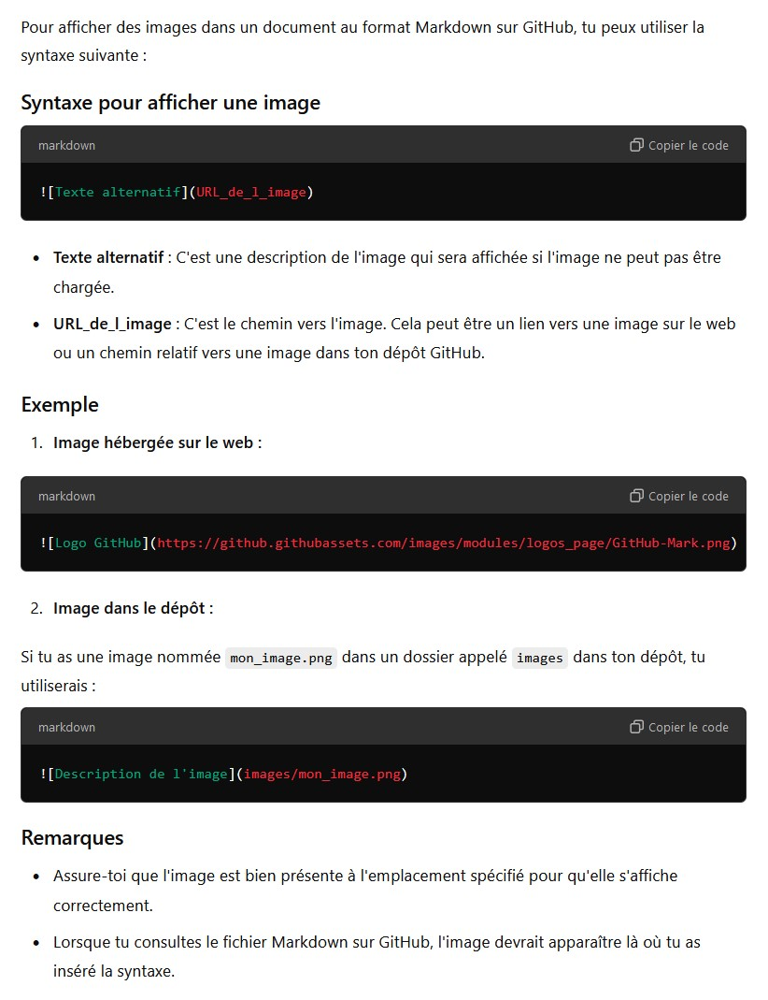

# Glossaire

Ce glossaire sera complété au fur et à mesure de la progression de la formation mais il sera également considéré comme un réel support de cours qui autorisera de longues explications si elles sont nécessaires à la présentation d'une notion complexe.

**Voici comment afficher une image dans nos documents en format .md**

